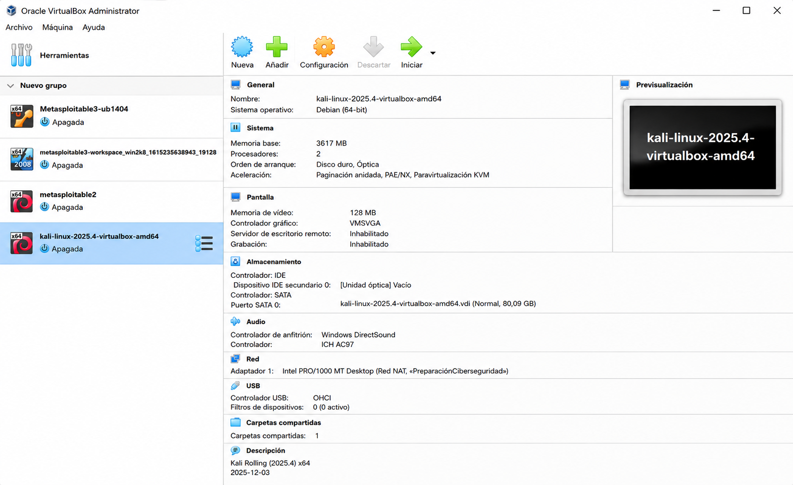

Laboratory 01 – Cybersecurity Lab Environment
Introduction

A secure and well-designed laboratory environment is the foundation of every cybersecurity assessment. Before performing vulnerability assessments, penetration testing, digital forensics, or defensive security operations, it is essential to establish an isolated infrastructure where testing can be conducted without affecting production systems.

This laboratory documents the virtual infrastructure used throughout this cybersecurity portfolio. The environment has been built using Oracle VirtualBox and consists of multiple intentionally vulnerable virtual machines that simulate enterprise scenarios for cybersecurity research, vulnerability assessment, network analysis, and security validation.

All subsequent laboratories contained in this repository will be conducted within this isolated environment.

Laboratory Overview

The following figure presents the Oracle VirtualBox environment used throughout this cybersecurity portfolio.

  
 
 <b>Figure 1.</b> Oracle VirtualBox Cybersecurity Laboratory Environment. 

Learning Objectives

After completing this laboratory, the reader will be able to:

Understand the architecture of an isolated cybersecurity laboratory.
Identify the purpose of each virtual machine.
Configure a secure virtual environment for security assessments.
Understand virtualization concepts applied to cybersecurity.
Recognize the importance of network isolation.
Prepare the environment for future penetration testing and Blue Team exercises.
Laboratory Specifications
Component	Specification
Virtualization Platform	Oracle VirtualBox
Host Operating System	Windows 11 Pro
Virtual Network	NAT Network (Isolated)
Number of Virtual Machines	4
Primary Attacker Machine	Kali Linux 2025.4
Target Systems	Metasploitable 2, Metasploitable 3 Ubuntu, Metasploitable 3 Windows
Laboratory Environment

The laboratory consists of four virtual machines designed to simulate a small enterprise environment.

Virtual Machine	Operating System	Primary Role
Kali Linux 2025.4	Debian Linux	Attacker workstation used for reconnaissance, vulnerability assessment, penetration testing, digital forensics, and security validation.
Metasploitable 2	Ubuntu Linux	Intentionally vulnerable Linux server used for basic penetration testing exercises.
Metasploitable 3 Ubuntu	Ubuntu Server	Enterprise Linux environment containing multiple vulnerable services.
Metasploitable 3 Windows	Windows Server 2008	Enterprise Windows environment for Active Directory and Windows security testing.

Laboratory Architecture

The laboratory follows a client-server architecture in which Kali Linux performs offensive security tasks while the remaining virtual machines simulate vulnerable enterprise systems.

                     Oracle VirtualBox

                  Isolated NAT Network

                            │
     ┌──────────────────────┼──────────────────────┐
     │                      │                      │
     │                      │                      │
┌───────────────┐   ┌────────────────┐   ┌────────────────────┐
│ Kali Linux    │   │ Metasploitable │   │ Metasploitable 3   │
│ 2025.4        │   │ 2              │   │ Ubuntu             │
│ Attacker      │   │ Vulnerable VM  │   │ Vulnerable VM      │
└───────────────┘   └────────────────┘   └────────────────────┘
                             │
                   ┌────────────────────┐
                   │ Metasploitable 3   │
                   │ Windows Server     │
                   │ Vulnerable VM      │
                   └────────────────────┘

The entire environment remains isolated from production systems to ensure safe cybersecurity experimentation.

Virtualization Platform

Oracle VirtualBox has been selected because it provides:

Secure virtualization
Snapshot management
Flexible virtual networking
Resource allocation
Cross-platform compatibility
Easy recovery of laboratory environments
Network Configuration

The virtual machines communicate through an isolated NAT Network configured in Oracle VirtualBox.

This configuration enables:

Host discovery
Port scanning
Service enumeration
Vulnerability assessment
Web application testing
Packet capture
Traffic analysis
Controlled attack simulation

No production systems are connected to this laboratory.

Security Tools

The following tools will be used throughout this cybersecurity portfolio.

Tool	Purpose
Nmap	Network Discovery and Port Scanning
Wireshark	Network Packet Analysis
Burp Suite Community	Web Application Security Testing
OWASP ZAP	Web Vulnerability Assessment
OpenVAS	Vulnerability Scanning
Nikto	Web Server Assessment
Gobuster	Directory and Resource Enumeration
SQLMap	SQL Injection Testing
Autopsy	Digital Forensics
Wazuh	SIEM and Blue Team Monitoring
pfSense	Firewall and Network Security Laboratory

Additional security tools will be incorporated as future laboratories are developed.

Security Considerations

This laboratory follows responsible cybersecurity practices.

The following principles are respected throughout every exercise:

Complete isolation from production environments.
Testing only against authorized systems.
Vulnerable machines are used exclusively for educational purposes.
Offensive security activities remain confined to the laboratory.
Ethical hacking principles are followed during all assessments.
Laboratory snapshots are created before major testing activities.
Laboratory Scope

This laboratory serves as the foundation for practical exercises involving:

Network Reconnaissance
Port Scanning
Service Enumeration
Vulnerability Assessment
Web Application Security
Blue Team Operations
Digital Forensics
Active Directory Security
Cloud Security
Security Awareness
Secure Configuration Assessment
Expected Learning Outcomes

After completing this laboratory, the reader will possess a fully operational cybersecurity environment capable of supporting professional security assessments.

This infrastructure serves as the foundation for every practical exercise documented throughout this cybersecurity portfolio.

Next Laboratory

The next laboratory introduces network reconnaissance using Nmap.

Laboratory 02 – Network Reconnaissance

Topics include:

Host Discovery
Port Scanning
Service Detection
Operating System Detection
Nmap Scripting Engine (NSE)
Lessons Learned

Building an isolated cybersecurity laboratory is the first step toward developing practical security skills.

A properly documented virtual environment improves reproducibility, facilitates experimentation, minimizes operational risks, and provides a secure platform for learning, research, and professional cybersecurity assessments.

References
Oracle. Oracle VM VirtualBox User Manual.
Kali Linux Documentation.
OWASP Foundation.
NIST SP 800-115 — Technical Guide to Information Security Testing and Assessment.
NIST Cybersecurity Framework (CSF) 2.0.
MITRE ATT&CK Framework.
CIS Controls Version 8.
