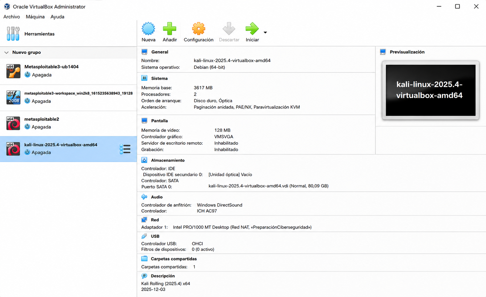
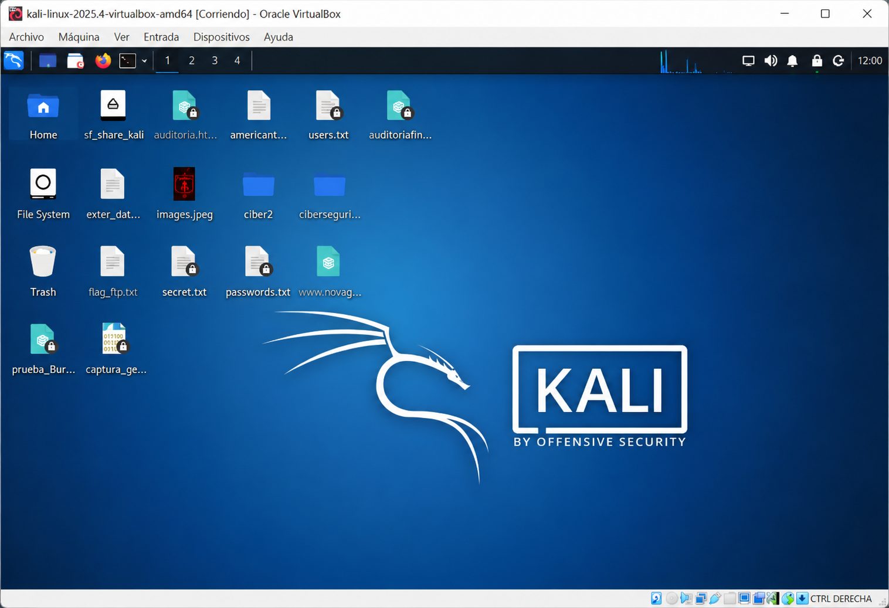
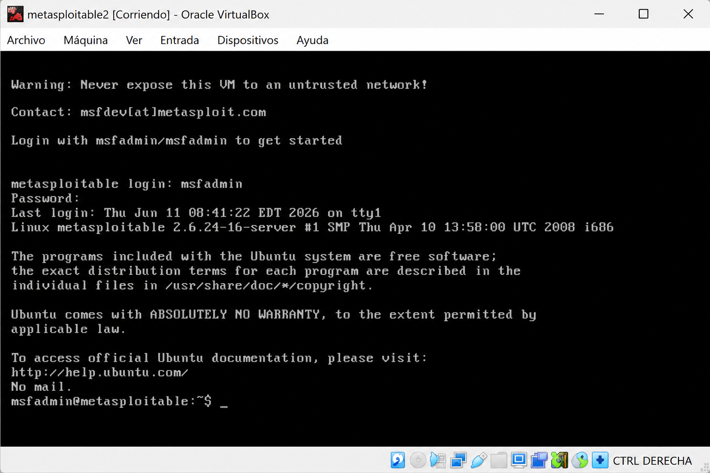
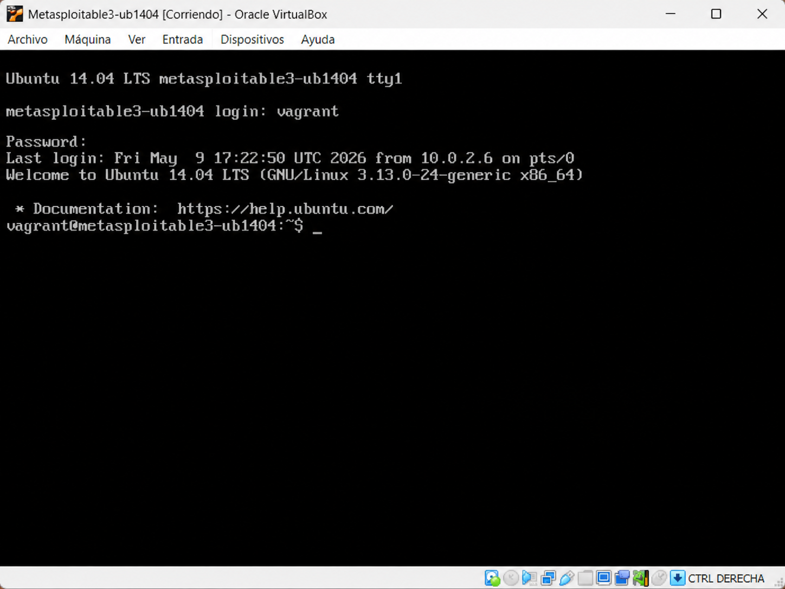
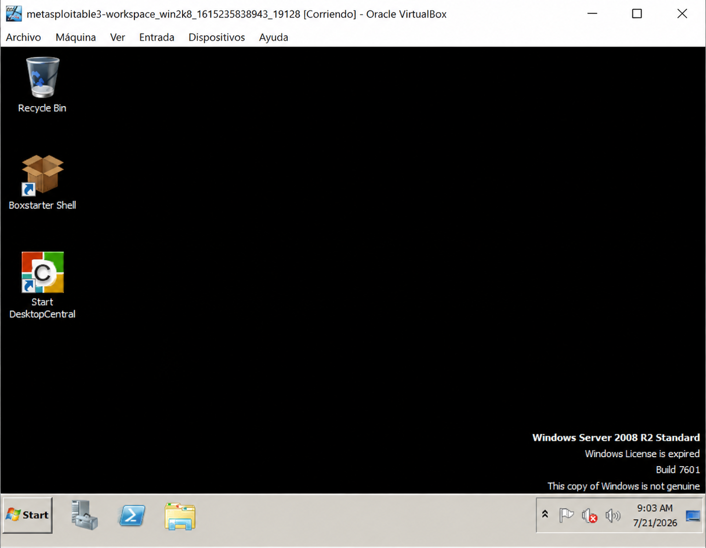

# 🖥️ Laboratory 01 – Cybersecurity Lab Environment

---
## 📑 Table of Contents

- [Introduction](#-introduction)
- [Laboratory Overview](#-laboratory-overview)
- [Learning Objectives](#-learning-objectives)
- [Laboratory Specifications](#-laboratory-specifications)
- [Virtual Machines](#-virtual-machines)
- [Laboratory Architecture](#-laboratory-architecture)
- [Network Configuration](#-network-configuration)
- [Security Tools](#-security-tools)
- [Security Considerations](#-security-considerations)
- [Laboratory Scope](#-laboratory-scope)
- [Expected Learning Outcomes](#-expected-learning-outcomes)
- [Next Laboratory](#-next-laboratory)
- [Lessons Learned](#-lessons-learned)
- [References](#-references)

---

## 📖 Introduction

A secure and well-designed laboratory environment is the foundation of every cybersecurity assessment. Before performing vulnerability assessments, penetration testing, digital forensics, or defensive security operations, it is essential to establish an isolated infrastructure where testing can be conducted safely without affecting production systems.

This laboratory documents the virtual infrastructure used throughout this cybersecurity portfolio. The environment has been built using Oracle VirtualBox and consists of multiple intentionally vulnerable virtual machines that simulate enterprise scenarios for cybersecurity research, vulnerability assessment, network analysis, and security validation.

All subsequent laboratories contained in this repository will be conducted within this isolated environment.

---

## 🖼️ Laboratory Overview

The following figure illustrates the Oracle VirtualBox environment used throughout this cybersecurity portfolio.

<p align="center">
  
</p>

<p align="center">
<b>Figure 1.</b> Oracle VirtualBox Cybersecurity Laboratory Environment.
</p>

---

## 🎯 Learning Objectives

After completing this laboratory, the reader will be able to:

- Understand the architecture of an isolated cybersecurity laboratory.
- Identify the purpose of each virtual machine.
- Configure a secure environment for security assessments.
- Understand virtualization concepts applied to cybersecurity.
- Recognize the importance of network isolation.
- Prepare the laboratory for future penetration testing and Blue Team exercises.

---

## ⚙️ Laboratory Specifications

| Component | Specification |
|-----------|---------------|
| Virtualization Platform | Oracle VirtualBox |
| Host Operating System | Windows 11 Pro |
| Virtual Network | NAT Network |
| Number of Virtual Machines | 4 |
| Attacker Machine | Kali Linux 2025.4 |
| Target Machines | Metasploitable 2, Metasploitable 3 Ubuntu, Metasploitable 3 Windows |

---

## 🖥️ Virtual Machines

| Virtual Machine | Operating System | Primary Role |
|----------------|------------------|--------------|
| Kali Linux 2025.4 | Debian Linux | Attacker workstation used for reconnaissance, vulnerability assessment, penetration testing, digital forensics, and security validation. |
| Metasploitable 2 | Ubuntu Linux | Intentionally vulnerable Linux server. |
| Metasploitable 3 Ubuntu | Ubuntu Server | Enterprise Linux environment for security assessments. |
| Metasploitable 3 Windows | Windows Server 2008 | Enterprise Windows environment for Windows security and Active Directory testing. |

### Kali Linux 2025.4

Kali Linux is the primary attacker workstation used throughout this cybersecurity portfolio. It provides the tools required for reconnaissance, vulnerability assessment, penetration testing, web security testing, digital forensics, and network analysis.

<p align="center">
  
</p>

<p align="center">
<b>Figure 2.</b> Kali Linux 2025.4 configured as the primary attacker workstation.
</p>
---
### Metasploitable 2

Metasploitable 2 is an intentionally vulnerable Ubuntu-based virtual machine designed for learning penetration testing, service enumeration, vulnerability assessment, and exploitation techniques in a controlled environment.

<p align="center">
  
</p>

<p align="center">
<b>Figure 3.</b> Metasploitable 2 intentionally vulnerable Linux target.
</p>

### Metasploitable 3 Ubuntu

Metasploitable 3 Ubuntu simulates a modern enterprise Linux environment containing intentionally vulnerable services for realistic security assessments and penetration testing exercises.

<p align="center">
  
</p>

<p align="center">
<b>Figure 4.</b> Metasploitable 3 Windows Server environment for Active Directory security assessments.
</p>

### Metasploitable 3 Windows

Metasploitable 3 Windows simulates a Windows Server enterprise environment that will later be used for Active Directory security assessments, enumeration, privilege escalation, and Blue Team exercises.

<p align="center">
  
</p>

<p align="center">
<b>Figure 5.</b> Metasploitable 3 Windows Server virtual machine.
</p>

## 🏗️ Laboratory Architecture

```
                    Oracle VirtualBox

                  Isolated NAT Network

                           │
      ┌────────────────────┼────────────────────┐
      │                    │                    │
      │                    │                    │
┌──────────────┐   ┌────────────────┐   ┌────────────────────┐
│ Kali Linux   │   │ Metasploitable │   │ Metasploitable 3   │
│ 2025.4       │   │ 2              │   │ Ubuntu             │
│ Attacker     │   │ Target VM      │   │ Target VM          │
└──────────────┘   └────────────────┘   └────────────────────┘
                            │
                    ┌────────────────────┐
                    │ Metasploitable 3   │
                    │ Windows Server     │
                    │ Target VM          │
                    └────────────────────┘
```

The laboratory remains completely isolated from production environments, allowing realistic cybersecurity exercises in a safe environment.

---

## 🌐 Network Configuration

The virtual machines communicate through an isolated NAT Network configured in Oracle VirtualBox.

This configuration supports:

- Host Discovery
- Port Scanning
- Service Enumeration
- Vulnerability Assessment
- Web Application Security Testing
- Packet Capture
- Traffic Analysis
- Controlled Attack Simulation

No production systems participate in this laboratory.

---

## 🛠️ Security Tools

| Tool | Purpose |
|------|----------|
| Nmap | Network Discovery and Port Scanning |
| Wireshark | Packet Analysis |
| Burp Suite Community | Web Security Testing |
| OWASP ZAP | Web Vulnerability Assessment |
| OpenVAS | Vulnerability Scanning |
| Nikto | Web Server Assessment |
| Gobuster | Directory Enumeration |
| SQLMap | SQL Injection Testing |
| Autopsy | Digital Forensics |
| Wazuh | SIEM Monitoring |
| pfSense | Firewall Laboratory |

Additional tools will be incorporated in future laboratories.

---

## 🔒 Security Considerations

This laboratory follows responsible cybersecurity practices.

The following principles are respected:

- Complete isolation from production environments.
- Testing only against authorized laboratory systems.
- Vulnerable machines are used exclusively for educational purposes.
- Offensive security activities remain confined to the laboratory.
- Ethical hacking principles are followed throughout every assessment.
- Snapshots are created before major testing activities.

---

## 📚 Laboratory Scope

This environment supports practical exercises related to:

- Network Reconnaissance
- Service Enumeration
- Vulnerability Assessment
- Web Application Security
- Blue Team Operations
- Digital Forensics
- Active Directory Security
- Cloud Security
- Security Awareness
- Secure Configuration Assessment

---

## ✅ Expected Learning Outcomes

After completing this laboratory, the reader will have a fully operational cybersecurity environment capable of supporting professional security assessments.

This laboratory serves as the foundation for all subsequent exercises contained in this repository.

---

## 🚀 Next Laboratory

**Laboratory 02 – Network Reconnaissance**

Topics:

- Host Discovery
- Port Scanning
- Service Detection
- Operating System Detection
- Nmap Scripting Engine (NSE)

---

## 💡 Lessons Learned

Building an isolated cybersecurity laboratory is the first step toward developing practical security skills.

A properly documented virtual environment improves reproducibility, facilitates experimentation, minimizes operational risks, and provides a secure platform for learning, research, and professional cybersecurity assessments.

---

## 📌 Project Status

✅ Laboratory completed

The laboratory environment has been successfully configured and documented.

This environment will be used throughout all subsequent cybersecurity laboratories included in this repository.

---
## 📖 References

1. Oracle VM VirtualBox User Manual.
2. Kali Linux Documentation.
3. OWASP Foundation.
4. NIST SP 800-115 – Technical Guide to Information Security Testing and Assessment.
5. NIST Cybersecurity Framework (CSF) 2.0.
6. MITRE ATT&CK Framework.
7. CIS Controls Version 8.

---

## 👨‍💻 Author

**Luis Germán Toro Pareja**

Systems Engineer | Cybersecurity Researcher | University Professor

GitHub:
https://github.com/LuisToro06

LinkedIn:
https://www.linkedin.com/in/luis-toro-74a66694/

## 📄 License

This project is licensed under the MIT License.
