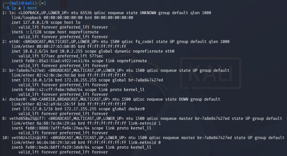
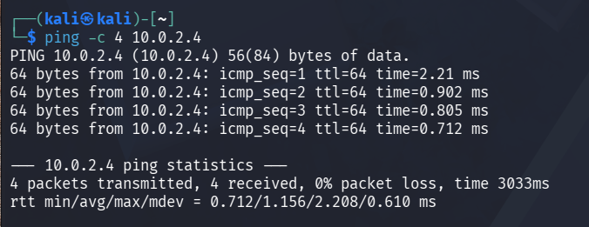
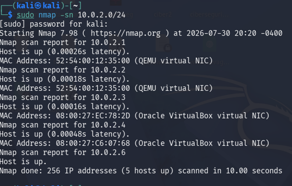
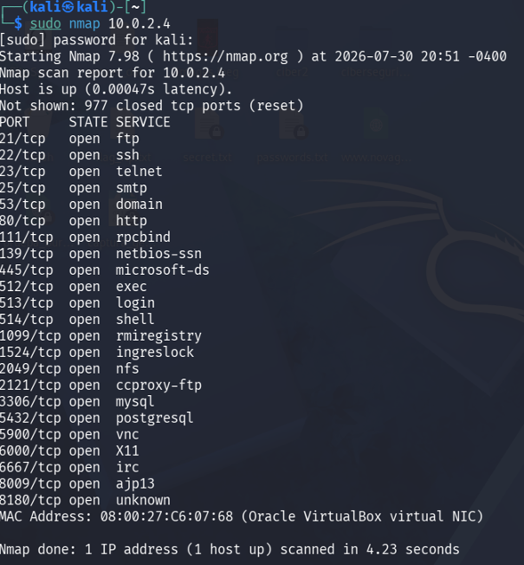
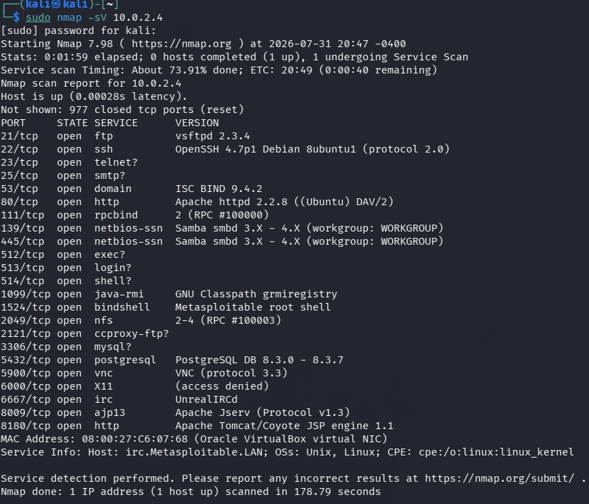
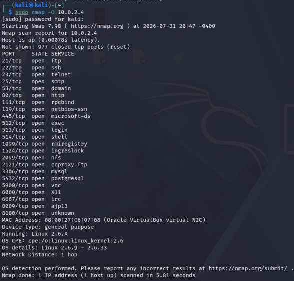
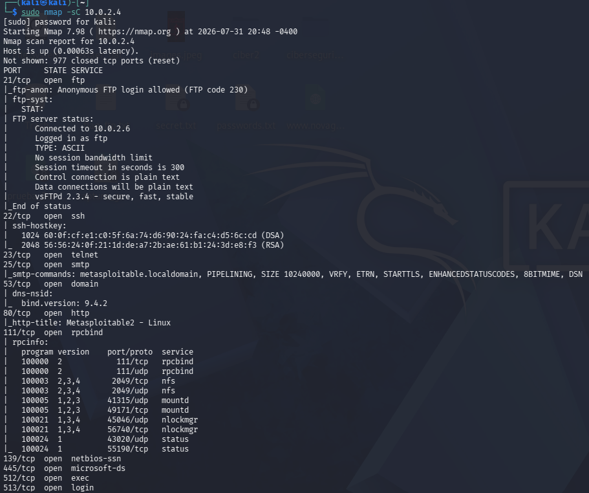
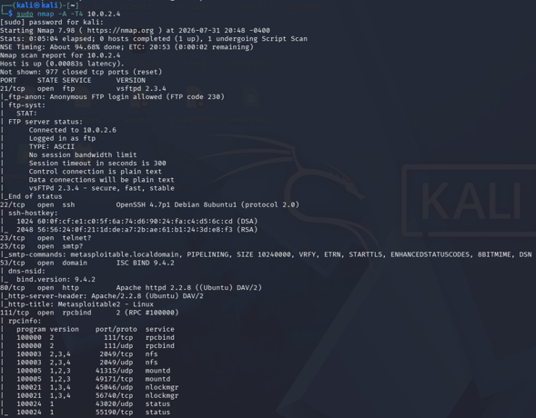

# 🛰️ Laboratory 02 – Network Reconnaissance with Nmap

---

## 📖 Introduction

Network reconnaissance is the first phase of any penetration test or security assessment. Its primary objective is to collect information about target systems before attempting vulnerability analysis or exploitation.

This laboratory demonstrates how to perform a structured reconnaissance process using **Nmap**, one of the most widely used network scanning tools in cybersecurity.

The assessment includes host discovery, connectivity verification, port scanning, service detection, operating system identification, execution of Nmap Scripting Engine (NSE) scripts, and a comprehensive scan against an intentionally vulnerable virtual machine.

All activities were conducted within the isolated laboratory environment configured in **Laboratory 01**, ensuring a safe and controlled testing environment.

---

## 📑 Table of Contents

- Introduction
- Learning Objectives
- Lab Scenario
- Target Environment
- Network Verification
- Host Discovery
- Port Scanning
- Service Detection
- Operating System Detection
- Nmap Scripting Engine (NSE)
- Comprehensive Scan
- Key Findings
- Lessons Learned
- References
- License

---

## 🎯 Learning Objectives

After completing this laboratory, the reader will be able to:

- Understand the reconnaissance phase of a penetration test.
- Verify network connectivity between attacker and target systems.
- Discover active hosts within a subnet.
- Identify open TCP ports.
- Detect running services and versions.
- Identify the operating system of a target host.
- Execute default NSE scripts.
- Perform a comprehensive reconnaissance scan using Nmap.
- Interpret reconnaissance results for future security assessments.

---

## 🧪 Lab Scenario

The laboratory consists of an attacker machine and an intentionally vulnerable target hosted within an isolated Oracle VirtualBox environment.

### Attacker

- Kali Linux 2025.4

### Target

- Metasploitable 2

### Virtualization Platform

- Oracle VirtualBox

### Network Configuration

- NAT Network

---

## 🌐 Target Environment

The following figure shows the IP configuration of the laboratory environment used throughout this assessment.

<p align="center">

</p>

<p align="center">
<b>Figure 1.</b> IP address configuration of the attacker and target machines.
</p>

Before starting the reconnaissance process, both virtual machines were verified to ensure they belonged to the same isolated virtual network.

---

## 📡 Network Verification

Connectivity between the attacker and the target machine was verified using the ICMP protocol.

<p align="center">

</p>

<p align="center">
<b>Figure 2.</b> Successful ICMP connectivity test between Kali Linux and Metasploitable 2.
</p>

The successful responses confirmed that both systems could communicate correctly before initiating network scanning.

---

## 🔍 Host Discovery

The first reconnaissance activity consisted of identifying active hosts within the virtual network.

Command used:

```bash
sudo nmap -sn <network>/24
```

<p align="center">

</p>

<p align="center">
<b>Figure 3.</b> Host discovery using Nmap Ping Scan.
</p>

The scan successfully identified active devices connected to the isolated laboratory network.

---

## 🚪 Port Scanning

Once the target host was identified, a basic TCP scan was performed to discover open ports.

Command used:

```bash
sudo nmap <target-ip>
```

<p align="center">

</p>

<p align="center">
<b>Figure 4.</b> TCP port scan performed against Metasploitable 2.
</p>

The results revealed multiple open ports representing services available for further enumeration.

---

## ⚙️ Service Detection

Service version detection provides valuable information regarding software versions running on the target host.

Command used:

```bash
sudo nmap -sV <target-ip>
```

<p align="center">

</p>

<p align="center">
<b>Figure 5.</b> Detection of network services and software versions.
</p>

The information obtained allows security analysts to correlate services with publicly known vulnerabilities.

---

## 💻 Operating System Detection

Operating system fingerprinting was performed using Nmap OS detection.

Command used:

```bash
sudo nmap -O <target-ip>
```

<p align="center">

</p>

<p align="center">
<b>Figure 6.</b> Operating system detection using Nmap.
</p>

Identifying the operating system assists analysts in selecting appropriate enumeration techniques during subsequent assessment phases.

---

## 🛡️ Nmap Scripting Engine (NSE)

Nmap includes a scripting engine capable of performing additional enumeration and security checks.

Command used:

```bash
sudo nmap -sC <target-ip>
```

<p align="center">

</p>

<p align="center">
<b>Figure 7.</b> Execution of default Nmap NSE scripts.
</p>

The default scripts collected additional information from several network services, improving situational awareness.

---

## 🚀 Comprehensive Scan

Finally, a complete reconnaissance scan combining multiple detection techniques was executed.

Command used:

```bash
sudo nmap -A -T4 <target-ip>
```

<p align="center">

</p>

<p align="center">
<b>Figure 8.</b> Comprehensive reconnaissance using advanced Nmap options.
</p>

This scan combines:

- Service Detection
- Operating System Detection
- Default NSE Scripts
- Traceroute

providing a complete overview of the target host.

---

## 🔎 Key Findings

The reconnaissance process produced the following observations:

- Network connectivity was successfully established.
- The target host responded to ICMP requests.
- Multiple TCP ports were identified as open.
- Several network services were detected.
- Operating system fingerprinting was successful.
- NSE scripts collected additional service information.
- The comprehensive scan provided a detailed view of the attack surface.

These findings establish the foundation for future vulnerability assessments and penetration testing activities.

---

## 💡 Lessons Learned

This laboratory demonstrated the importance of the reconnaissance phase in cybersecurity assessments.

By systematically identifying hosts, services, operating systems, and network characteristics, security professionals can better understand the target environment before conducting vulnerability analysis or exploitation.

Accurate reconnaissance significantly improves the efficiency and effectiveness of subsequent penetration testing activities.

---

## 📖 References

1. Nmap Official Documentation.
2. Oracle VM VirtualBox User Manual.
3. Kali Linux Documentation.
4. NIST SP 800-115 – Technical Guide to Information Security Testing and Assessment.
5. MITRE ATT&CK Framework.
6. OWASP Testing Guide.
7. CIS Controls Version 8.

---

## 📄 License

This project is licensed under the MIT License. See the [LICENSE](../../LICENSE) file for more information.
