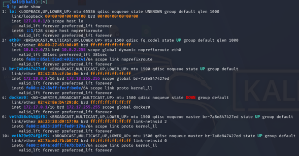
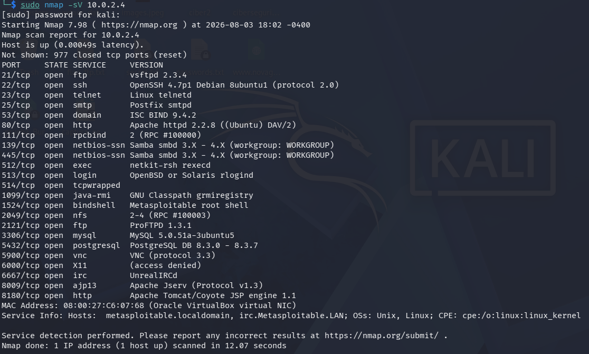
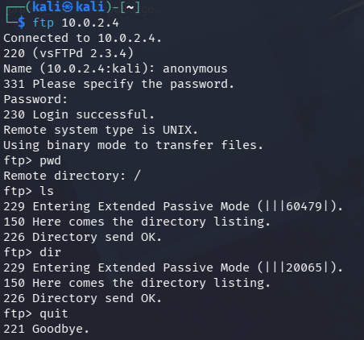
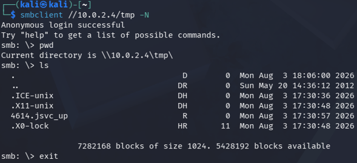
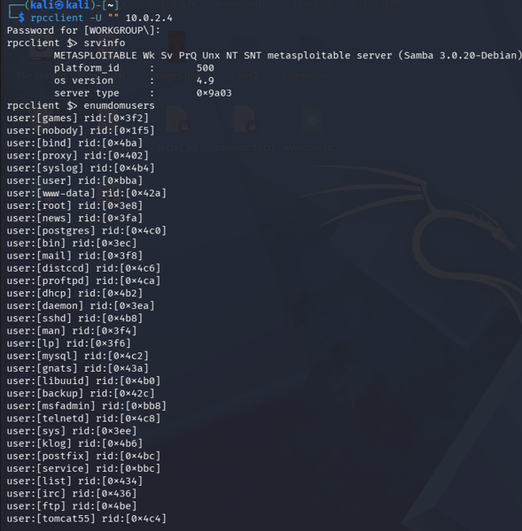
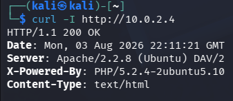
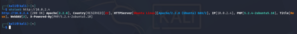
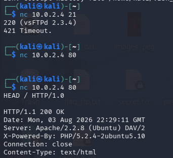
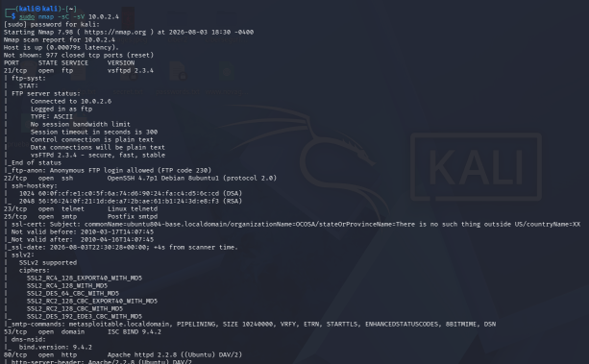
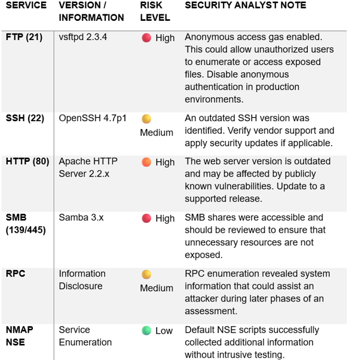

# 🔎 Laboratory 03 – Service Enumeration

---

## 📖 Introduction

Service enumeration is one of the most important phases of a penetration test. After identifying active hosts and open ports during the reconnaissance phase, security analysts must gather detailed information about the services running on the target system.

The objective of service enumeration is to identify service versions, authentication mechanisms, shared resources, exposed technologies, and additional information that may assist in vulnerability identification or later stages of a security assessment.

This laboratory demonstrates how to enumerate services running on an intentionally vulnerable system using multiple security tools available in Kali Linux. The exercises include FTP, SMB, RPC, HTTP, banner grabbing, web technology fingerprinting, and Nmap NSE scripts.

All activities were conducted within the isolated virtual laboratory created in Laboratory 01 and using the target identified during Laboratory 02.

---

## 📑 Table of Contents

- [Introduction](#-introduction)
- [Learning Objectives](#-learning-objectives)
- [Laboratory Scenario](#-laboratory-scenario)
- [Target Environment](#-target-environment)
- [Network Topology](#-network-topology)
- [Service Version Detection](#-service-version-detection)
- [FTP Enumeration](#-ftp-enumeration)
- [SMB Enumeration](#-smb-enumeration)
- [RPC Enumeration](#-rpc-enumeration)
- [HTTP Enumeration](#-http-enumeration)
- [Web Technology Identification](#-web-technology-identification)
- [Banner Grabbing](#-banner-grabbing)
- [Nmap Scripting Engine (NSE)](#-nmap-scripting-engine-nse)
- [Security Findings](#-security-findings)
- [Security Analyst Notes](#-security-analyst-notes)
- [Key Findings](#-key-findings)
- [Lessons Learned](#-lessons-learned)
- [References](#-references)
- [License](#-license)

---

## 🎯 Learning Objectives

After completing this laboratory, the reader will be able to:

- Understand the importance of service enumeration.
- Identify software versions running on exposed services.
- Enumerate FTP resources.
- Enumerate SMB shared folders.
- Collect information using RPC services.
- Analyze HTTP services.
- Identify web technologies.
- Perform banner grabbing.
- Execute Nmap NSE scripts.
- Analyze the attack surface from a security perspective.

---

## 🧪 Laboratory Scenario

This laboratory was conducted inside the isolated Oracle VirtualBox environment created during Laboratory 01.

### Attacker Machine

- Kali Linux 2025.4

### Target Machine

- Metasploitable 2

### Virtualization Platform

- Oracle VirtualBox

### Virtual Network

- NAT Network

No production systems participated in this assessment.

---

## 🌐 Target Environment

The attacker and target machines were configured within the same isolated virtual network.

The objective was to perform service enumeration without affecting external systems.

---

## 🖥️ Network Topology

The following figure illustrates the laboratory environment used during this assessment.

<p align="center">

</p>

<p align="center">
<b>Figure 1.</b> Laboratory topology showing the Kali Linux attacker machine and the Metasploitable 2 target.
</p>

The isolated environment ensures that all security testing activities remain confined to the laboratory.

---

## 🔍 Service Version Detection

Before performing detailed enumeration, it is important to identify the versions of the services running on the target host.

### Command

```bash
sudo nmap -sV <Target-IP>
```

Example:

```bash
sudo nmap -sV 192.168.56.101
```

<p align="center">

</p>

<p align="center">
<b>Figure 2.</b> Service version detection using Nmap.
</p>

### Analysis

The `-sV` option enables version detection, allowing Nmap to identify the software and versions running behind open ports.

This information is critical because software versions can later be correlated with publicly known vulnerabilities.

---

## 📂 FTP Enumeration

FTP enumeration was performed to verify authentication mechanisms and discover accessible resources.

### Command

```bash
ftp <Target-IP>
```

Authentication:

```
Username:
anonymous

Password:
anonymous
```

Commands executed:

```text
pwd

ls

dir

quit
```

<p align="center">

</p>

<p align="center">
<b>Figure 3.</b> FTP service enumeration.
</p>

### Analysis

The FTP server accepted anonymous authentication.

The directory listing confirmed that the service allowed unauthenticated users to enumerate available resources.

Anonymous FTP access significantly increases the attack surface and should be disabled unless explicitly required.

---

## 🖥️ SMB Enumeration

SMB enumeration was performed to identify shared folders and verify whether anonymous access was allowed.

### Commands

```bash
smbclient -L //<Target-IP> -N
```

Accessing a shared resource:

```bash
smbclient //<Target-IP>/tmp -N
```

Commands executed inside the shared folder:

```text
pwd

ls

exit
```

<p align="center">

</p>

<p align="center">
<b>Figure 4.</b> SMB shared resource enumeration.
</p>

### Analysis

The SMB service exposed multiple shared resources.

The ability to enumerate shares without authentication may reveal valuable information to attackers and facilitate lateral movement in enterprise environments.

---
## 🔑 RPC Enumeration

Remote Procedure Call (RPC) enumeration was performed to collect information about the target system, including domain information, users, and available services.

### Command

```bash
rpcclient -U "" <Target-IP>
```

Commands executed:

```text
srvinfo

enumdomusers

querydispinfo

exit
```

<p align="center">

</p>

<p align="center">
<b>Figure 5.</b> RPC service enumeration using rpcclient.
</p>

### Analysis

RPC enumeration provides valuable information regarding the target operating system and available network services.

If anonymous enumeration is permitted, attackers may obtain information useful for privilege escalation or credential attacks.

For production environments, unnecessary RPC exposure should be restricted through proper firewall rules and security policies.

---

## 🌍 HTTP Enumeration

The HTTP service was analyzed to collect information regarding the web server and HTTP response headers.

### Commands

Retrieve the web page:

```bash
curl http://<Target-IP>
```

Retrieve HTTP headers:

```bash
curl -I http://<Target-IP>
```

<p align="center">

</p>

<p align="center">
<b>Figure 6.</b> HTTP service enumeration using curl.
</p>

### Analysis

HTTP response headers often reveal valuable information including:

- Web server software
- Server version
- Supported HTTP methods
- Content type
- Security headers

Attackers frequently use this information to identify known vulnerabilities affecting outdated web servers.

---

## 🛠️ Web Technology Identification

After confirming the web service, the technologies used by the web application were identified.

### Command

```bash
whatweb http://<Target-IP>
```

<p align="center">

</p>

<p align="center">
<b>Figure 7.</b> Web technology fingerprinting using WhatWeb.
</p>

### Analysis

WhatWeb performs passive fingerprinting of web technologies.

The tool identifies components such as:

- Web server
- Programming language
- Frameworks
- CMS
- Cookies
- HTTP headers
- HTML signatures

Technology fingerprinting assists analysts in selecting appropriate vulnerability assessment techniques.

---

## 📢 Banner Grabbing

Banner grabbing was performed to identify service banners exposed by network services.

### FTP Banner

```bash
nc <Target-IP> 21
```

### HTTP Banner

```bash
nc <Target-IP> 80
```

Request:

```text
HEAD / HTTP/1.0
```

<p align="center">

</p>

<p align="center">
<b>Figure 8.</b> Banner grabbing using Netcat.
</p>

### Analysis

Many services expose banners containing:

- Software name
- Version
- Operating system information
- Protocol information

Although useful for administrators, banner disclosure also provides attackers with information that can accelerate vulnerability identification.

Whenever possible, service banners should be minimized or removed in production environments.

---

## ⚙️ Nmap Scripting Engine (NSE)

Nmap Scripting Engine (NSE) extends Nmap's capabilities through scripts that automate service enumeration and information gathering.

### Command

```bash
sudo nmap -sC -sV <Target-IP>
```

<p align="center">

</p>

<p align="center">
<b>Figure 9.</b> Service enumeration using Nmap NSE default scripts.
</p>

### Analysis

The default NSE scripts automatically collect additional information from exposed services.

Typical information includes:

- HTTP titles
- SSL certificates
- FTP capabilities
- SMB details
- SSH host keys
- Service configuration

NSE significantly reduces manual enumeration time while improving the amount of information collected.

---

## 📊 Security Findings

The following table summarizes the most relevant findings identified during the enumeration phase.

<p align="center">

</p>

<p align="center">
<b>Figure 10.</b> Summary of the security findings identified during service enumeration.
</p>

### Summary of Findings

| Service | Observation | Risk |
|----------|-------------|------|
| FTP | Anonymous authentication enabled | High |
| SSH | Outdated OpenSSH version detected | Medium |
| HTTP | Apache version identified | High |
| SMB | Shared resources accessible | High |
| RPC | Information disclosure | Medium |
| NSE | Additional service information collected | Low |

The enumeration process successfully identified several exposed services and configuration weaknesses.

These findings provide the foundation for the vulnerability assessment phase, where each identified service will be analyzed for publicly known vulnerabilities and potential exploitation paths.

---
## 🛡️ Security Analyst Notes

Service enumeration represents one of the most valuable phases of a penetration test because it transforms raw network information into actionable security intelligence.

During this laboratory, multiple exposed services were successfully identified and analyzed. The information collected provides a comprehensive view of the target system's attack surface and establishes the foundation for subsequent vulnerability assessments.

Several observations deserve special attention:

### FTP Service

The FTP service allowed anonymous authentication, enabling unauthenticated users to access the server.

Although anonymous FTP may be intentionally configured for public file distribution, it represents a significant security risk in production environments because attackers can enumerate directories, discover sensitive files, or abuse misconfigured permissions.

**Recommendation**

- Disable anonymous authentication.
- Enforce authenticated access.
- Restrict file permissions.
- Monitor FTP logs for unauthorized activity.

---

### SMB Service

The SMB service exposed multiple shared resources that could be enumerated without authentication.

SMB enumeration frequently reveals valuable information such as shared folders, usernames, hostnames, and network structure, which may facilitate lateral movement after an initial compromise.

**Recommendation**

- Disable unnecessary SMB shares.
- Require authentication for all shared resources.
- Restrict SMB access through firewall policies.
- Disable legacy SMB protocols when possible.

---

### RPC Service

RPC enumeration successfully disclosed system information regarding the target environment.

Although the collected information is not immediately exploitable, excessive information disclosure simplifies future attack phases by providing attackers with valuable intelligence.

**Recommendation**

- Restrict anonymous RPC enumeration.
- Limit RPC exposure to trusted networks.
- Continuously monitor RPC-related events.

---

### HTTP Service

The Apache HTTP Server version identified during enumeration appears outdated.

Legacy web server versions frequently contain publicly disclosed vulnerabilities that may be exploited if security updates are not applied.

**Recommendation**

- Upgrade to a supported web server version.
- Disable unnecessary HTTP methods.
- Implement secure HTTP response headers.
- Perform periodic vulnerability assessments.

---

### Banner Disclosure

Several network services disclosed software versions through service banners.

Banner disclosure significantly assists attackers by revealing technologies and software versions before exploitation attempts begin.

**Recommendation**

- Minimize service banner information.
- Disable version disclosure whenever possible.
- Review default server configurations.

---

## 📌 Key Findings

The enumeration process successfully identified several characteristics of the target system.

### Positive Findings

- Successful communication between attacker and target.
- Accurate service version identification.
- Discovery of multiple exposed network services.
- Identification of shared SMB resources.
- Detection of web technologies.
- Collection of additional service information using Nmap NSE.

### Security Concerns

- Anonymous FTP authentication enabled.
- Outdated software versions detected.
- SMB shares exposed.
- Information disclosure through RPC.
- Service banners revealing software versions.
- Increased attack surface due to multiple exposed services.

These findings demonstrate how service enumeration provides valuable intelligence before vulnerability assessment and exploitation activities begin.

---

## 💡 Lessons Learned

This laboratory demonstrated that service enumeration extends far beyond simply identifying open ports.

By combining multiple enumeration techniques, security analysts can obtain detailed information regarding:

- Network services
- Software versions
- Authentication mechanisms
- Shared resources
- Web technologies
- System configuration
- Information disclosure

The collected information significantly improves situational awareness and enables more effective vulnerability assessments during subsequent penetration testing phases.

Understanding how services expose information is essential for both offensive and defensive cybersecurity professionals.

---

## 📖 References

1. Nmap Official Documentation. https://nmap.org/docs.html
2. Kali Linux Documentation. https://www.kali.org/docs/
3. WhatWeb Documentation. https://github.com/urbanadventurer/WhatWeb
4. Samba Documentation. https://www.samba.org/samba/docs/
5. OpenSSH Documentation. https://www.openssh.com/manual.html
6. Apache HTTP Server Documentation. https://httpd.apache.org/docs/
7. OWASP Web Security Testing Guide. https://owasp.org/www-project-web-security-testing-guide/
8. NIST SP 800-115 – Technical Guide to Information Security Testing and Assessment.
9. MITRE ATT&CK Framework. https://attack.mitre.org/
10. CIS Controls Version 8. https://www.cisecurity.org/controls

---

## 📄 License

This project is licensed under the MIT License.

See the [LICENSE](../../LICENSE) file for additional information.

---

## 👨‍💻 Author

**Luis Toro**

Systems Engineer | Cybersecurity Researcher | University Professor

GitHub: https://github.com/LuisToro06

LinkedIn: https://www.linkedin.com/in/luis-toro-74a66694/

---

> **Disclaimer**

This laboratory was developed exclusively for educational and research purposes within an isolated virtual environment.

All assessments were performed against intentionally vulnerable systems under the author's control.

No unauthorized systems or production environments were targeted during the execution of this laboratory.

