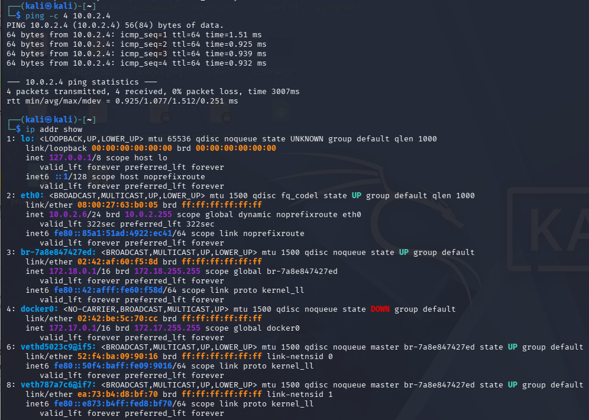
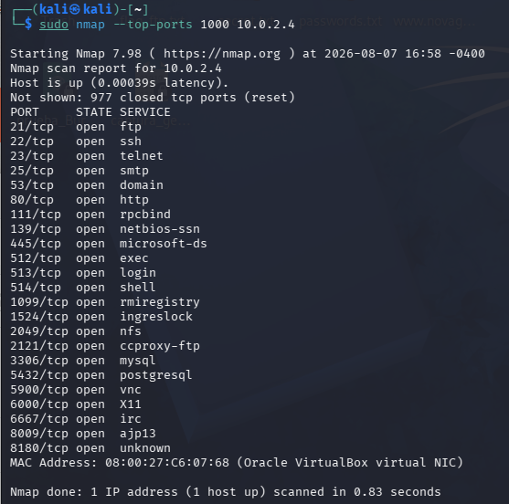
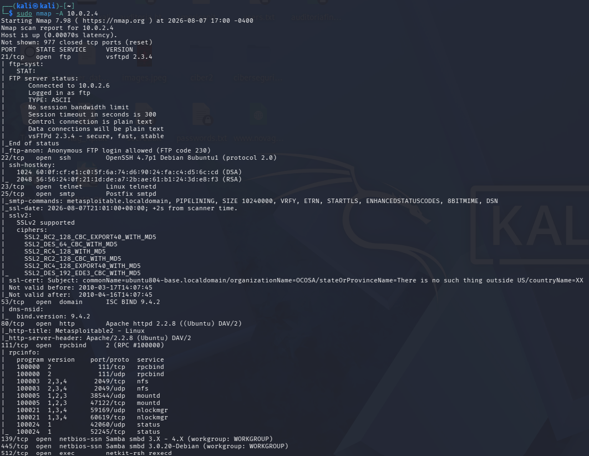
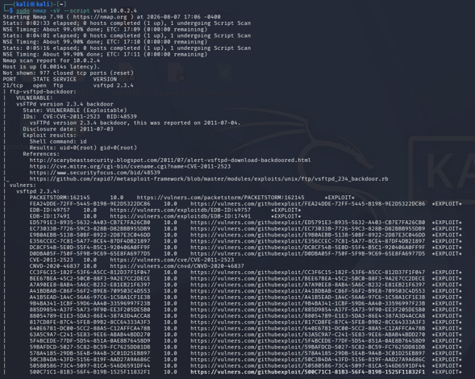
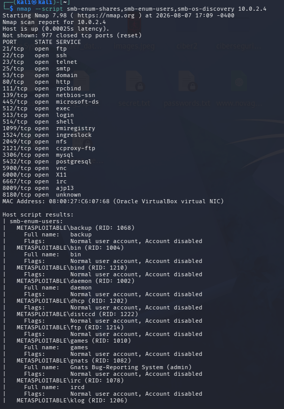
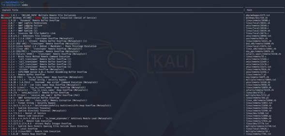
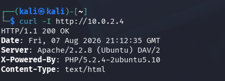
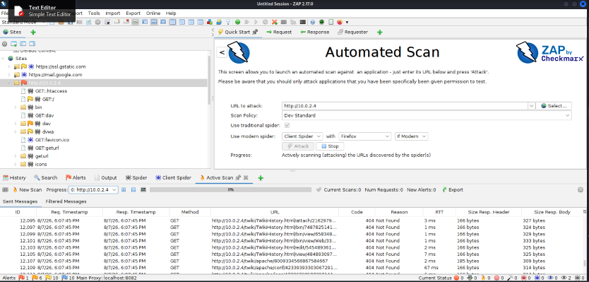
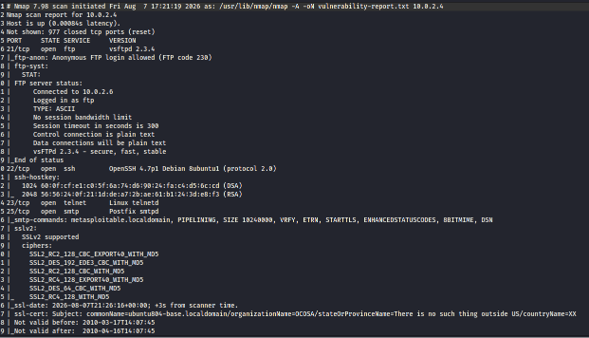
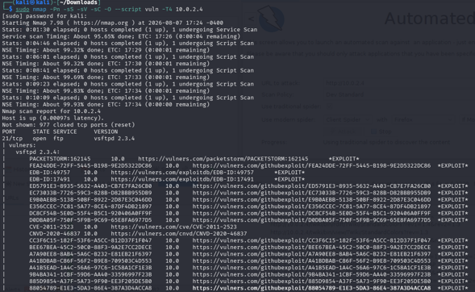

# 🛡️ Laboratory 04 – Vulnerability Assessment

## 📌 Introduction

Vulnerability assessment is a fundamental phase of a cybersecurity assessment. Its purpose is to identify potential weaknesses, outdated services, insecure configurations, exposed information, and known vulnerabilities that could increase the attack surface of a system.

This laboratory builds upon the reconnaissance and service enumeration activities performed in **Laboratory 02 – Network Reconnaissance with Nmap** and **Laboratory 03 – Service Enumeration**.

The objective is to move from information gathering toward the identification, analysis, and documentation of potential security weaknesses within an intentionally vulnerable environment.

The assessment was performed using **Kali Linux** as the security testing platform and an intentionally vulnerable virtual machine as the target.

All activities were conducted within an isolated and controlled laboratory environment for authorized educational security testing.

---

## 📑 Table of Contents

- [Introduction](#-introduction)
- [Learning Objectives](#-learning-objectives)
- [Laboratory Scenario](#-laboratory-scenario)
- [Tools and Technologies](#-tools-and-technologies)
- [Assessment Methodology](#-assessment-methodology)
- [1. Connectivity Verification](#1--connectivity-verification)
- [2. Port Scanning](#2--port-scanning)
- [3. Service Version Detection](#3--service-version-detection)
- [4. Nmap NSE Vulnerability Scanning](#4--nmap-nse-vulnerability-scanning)
- [5. SMB Vulnerability Assessment](#5--smb-vulnerability-assessment)
- [6. SearchSploit Analysis](#6--searchsploit-analysis)
- [7. Banner Grabbing](#7--banner-grabbing)
- [8. OWASP ZAP Assessment](#8--owasp-zap-assessment)
- [9. Vulnerability Report](#9--vulnerability-report)
- [10. Security Findings](#10--security-findings)
- [Key Findings](#-key-findings)
- [Risk Analysis](#-risk-analysis)
- [Recommendations](#-recommendations)
- [Lessons Learned](#-lessons-learned)
- [Conclusion](#-conclusion)
- [References](#-references)
- [Ethical Considerations](#-ethical-considerations)
- [Author](#-author)
- [Laboratory Structure](#-laboratory-structure)
- [Laboratory Status](#-laboratory-status)

---

## 🎯 Learning Objectives

The main objectives of this laboratory are:

- Understand the role of vulnerability assessment within a penetration testing methodology.
- Verify connectivity between the assessment workstation and the target.
- Identify open network ports and exposed services.
- Detect service versions using Nmap.
- Use Nmap NSE scripts to identify potential vulnerabilities.
- Assess SMB services for potential security weaknesses.
- Use SearchSploit to correlate software versions with publicly documented exploits.
- Perform banner grabbing to identify information exposed by network services.
- Perform a web application security assessment using OWASP ZAP.
- Collect and document technical evidence.
- Analyze potential security findings.
- Evaluate the security relevance of identified weaknesses.
- Develop appropriate mitigation and remediation recommendations.
- Produce structured technical security documentation.

---

## 🧪 Laboratory Scenario

The laboratory consists of an isolated virtualized environment designed for cybersecurity training.

The assessment workstation is **Kali Linux**, which is used to perform the security assessment against an intentionally vulnerable target virtual machine.

### Laboratory architecture

```text
┌──────────────────────────────┐
│          Kali Linux          │
│                              │
│  Security Assessment System  │
│                              │
│ Nmap                         │
│ Nmap NSE                     │
│ SearchSploit                 │
│ Netcat                       │
│ OWASP ZAP                    │
└───────────────┬──────────────┘
                │
                │ Isolated
                │ Laboratory Network
                │
                ▼
┌──────────────────────────────┐
│      Vulnerable Target VM    │
│                              │
│ Network Services             │
│ SMB Services                 │
│ Web Application              │
│ Vulnerable Software          │
└──────────────────────────────┘
```

The target system is intentionally vulnerable and exists exclusively for authorized security testing and educational purposes.

---

## 🛠️ Tools and Technologies

| Tool / Technology | Purpose |
|---|---|
| **Kali Linux** | Security assessment platform |
| **Nmap** | Network discovery and port scanning |
| **Nmap NSE** | Vulnerability and security checks |
| **SearchSploit** | Public exploit research |
| **Netcat** | Service and banner analysis |
| **OWASP ZAP** | Web application security assessment |
| **VirtualBox** | Virtualized laboratory environment |
| **Vulnerable VM** | Authorized assessment target |

---

# 🔬 Assessment Methodology

The assessment followed a structured vulnerability assessment methodology.

```text
Connectivity Verification
          ↓
Port Scanning
          ↓
Service Identification
          ↓
Vulnerability Detection
          ↓
SMB Assessment
          ↓
Exploit Research
          ↓
Banner Analysis
          ↓
Web Application Assessment
          ↓
Vulnerability Documentation
          ↓
Security Findings
          ↓
Risk Analysis
          ↓
Recommendations
```

The methodology was designed to progressively increase the level of analysis while maintaining the laboratory within an authorized and controlled environment.

---

# 1. 🔌 Connectivity Verification

The first stage consisted of verifying connectivity between Kali Linux and the target virtual machine.

### Command

```bash
ping -c 4 <TARGET-IP>
```

The `ping` command sends ICMP Echo Requests to determine whether the target is reachable.

### Evidence



**Figure 1. Connectivity verification between Kali Linux and the target system.**

### Analysis

Successful responses indicate that the target is reachable from the assessment workstation.

Connectivity verification is an important preliminary step because subsequent scanning activities depend on network communication between the assessment system and the target.

---

# 2. 🔎 Port Scanning

Once connectivity was confirmed, Nmap was used to identify accessible TCP ports.

### Command

```bash
nmap -sS <TARGET-IP>
```

The `-sS` option performs a TCP SYN scan.

A complete TCP port scan can also be performed using:

```bash
nmap -p- <TARGET-IP>
```

### Evidence



**Figure 2. TCP port scanning performed against the target system.**

### Analysis

Port scanning provides an initial view of the target's network attack surface.

Each open port may represent a network service that requires further investigation.

The information obtained during this stage serves as the basis for subsequent service identification and vulnerability analysis.

---

# 3. 🧩 Service Version Detection

After identifying open ports, Nmap service detection was used to determine the services and software versions associated with the exposed ports.

### Command

```bash
nmap -sV <TARGET-IP>
```

The `-sV` option attempts to identify the service and version running on each discovered port.

### Evidence



**Figure 3. Service and software version detection using Nmap.**

### Analysis

Service and version identification is an important component of vulnerability assessment.

Software versions can be correlated with publicly documented vulnerabilities, security advisories, and exploit references.

However, version detection should be treated as an initial indicator. The identified information should be validated before considering a vulnerability confirmed.

---

# 4. 🧪 Nmap NSE Vulnerability Scanning

The **Nmap Scripting Engine (NSE)** provides additional functionality for security testing.

The vulnerability script category was used to identify potential vulnerabilities associated with the services discovered during the previous stages.

### Command

```bash
nmap --script vuln <TARGET-IP>
```

### Evidence



**Figure 4. Nmap NSE vulnerability assessment against the target system.**

### Analysis

NSE vulnerability scripts can identify indicators associated with known vulnerabilities, insecure configurations, and exposed services.

The results generated by automated tools should not automatically be interpreted as confirmed vulnerabilities.

Each finding should be reviewed and, when possible, validated manually before assigning a definitive severity level.

---

# 5. 🖥️ SMB Vulnerability Assessment

The **Server Message Block (SMB)** protocol is commonly used for file and resource sharing.

Exposed SMB services require careful security analysis because vulnerable implementations, insecure configurations, or excessive resource exposure can increase the risk of unauthorized access.

### Command

```bash
nmap -p 139,445 --script smb-vuln* <TARGET-IP>
```

Additional SMB enumeration can be performed with:

```bash
nmap -p 139,445 --script smb-enum-shares,smb-enum-users <TARGET-IP>
```

### Evidence



**Figure 5. SMB vulnerability assessment against the target system.**

### Analysis

The assessment provides information about potential weaknesses affecting SMB services.

Particular attention should be given to:

- Outdated SMB implementations.
- Legacy protocols.
- Exposed network shares.
- Weak access controls.
- Anonymous access.
- Known SMB vulnerabilities.
- Unnecessary exposure of SMB services.

SMB should generally be restricted to authorized systems and networks.

---

# 6. 🔍 SearchSploit Analysis

**SearchSploit** provides a command-line interface for searching publicly available exploit references from the Exploit Database.

The tool was used to correlate identified software and versions with publicly documented security research.

### Command

```bash
searchsploit <SERVICE> <VERSION>
```

For example:

```bash
searchsploit apache 2.2
```

The actual search should be adapted according to the software and version identified during the service enumeration phase.

### Evidence



**Figure 6. SearchSploit search for publicly documented exploit references.**

### Analysis

SearchSploit can assist security professionals in determining whether publicly documented exploit references exist for a specific software version.

The existence of a public exploit does **not** automatically mean that the target can be successfully compromised.

Exploit applicability depends on several factors, including:

- Exact software version.
- Configuration.
- Operating system.
- Patch level.
- Network accessibility.
- Required authentication.
- Exploit prerequisites.

Therefore, exploit references should be treated as supporting evidence for vulnerability analysis rather than automatic confirmation of compromise.

---

## 7. 🏷️ Banner Grabbing

Banner grabbing was performed to identify information exposed by the target's HTTP service.

### Command

The HTTP response headers were retrieved using `curl`:

```bash
curl -I http://<TARGET-IP>

The specific port should be selected according to the service identified during enumeration.

### Evidence



**Figure 7. Banner grabbing and service information analysis.**

### Analysis

Service banners can expose information such as:

- Software names.
- Software versions.
- Server technologies.
- Operating system information.
- Configuration details.

Although banners can be useful for legitimate administration and troubleshooting, excessive information disclosure can facilitate reconnaissance and vulnerability research.

---

# 8. 🌐 OWASP ZAP Assessment

**OWASP ZAP (Zed Attack Proxy)** was used to perform a web application security assessment against the intentionally vulnerable web application.

The assessment was performed from the Kali Linux environment against the target system.

### Target

```text
http://<TARGET-IP>
```

### Assessment activities

The assessment included:

- Discovering web application resources.
- Spidering accessible content.
- Identifying application responses.
- Reviewing application behavior.
- Detecting potential security weaknesses.
- Reviewing generated alerts.
- Analyzing the identified security issues.

### Evidence



**Figure 8. OWASP ZAP automated assessment of the target web application.**

### Analysis

OWASP ZAP identified multiple potential security issues within the tested web application.

Automated web application scanning provides valuable visibility into potential weaknesses, but the generated alerts should be manually reviewed.

A professional assessment should distinguish between:

- Informational findings.
- Low-risk findings.
- Medium-risk findings.
- High-risk findings.
- False positives.

This validation process helps ensure that security recommendations are based on reliable evidence.

---

# 9. 📊 Vulnerability Report

The technical information obtained during the previous assessment stages was consolidated into a structured vulnerability report.

### Evidence



**Figure 9. Consolidated vulnerability assessment report.**

### Analysis

A vulnerability report transforms technical scanner output into information that can be used by security teams to understand and prioritize risks.

A professional vulnerability record should contain, when applicable:

| Element | Description |
|---|---|
| Vulnerability | Name or description of the security weakness |
| Affected Component | Service, application, or system affected |
| Evidence | Technical information supporting the finding |
| Severity | Relative risk level |
| Impact | Potential security consequences |
| Recommendation | Proposed mitigation |
| Reference | CVE, advisory, or technical reference |
| Validation | Status of technical verification |

The report should distinguish between potential findings identified by automated tools and vulnerabilities that have been manually validated.

---

# 10. 🚨 Security Findings

The final stage consisted of consolidating the relevant security findings identified throughout the vulnerability assessment.

### Evidence



**Figure 10. Consolidated security findings identified during the vulnerability assessment.**

### Analysis

The assessment demonstrated that the intentionally vulnerable environment exposes multiple services and potential security weaknesses.

The results obtained from Nmap, NSE scripts, SMB assessment, SearchSploit, banner grabbing, and OWASP ZAP should be analyzed collectively.

This approach provides a broader view of the target's security posture instead of evaluating each tool's output in isolation.

---

# 🔑 Key Findings

The following table summarizes the main assessment areas.

| Assessment Area | Observation | Security Relevance |
|---|---|---|
| Connectivity | Target was reachable from Kali Linux | Enables further assessment |
| Network Exposure | Multiple ports were identified | Indicates available attack surface |
| Service Detection | Services and versions were identified | Enables vulnerability correlation |
| NSE Assessment | Potential vulnerabilities were detected | Requires validation |
| SMB | SMB services were assessed for known weaknesses | Potential exposure depending on configuration |
| Exploit Research | Public exploit references were identified | Supports vulnerability analysis |
| Banner Grabbing | Service information was exposed | Can facilitate reconnaissance |
| Web Application | OWASP ZAP generated security alerts | Requires manual review |
| Security Findings | Technical findings were consolidated | Supports risk prioritization |

---

# ⚠️ Risk Analysis

Vulnerability identification should not be confused with successful exploitation.

The risk associated with a finding depends on several factors, including:

- Exploitability.
- Potential impact.
- Network accessibility.
- Authentication requirements.
- Availability of public exploits.
- Software version.
- System configuration.
- Existing security controls.
- Confidentiality impact.
- Integrity impact.
- Availability impact.

A professional vulnerability assessment should therefore prioritize findings according to their actual security context.

### General risk model

```text
Vulnerability
      ↓
Technical Evidence
      ↓
Validation
      ↓
Exploitability
      ↓
Potential Impact
      ↓
Risk Classification
      ↓
Remediation Priority
```

---

# 🛠️ Recommendations

Based on the assessment methodology, the following general security recommendations are applicable.

## 1. Patch Management

Maintain operating systems, applications, and network services with current security updates.

Known vulnerabilities should be prioritized according to their risk and exposure.

## 2. Service Hardening

Disable unnecessary services and close unused network ports.

Only required services should remain accessible.

## 3. SMB Security

Restrict SMB access to authorized hosts and networks.

Where applicable:

- Disable unnecessary legacy protocols.
- Restrict anonymous access.
- Review shared resources.
- Apply security patches.
- Enforce appropriate authentication and authorization.

## 4. Information Disclosure

Configure services to minimize unnecessary disclosure of:

- Software versions.
- Server information.
- Operating system details.
- Configuration information.

## 5. Web Application Security

Perform regular security assessments of web applications.

Particular attention should be given to:

- Authentication.
- Authorization.
- Session management.
- Input validation.
- Security headers.
- Access control.
- Error handling.
- Information disclosure.
- Secure configuration.

## 6. Network Segmentation

Implement appropriate network segmentation to limit communication between systems and reduce the potential impact of a compromised host.

## 7. Vulnerability Management

Organizations should establish a continuous vulnerability management lifecycle:

```text
Discovery
    ↓
Identification
    ↓
Validation
    ↓
Risk Classification
    ↓
Remediation
    ↓
Verification
    ↓
Continuous Monitoring
```

## 8. Security Monitoring

Implement appropriate logging and monitoring mechanisms to detect suspicious activity involving exposed services and applications.

---

# 🧠 Lessons Learned

This laboratory provided practical experience in the vulnerability assessment phase of a cybersecurity assessment.

The main lessons learned include:

- Vulnerability assessment should build upon reconnaissance and service enumeration.
- Open ports represent potential attack surfaces.
- Service versions are important for vulnerability correlation.
- Automated scanners provide useful information but require validation.
- SMB services require careful security analysis.
- Public exploit repositories support vulnerability research.
- Service banners may disclose valuable technical information.
- Web application scanners can identify numerous potential security weaknesses.
- Technical findings must be converted into structured security documentation.
- Vulnerabilities should be prioritized according to their actual risk.
- Effective vulnerability management requires continuous assessment and remediation.

---

# 💼 Professional Security Perspective

A professional vulnerability assessment should not focus solely on identifying vulnerabilities.

The objective is to transform technical evidence into actionable security information.

```text
Identify
   ↓
Validate
   ↓
Analyze
   ↓
Prioritize
   ↓
Recommend
   ↓
Remediate
   ↓
Verify
```

This approach allows security professionals to move from technical discovery toward effective risk reduction.

The ability to document findings clearly is therefore as important as the technical ability to identify them.

---

# 🏁 Conclusion

This laboratory demonstrated a structured vulnerability assessment process against an intentionally vulnerable virtual machine.

The assessment progressed through:

1. Connectivity verification.
2. Network port scanning.
3. Service and version identification.
4. Nmap NSE vulnerability assessment.
5. SMB vulnerability assessment.
6. Public exploit research using SearchSploit.
7. Banner grabbing.
8. Web application assessment using OWASP ZAP.
9. Vulnerability reporting.
10. Consolidation of security findings.

The laboratory demonstrates that effective vulnerability assessment requires more than automated scanning.

A professional assessment combines:

- Technical tools.
- Evidence collection.
- Service identification.
- Vulnerability validation.
- Risk analysis.
- Documentation.
- Remediation recommendations.

The experience developed in this laboratory builds directly upon the reconnaissance and service enumeration skills developed in the previous laboratories and establishes a stronger foundation for subsequent cybersecurity assessment activities.

---

# 📚 References

- **Nmap Documentation**  
  https://nmap.org/docs.html

- **Nmap Reference Guide**  
  https://nmap.org/book/man.html

- **Nmap Scripting Engine**  
  https://nmap.org/book/nse.html

- **Exploit Database**  
  https://www.exploit-db.com/

- **SearchSploit**  
  https://www.exploit-db.com/searchsploit

- **OWASP ZAP**  
  https://www.zaproxy.org/

- **OWASP Web Security Testing Guide**  
  https://owasp.org/www-project-web-security-testing-guide/

- **OWASP Top 10**  
  https://owasp.org/www-project-top-ten/

---

# ⚖️ Ethical Considerations

All activities documented in this laboratory were performed exclusively against systems configured for authorized educational security testing.

The techniques demonstrated in this laboratory must only be used against systems for which explicit authorization has been obtained.

Unauthorized vulnerability scanning, exploitation, credential attacks, or access to third-party systems may cause service disruption, data exposure, or legal consequences.

This laboratory is strictly educational and is intended to demonstrate responsible cybersecurity assessment methodologies.

---

# 👨‍💻 Author

**Luis Toro**

Systems Engineer | Cybersecurity Professional | University Lecturer

**Cybersecurity Portfolio:**  
https://github.com/LuisToro06

---

# 📁 Laboratory Structure

```text
04-vulnerability-assessment/
│
├── images/
│   ├── 01-connectivity-test.png
│   ├── 02-port-scan.png
│   ├── 03-version-detection.png
│   ├── 04-nse-vulnerability-scan.png
│   ├── 05-smb-vulnerabilities.png
│   ├── 06-searchsploit.png
│   ├── 07-banner-grabbing.png
│   ├── 08-zap-scan.png
│   ├── 09-vulnerability-report.png
│   └── 10-security-findings.png
│
└── README.md
```

---

# ✅ Laboratory Status

| Component | Status |
|---|---|
| Laboratory environment | ✅ Completed |
| Connectivity verification | ✅ Completed |
| Port scanning | ✅ Completed |
| Service detection | ✅ Completed |
| NSE vulnerability assessment | ✅ Completed |
| SMB assessment | ✅ Completed |
| SearchSploit analysis | ✅ Completed |
| Banner grabbing | ✅ Completed |
| OWASP ZAP assessment | ✅ Completed |
| Vulnerability report | ✅ Completed |
| Security findings | ✅ Completed |
| Documentation | ✅ Completed |

---

## 📸 Evidence Summary

| Figure | File | Assessment Activity |
|---|---|---|
| Figure 1 | `01-connectivity-test.png` | Connectivity verification |
| Figure 2 | `02-port-scan.png` | Port scanning |
| Figure 3 | `03-version-detection.png` | Service version detection |
| Figure 4 | `04-nse-vulnerability-scan.png` | Nmap NSE vulnerability assessment |
| Figure 5 | `05-smb-vulnerabilities.png` | SMB vulnerability assessment |
| Figure 6 | `06-searchsploit.png` | Exploit research |
| Figure 7 | `07-banner-grabbing.png` | Banner grabbing |
| Figure 8 | `08-zap-scan.png` | OWASP ZAP assessment |
| Figure 9 | `09-vulnerability-report.png` | Vulnerability report |
| Figure 10 | `10-security-findings.png` | Security findings |
