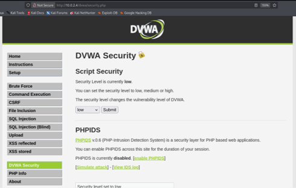
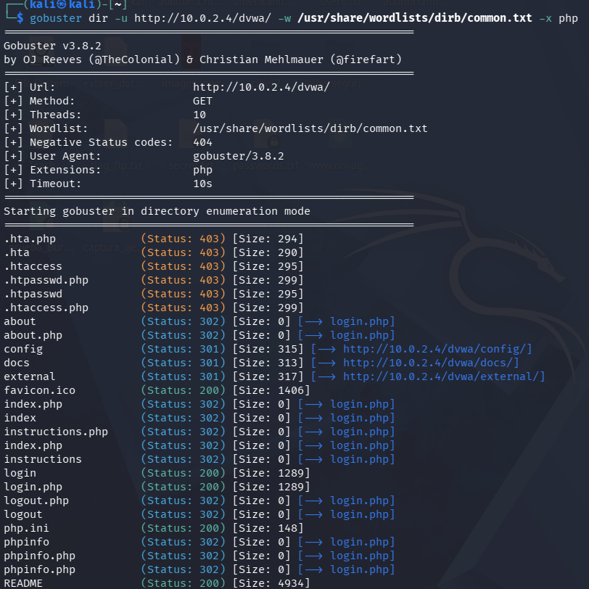
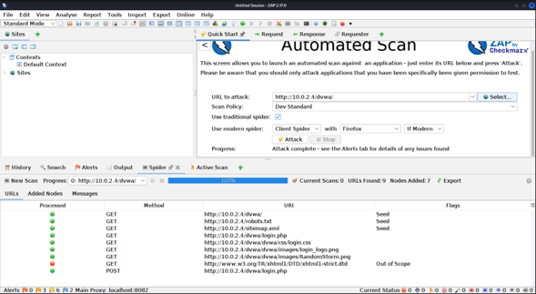
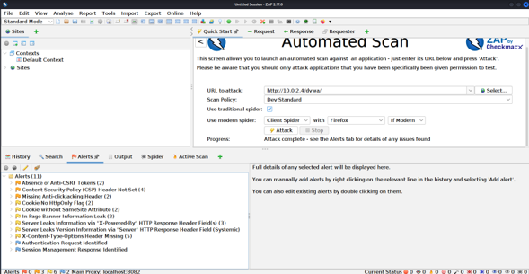
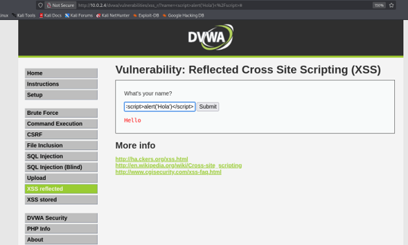
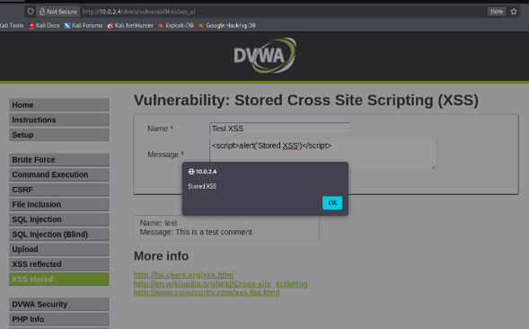
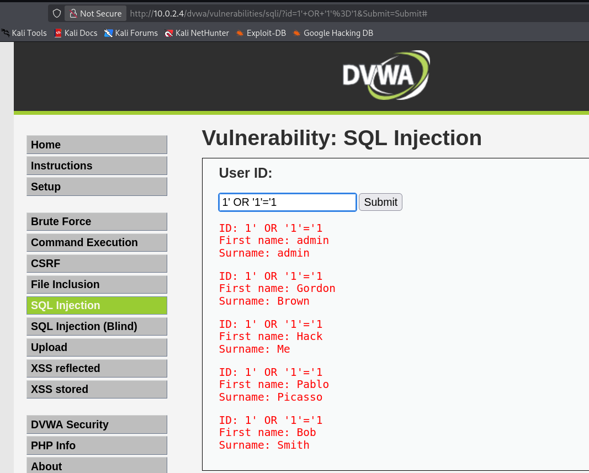
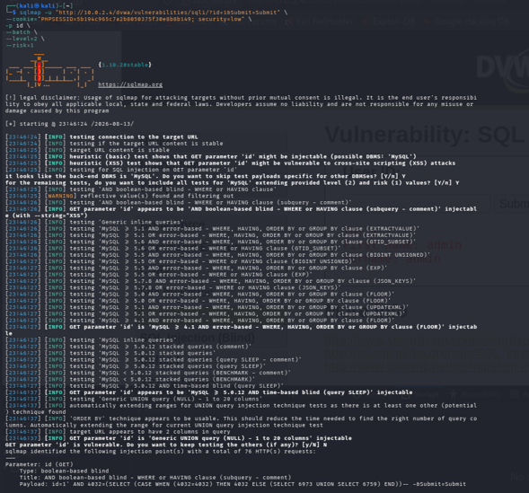
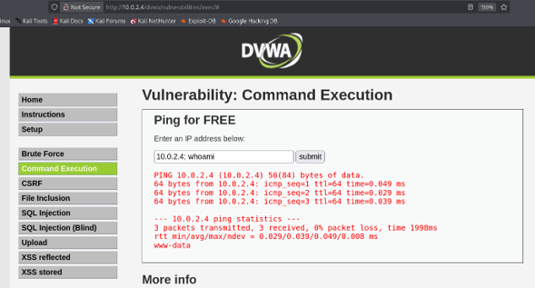
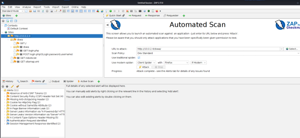

# 🌐 Lab 05 — Web Application Security Assessment

This laboratory focuses on the security assessment of an intentionally vulnerable web application using **Damn Vulnerable Web Application (DVWA)**.

The objective is to identify, analyze, validate, and document common web application security weaknesses in a controlled and isolated laboratory environment.

The assessment was performed from **Kali Linux** against the DVWA instance hosted on **Metasploitable 2**.

---

## 📑 Table of Contents

- [🎯 Objectives](#-objectives)
- [🧪 Laboratory Environment](#-laboratory-environment)
- [1. 🎯 DVWA Target](#1--dvwa-target)
- [2. 🔎 Web Resource Discovery](#2--web-resource-discovery)
- [3. 🕷️ OWASP ZAP Spider](#3--owasp-zap-spider)
- [4. 🛡️ OWASP ZAP Passive Scan](#4--owasp-zap-passive-scan)
- [5. ⚠️ Reflected Cross-Site Scripting (XSS)](#5--reflected-cross-site-scripting-xss)
- [6. 💾 Stored Cross-Site Scripting (XSS)](#6--stored-cross-site-scripting-xss)
- [7. 💉 SQL Injection](#7--sql-injection)
- [8. 🧰 SQLMap Assessment](#8--sqlmap-assessment)
- [9. ⚙️ Command Injection](#9--command-injection)
- [10. 🚨 Security Findings](#10--security-findings)
- [11. 📊 Security Assessment Summary](#11--security-assessment-summary)
- [12. 🔍 Security Findings and Risk Considerations](#12--security-findings-and-risk-considerations)
  - [12.1 Cross-Site Scripting](#121-cross-site-scripting)
  - [12.2 SQL Injection](#122-sql-injection)
  - [12.3 Command Injection](#123-command-injection)
  - [12.4 HTTP Security Headers](#124-http-security-headers)
  - [12.5 Cookie Security](#125-cookie-security)
  - [12.6 Information Disclosure](#126-information-disclosure)
- [13. 🛠️ Security Recommendations](#13--security-recommendations)
  - [13.1 Input Validation](#131-input-validation)
  - [13.2 Output Encoding](#132-output-encoding)
  - [13.3 Database Security](#133-database-security)
  - [13.4 Session Security](#134-session-security)
  - [13.5 HTTP Security Headers](#135-http-security-headers)
  - [13.6 Secure Error Handling](#136-secure-error-handling)
  - [13.7 Continuous Security Testing](#137-continuous-security-testing)
- [14. 🧠 Lessons Learned](#14--lessons-learned)
- [15. 📋 Assessment Methodology](#15--assessment-methodology)
- [16. 📁 Evidence Structure](#16--evidence-structure)
- [17. 🧰 Tools Used](#17--tools-used)
- [18. 📸 Evidence Index](#18--evidence-index)
- [19. 🔐 Scope and Authorization](#19--scope-and-authorization)
- [20. ✅ Conclusion](#20--conclusion)
- [21. ⚖️ Disclaimer](#disclaimer)

---
## 🎯 Objectives

The main objectives of this laboratory are:

- Identify the target web application.
- Verify connectivity to the target.
- Discover accessible web resources and directories.
- Analyze the application's attack surface.
- Perform passive web application security analysis.
- Identify common web application vulnerabilities.
- Demonstrate reflected Cross-Site Scripting (XSS).
- Demonstrate stored Cross-Site Scripting (XSS).
- Perform SQL Injection testing.
- Validate SQL Injection using SQLMap.
- Test Command Injection behavior.
- Perform a consolidated security assessment using OWASP ZAP.
- Document technical evidence for each assessment activity.
- Analyze the security implications of the findings.
- Provide security recommendations and mitigation measures.

---

## 🧪 Laboratory Environment

| Component | Description |
|---|---|
| Attacker | Kali Linux |
| Target | Metasploitable 2 |
| Web Application | Damn Vulnerable Web Application (DVWA) |
| Target IP | `10.0.2.4` |
| Web Server | Apache / PHP |
| Database | MySQL |
| Browser | Firefox |
| Web Discovery | Gobuster |
| Web Security Assessment | OWASP ZAP |
| SQL Injection Testing | SQLMap |
| Network | Isolated virtual laboratory |

> **Important:** This laboratory is intended exclusively for authorized security testing in an isolated environment. DVWA is intentionally vulnerable and must not be exposed to the Internet or production networks.

---

# 1. 🎯 DVWA Target

The first step was to verify access to the DVWA web application hosted on the Metasploitable 2 virtual machine.

### Target

```text
http://10.0.2.4/dvwa/
```

### Evidence



**Figure 1. DVWA vulnerable web application hosted on Metasploitable 2.**

### Analysis

The target was identified as **Damn Vulnerable Web Application (DVWA)**.

DVWA is intentionally designed to contain common web application vulnerabilities and is therefore appropriate for controlled cybersecurity training.

Successful access confirmed communication between the Kali Linux assessment machine and the Metasploitable 2 target.

### Security Relevance

Target identification establishes the scope of the assessment and confirms that testing is being performed against the intended authorized system.

---

# 2. 🔎 Web Resource Discovery

After confirming access to DVWA, web resource discovery was performed using **Gobuster**.

The purpose of this phase was to identify directories and resources that could expand the application's attack surface.

### Command

```bash
gobuster dir -u http://10.0.2.4/dvwa/ -w /usr/share/wordlists/dirb/common.txt
```

### Evidence



**Figure 2. Web resource discovery performed using Gobuster.**

### Analysis

Directory enumeration can identify application resources that are not immediately visible through the main application interface.

Potentially discoverable resources include:

- Application directories.
- Web pages.
- Authentication-related resources.
- Administrative resources.
- Additional application functionality.
- Backup or configuration resources when exposed.

### Security Relevance

Unnecessary or exposed resources can increase the attack surface of a web application.

### Recommendation

Organizations should:

- Remove unnecessary files and directories.
- Restrict administrative resources.
- Disable directory listing where appropriate.
- Avoid exposing backup or configuration files.
- Apply appropriate access controls.

---

# 3. 🕷️ OWASP ZAP Spider

**OWASP ZAP (Zed Attack Proxy)** was used to crawl the DVWA application and identify accessible pages, resources, links, and requests.

### Target

```text
http://10.0.2.4/dvwa/
```

### Evidence



**Figure 3. OWASP ZAP Spider results for the DVWA application.**

### Analysis

The Spider functionality provided a structured view of the web application's accessible resources.

The crawling process can identify:

- Application endpoints.
- Parameters.
- HTTP requests.
- Login-related resources.
- Functional modules.
- Additional attack surface.

Spidering is primarily a discovery technique and does not by itself confirm the existence of a vulnerability.

### Security Relevance

Application mapping is an important step before vulnerability validation because it helps ensure that relevant application functionality is included in the assessment.

---

# 4. 🛡️ OWASP ZAP Passive Scan

OWASP ZAP was used to perform passive security analysis while interacting with the DVWA application.

Passive scanning analyzes HTTP requests and responses without intentionally modifying application behavior to exploit a vulnerability.

### Target

```text
http://10.0.2.4/dvwa/
```

### Evidence



**Figure 4. OWASP ZAP passive security analysis of the DVWA application.**

### Analysis

Passive analysis can identify security observations involving:

- HTTP security headers.
- Cookie configuration.
- Session management.
- Information disclosure.
- Browser security controls.
- Application configuration.

### Security Relevance

Security headers and cookie attributes provide additional defensive controls for web applications.

### Recommendation

Applications should review and configure appropriate controls such as:

- `Content-Security-Policy`
- `X-Content-Type-Options`
- Clickjacking protection
- `HttpOnly`
- `Secure`
- `SameSite`

according to the application's architecture and security requirements.

---

# 5. ⚠️ Reflected Cross-Site Scripting (XSS)

The DVWA **XSS Reflected** module was used to demonstrate reflected Cross-Site Scripting.

Reflected XSS occurs when user-controlled input is returned in an HTTP response and interpreted by the browser without appropriate output encoding.

### Controlled Test Payload

```html
<script>alert('XSS')</script>
```

### Evidence



**Figure 5. Reflected Cross-Site Scripting testing in DVWA.**

### Analysis

The test evaluates whether user-controlled input is reflected into the application's response as executable HTML or JavaScript.

In the intentionally vulnerable DVWA environment, the payload can be interpreted by the browser when the appropriate security level is configured.

### Potential Impact

A reflected XSS vulnerability may allow:

- Execution of attacker-controlled JavaScript.
- Manipulation of page content.
- Phishing scenarios.
- User redirection.
- Actions performed in the context of the victim's browser.
- Session-related attacks depending on application configuration.

### Security Recommendations

Applications should implement:

- Context-aware output encoding.
- Strict input validation.
- Safe handling of HTML.
- Content Security Policy.
- Secure framework defaults.

---

# 6. 💾 Stored Cross-Site Scripting (XSS)

The DVWA **XSS Stored** module was used to demonstrate persistent Cross-Site Scripting.

Unlike reflected XSS, stored XSS involves content being stored by the application and subsequently displayed to users.

### Input Fields

The DVWA form contains:

- `Name`
- `Message`

A controlled JavaScript payload was used during the laboratory assessment.

### Controlled Test Payload

```html
<script>alert('XSS')</script>
```

### Evidence



**Figure 6. Stored Cross-Site Scripting testing in DVWA.**

### Analysis

Stored XSS is particularly significant because malicious content can persist within the application.

When another user accesses a page containing the stored content, the browser may interpret the content as JavaScript if appropriate output encoding is absent.

### Potential Impact

Potential consequences include:

- Persistent JavaScript execution.
- Manipulation of application content.
- Attacks against other application users.
- Phishing scenarios.
- Session-related attacks.
- Unauthorized actions in the victim's browser context.

### Security Recommendations

Applications should:

- Encode output according to its context.
- Validate user input.
- Safely render user-generated content.
- Implement Content Security Policy.
- Avoid treating untrusted content as executable HTML.

---

# 7. 💉 SQL Injection

The DVWA **SQL Injection** module was used to assess the handling of user-controlled database input.

The vulnerable functionality uses the `id` parameter to retrieve information from the database.

### Target

```text
http://10.0.2.4/dvwa/vulnerabilities/sqli/
```

### Example Request

```text
http://10.0.2.4/dvwa/vulnerabilities/sqli/?id=1&Submit=Submit
```

### Parameter Tested

```text
id
```

### Evidence



**Figure 7. SQL Injection testing against the DVWA application.**

### Analysis

SQL Injection occurs when user-controlled input is incorporated into SQL statements without sufficient protection.

The DVWA environment is intentionally vulnerable and allows this behavior to be demonstrated in a controlled laboratory.

### Potential Impact

SQL Injection can potentially allow:

- Unauthorized database queries.
- Disclosure of database information.
- Manipulation of database operations.
- Authentication bypass in vulnerable applications.
- Modification or deletion of database data.

### Security Recommendations

Applications should use:

- Prepared statements.
- Parameterized queries.
- Secure ORM/query mechanisms.
- Input validation.
- Least-privilege database accounts.
- Secure error handling.

User-controlled input should never be directly concatenated into SQL statements.

---

# 8. 🧰 SQLMap Assessment

After the manual SQL Injection assessment, **SQLMap** was used to automate validation of the vulnerable `id` parameter.

DVWA requires an authenticated session, so the PHP session cookie was supplied to SQLMap.

### Target

```text
http://10.0.2.4/dvwa/vulnerabilities/sqli/?id=1&Submit=Submit
```

### Command

```bash
sqlmap -u "http://10.0.2.4/dvwa/vulnerabilities/sqli/?id=1&Submit=Submit" \
--cookie="PHPSESSID=<YOUR_SESSION_ID>; security=low" \
-p id \
--batch \
--level=2 \
--risk=1
```

Replace `<YOUR_SESSION_ID>` with the valid `PHPSESSID` obtained from the authorized DVWA laboratory session.

### Evidence



**Figure 8. SQLMap automated SQL Injection assessment against the DVWA application.**

### Analysis

The SQLMap assessment identified the `id` GET parameter as injectable in the intentionally vulnerable DVWA environment.

The result demonstrates how automated security tools can validate SQL Injection techniques and identify the underlying injection behavior.

The use of an authenticated session is important because the DVWA vulnerability modules are protected by the application's session and security configuration.

### Security Relevance

Automated tools can accelerate vulnerability validation, but their output should be interpreted together with manual testing and application context.

### Security Recommendations

The primary controls are:

- Parameterized queries.
- Prepared statements.
- Input validation.
- Least-privilege database accounts.
- Secure database error handling.

---

# 9. ⚙️ Command Injection

The DVWA **Command Injection** module was used to evaluate the application's handling of user-supplied IP address input.

### Target

```text
http://10.0.2.4/dvwa/vulnerabilities/exec/
```

The module expects an IP address as input.

### Valid Input Test

A valid IP address was first used to verify normal functionality:

```text
10.0.2.4
```

### Controlled Injection Attempt

A controlled injection test was attempted using:

```text
10.0.2.4; whoami
```

### Evidence



**Figure 9. DVWA Command Injection input validation and controlled security testing.**

### Observed Result

The application returned:

```text
ERROR: You have entered an invalid IP
```

### Analysis

The submitted value was rejected by the application's IP address validation.

Therefore, the evidence does **not** demonstrate successful operating-system command execution.

This distinction is important in professional security reporting. An attempted attack must not be documented as a confirmed vulnerability unless the expected security impact has actually been demonstrated.

The test nevertheless provides useful evidence regarding the application's input validation behavior.

### Security Recommendations

Applications that execute operating-system commands should:

- Use strict allow-list validation.
- Validate input according to the expected data type.
- Avoid shell execution whenever possible.
- Use safer operating-system APIs.
- Apply least privilege.
- Isolate application processes.
- Implement secure error handling.

---

# 10. 🚨 Security Findings

The final stage of the assessment used **OWASP ZAP** to consolidate security observations identified while interacting with the DVWA application.

### Target

```text
http://10.0.2.4/dvwa/
```

An automated ZAP assessment was executed against the authorized DVWA laboratory target.

### Evidence



**Figure 10. OWASP ZAP security findings identified during the DVWA assessment.**

### Observed Findings

The ZAP assessment identified observations including:

- Absence of Anti-CSRF Tokens.
- Content Security Policy (CSP) Header Not Set.
- Missing Anti-clickjacking Header.
- Cookie No HttpOnly Flag.
- Cookie without SameSite Attribute.
- In Page Banner Information Leak.
- Server information disclosure via `X-Powered-By`.
- Server information disclosure via the `Server` HTTP header.
- `X-Content-Type-Options` Header Missing.
- Authentication-related observations.
- Session management observations.

### Analysis

The ZAP results demonstrate that automated web application security scanners can identify weaknesses involving:

- HTTP security headers.
- Cookie security.
- Session management.
- Information disclosure.
- Authentication controls.
- Application configuration.

Automated scanner findings should be manually reviewed and validated before being classified as confirmed vulnerabilities.

---

# 11. 📊 Security Assessment Summary

| # | Assessment Area | Tool / Technique | Result |
|---|---|---|---|
| 1 | Target Identification | Firefox | DVWA successfully accessed |
| 2 | Web Resource Discovery | Gobuster | Web resources identified |
| 3 | Application Crawling | OWASP ZAP Spider | Application resources identified |
| 4 | Passive Analysis | OWASP ZAP | Security observations identified |
| 5 | Reflected XSS | DVWA manual testing | XSS behavior assessed |
| 6 | Stored XSS | DVWA manual testing | Stored XSS behavior assessed |
| 7 | SQL Injection | DVWA manual testing | SQL Injection demonstrated |
| 8 | SQL Injection Validation | SQLMap | Injectable parameter identified |
| 9 | Command Injection | DVWA manual testing | Input validation behavior assessed |
| 10 | Consolidated Findings | OWASP ZAP | Multiple security observations identified |

---

# 12. 🔍 Security Findings and Risk Considerations

## 12.1 Cross-Site Scripting

The laboratory demonstrated the risks of processing untrusted input without appropriate output encoding.

### Recommended Controls

- Context-aware output encoding.
- Input validation.
- Content Security Policy.
- Secure framework configuration.
- Safe HTML rendering.

## 12.2 SQL Injection

The SQL Injection assessment demonstrated the risks associated with dynamically constructing database queries from untrusted input.

### Recommended Controls

- Prepared statements.
- Parameterized queries.
- Input validation.
- Least-privilege database accounts.
- Secure error handling.

## 12.3 Command Injection

The Command Injection module was tested using a controlled payload.

The captured evidence showed that the application rejected the supplied value as an invalid IP address.

### Recommended Controls

- Strict allow-list validation.
- Avoid shell execution.
- Secure operating-system APIs.
- Least privilege.
- Process isolation.

## 12.4 HTTP Security Headers

OWASP ZAP identified missing or weak HTTP security headers.

Relevant examples include:

```text
Content-Security-Policy
X-Content-Type-Options
Anti-clickjacking protection
```

### Recommended Controls

Configure appropriate security headers according to the application's architecture and security requirements.

## 12.5 Cookie Security

The assessment identified cookie-related observations involving:

```text
HttpOnly
SameSite
```

Where appropriate, cookies should also use:

```text
Secure
```

to protect sensitive session information when transmitted over HTTPS.

## 12.6 Information Disclosure

The assessment identified information disclosure through HTTP headers and page banners.

Excessive information disclosure can assist attackers during reconnaissance.

### Recommended Controls

- Minimize server banner information.
- Remove unnecessary technology disclosure.
- Review HTTP response headers.
- Avoid exposing unnecessary implementation details.

---

# 13. 🛠️ Security Recommendations

Based on the assessment, the following controls are recommended.

### 13.1 Input Validation

All user-controlled input should be validated according to the expected:

- Data type.
- Format.
- Length.
- Allowed values.
- Business rules.

Allow-list validation should be preferred whenever practical.

### 13.2 Output Encoding

User-controlled content should be encoded according to the output context to prevent Cross-Site Scripting.

### 13.3 Database Security

Applications should use prepared statements and parameterized queries.

Database accounts should operate under least-privilege principles.

### 13.4 Session Security

Session cookies should use appropriate security attributes:

```text
HttpOnly
Secure
SameSite
```

according to the application's architecture.

### 13.5 HTTP Security Headers

Applications should implement appropriate security headers such as:

```text
Content-Security-Policy
X-Content-Type-Options
X-Frame-Options
```

or equivalent modern clickjacking protections.

### 13.6 Secure Error Handling

Error messages should avoid exposing unnecessary technical information such as:

- Database information.
- Server software versions.
- Internal paths.
- Configuration details.
- Stack traces.

### 13.7 Continuous Security Testing

Security testing should be integrated into the software development lifecycle through:

- SAST.
- DAST.
- Dependency analysis.
- Manual penetration testing.
- Secure code review.
- Periodic vulnerability assessments.

---

# 14. 🧠 Lessons Learned

This laboratory demonstrated the importance of combining multiple security testing techniques.

The main lessons learned were:

1. Reconnaissance establishes the attack surface.
2. Directory enumeration identifies additional application resources.
3. Application crawling provides visibility into accessible endpoints.
4. Passive scanning can identify configuration weaknesses.
5. Reflected XSS demonstrates the risk of improper output handling.
6. Stored XSS demonstrates the additional risk of persistent malicious content.
7. SQL Injection demonstrates the importance of parameterized database queries.
8. SQLMap can automate SQL Injection validation.
9. Command Injection testing demonstrates the importance of strict input validation.
10. OWASP ZAP can consolidate web application security observations.
11. Automated tools should complement manual security analysis.
12. Scanner findings must be validated before being classified as confirmed vulnerabilities.
13. Security testing must always be performed against authorized targets.
14. A professional assessment must document both successful and unsuccessful tests accurately.

---

# 15. 📋 Assessment Methodology

The laboratory followed a structured security assessment process:

```text
Reconnaissance
      ↓
Target Identification
      ↓
Web Resource Discovery
      ↓
Application Crawling
      ↓
Passive Security Analysis
      ↓
Manual Vulnerability Testing
      ↓
Automated Vulnerability Validation
      ↓
Security Findings Consolidation
      ↓
Risk Analysis
      ↓
Security Recommendations
```

This methodology provides a structured approach to identifying, validating, documenting, and mitigating web application security weaknesses.

---

# 16. 📁 Evidence Structure

The laboratory evidence is organized as follows:

```text
05-web-application-security/
│
├── images/
│   ├── 01-dvwa-target.png
│   ├── 02-gobuster-discovery.png
│   ├── 03-zap-spider.png
│   ├── 04-zap-passive-scan.png
│   ├── 05-reflected-xss.png
│   ├── 06-stored-xss.png
│   ├── 07-sql-injection.png
│   ├── 08-sqlmap.png
│   ├── 09-command-injection.png
│   └── 10-security-findings.png
│
└── README.md
```

---

# 17. 🧰 Tools Used

| Tool | Purpose |
|---|---|
| Kali Linux | Security assessment environment |
| Metasploitable 2 | Vulnerable target environment |
| DVWA | Intentionally vulnerable web application |
| Firefox | Web application interaction |
| Gobuster | Web resource discovery |
| OWASP ZAP | Web application security assessment |
| SQLMap | Automated SQL Injection validation |
| Browser Developer Tools | HTTP and session inspection |

---

# 18. 📸 Evidence Index

| Figure | Evidence | File |
|---|---|---|
| Figure 1 | DVWA Target | `01-dvwa-target.png` |
| Figure 2 | Gobuster Discovery | `02-gobuster-discovery.png` |
| Figure 3 | OWASP ZAP Spider | `03-zap-spider.png` |
| Figure 4 | OWASP ZAP Passive Scan | `04-zap-passive-scan.png` |
| Figure 5 | Reflected XSS | `05-reflected-xss.png` |
| Figure 6 | Stored XSS | `06-stored-xss.png` |
| Figure 7 | SQL Injection | `07-sql-injection.png` |
| Figure 8 | SQLMap | `08-sqlmap.png` |
| Figure 9 | Command Injection | `09-command-injection.png` |
| Figure 10 | Security Findings | `10-security-findings.png` |

---

# 19. 🔐 Scope and Authorization

The scope of this assessment was limited to:

```text
Target:
10.0.2.4

Application:
DVWA

Environment:
Metasploitable 2

Assessment Machine:
Kali Linux
```

No production or third-party systems were included in the assessment.

All activities were performed within an isolated virtual laboratory.

---

# 20. ✅ Conclusion

The Web Application Security Assessment successfully demonstrated a structured approach to evaluating an intentionally vulnerable web application.

The assessment combined:

- Target identification.
- Web resource discovery.
- Application crawling.
- Passive security analysis.
- Reflected XSS testing.
- Stored XSS testing.
- SQL Injection testing.
- SQLMap validation.
- Command Injection testing.
- OWASP ZAP assessment.
- Security findings analysis.
- Security recommendations.

The laboratory demonstrated the importance of secure development practices and layered web application defenses.

The principal defensive measures identified throughout the assessment include:

- Strong input validation.
- Context-aware output encoding.
- Parameterized database queries.
- Secure session management.
- Appropriate HTTP security headers.
- Least-privilege principles.
- Secure error handling.
- Reduction of unnecessary information disclosure.
- Continuous security testing.

The Command Injection test was documented according to the actual evidence obtained: the supplied input was rejected as an invalid IP address, and no successful command execution was claimed.

This approach ensures that the laboratory documentation remains technically accurate and professionally defensible.

---
<a id="disclaimer"></a>
# 21. ⚖️ Disclaimer

This laboratory was performed exclusively against an intentionally vulnerable application in a controlled and isolated virtual environment for educational and cybersecurity training purposes.

The techniques and commands documented in this laboratory must only be used against systems for which explicit authorization has been obtained.

Unauthorized vulnerability scanning, exploitation, SQL Injection testing, XSS testing, command execution, or other security testing activities against third-party systems may be illegal.

**The purpose of this laboratory is education, controlled experimentation, security validation, and professional cybersecurity training.**
