# 🔐 Laboratory 07 — Active Directory Security

## Windows Server Security Laboratories

Laboratorio práctico orientado al despliegue, configuración, validación y fortalecimiento de un entorno de **Active Directory Domain Services (AD DS)** utilizando **Windows Server 2022 Desktop Experience**.

El laboratorio implementa un Domain Controller denominado `DC01`, sobre el dominio de laboratorio `corp.local`, y aborda aspectos relacionados con la administración de identidades, estructura organizacional, grupos de seguridad, Group Policy, políticas de contraseñas, auditoría de eventos y controles básicos de hardening.

---

## 📋 Table of Contents

- [1. Objective](#1-objective)
- [2. Scope](#2-scope)
- [3. Laboratory Environment](#3-laboratory-environment)
- [4. Network and Active Directory Architecture](#4-network-and-active-directory-architecture)
- [5. Activities](#5-activities)
  - [Activity 01 — Windows Server 2022 Initial Configuration](#activity-01--windows-server-2022-initial-configuration)
  - [Activity 02 — Active Directory Domain Services Deployment](#activity-02--active-directory-domain-services-deployment)
  - [Activity 03 — Active Directory Validation](#activity-03--active-directory-validation)
  - [Activity 04 — Active Directory Organizational Structure](#activity-04--active-directory-organizational-structure)
  - [Activity 05 — Users and Security Groups](#activity-05--users-and-security-groups)
  - [Activity 06 — Group Policy Management](#activity-06--group-policy-management)
  - [Activity 07 — Password and Account Lockout Policy](#activity-07--password-and-account-lockout-policy)
  - [Activity 08 — Windows Security Auditing](#activity-08--windows-security-auditing)
  - [Activity 09 — Active Directory Security Hardening](#activity-09--active-directory-security-hardening)
  - [Activity 10 — Hardening Validation](#activity-10--hardening-validation)
  - [Activity 11 — Final Security Assessment](#activity-11--final-security-assessment)
- [6. Security Controls Implemented](#6-security-controls-implemented)
- [7. Evidence](#7-evidence)
- [8. Security Findings](#8-security-findings)
- [9. Recommendations](#9-recommendations)
- [10. Conclusion](#10-conclusion)

---

# 1. Objective

The objective of this laboratory is to deploy and configure an Active Directory environment using Windows Server 2022 and subsequently apply basic security controls to the resulting Domain Controller.

The laboratory focuses on:

- Deployment of Active Directory Domain Services.
- Configuration of a Windows Server 2022 Domain Controller.
- DNS integration with Active Directory.
- Validation of the Active Directory domain and forest.
- Creation of Organizational Units (OUs).
- Creation and management of domain users.
- Creation and management of security groups.
- Configuration of Group Policy.
- Password and account lockout controls.
- Windows Security event auditing.
- Review of privileged groups.
- Security hardening.
- Validation of applied security policies.
- Final security assessment.

---

# 2. Scope

The laboratory is intentionally implemented as an isolated cybersecurity training environment.

The infrastructure used for this laboratory is based exclusively on:

- Windows Server 2022 Desktop Experience.
- Active Directory Domain Services (AD DS).
- DNS Server.
- Group Policy.
- Windows Security Event Logging.
- PowerShell.
- Active Directory administrative tools.

The main Domain Controller is:

```text
Hostname: DC01
Domain: corp.local
NetBIOS Domain: CORP
Operating System: Windows Server 2022
Role: Domain Controller
```

---

# 3. Laboratory Environment

## 3.1 Operating System

```text
Windows Server 2022 Standard Evaluation
Desktop Experience
```

The graphical version of Windows Server 2022 was selected to facilitate the administration and documentation of the Active Directory environment.

---

## 3.2 Domain Controller

| Parameter | Configuration |
|---|---|
| Hostname | `DC01` |
| Domain | `corp.local` |
| NetBIOS | `CORP` |
| Server Role | Domain Controller |
| Directory Service | Active Directory Domain Services |
| DNS | Installed and integrated with AD |
| Management | PowerShell / GUI |
| Environment | Virtualized laboratory |

---

# 4. Network and Active Directory Architecture

The laboratory follows a centralized Active Directory architecture.

```text
                    ┌─────────────────────────┐
                    │   Windows Server 2022    │
                    │          DC01           │
                    │                         │
                    │   Active Directory      │
                    │   Domain Services       │
                    │   DNS                   │
                    │   Group Policy          │
                    │   Security Auditing     │
                    └────────────┬────────────┘
                                 │
                                 ▼
                         ┌───────────────┐
                         │   corp.local  │
                         │   AD Domain   │
                         └───────────────┘
```

Active Directory provides centralized management of:

- Users.
- Groups.
- Organizational Units.
- Authentication.
- Authorization.
- Group Policy.
- DNS integration.
- Security auditing.

---

# 5. Activities

# Activity 01 — Windows Server 2022 Initial Configuration

## Objective

Prepare the Windows Server 2022 instance before installing Active Directory Domain Services.

The initial configuration includes:

1. Windows Server 2022 Desktop Experience installation.
2. Server hostname configuration.
3. Network configuration.
4. Verification of the operating system.
5. Preparation of the server for the AD DS role.

---

## 5.1 Verify server hostname

PowerShell:

```powershell
hostname
```

Expected laboratory configuration:

```text
DC01
```

### Evidence

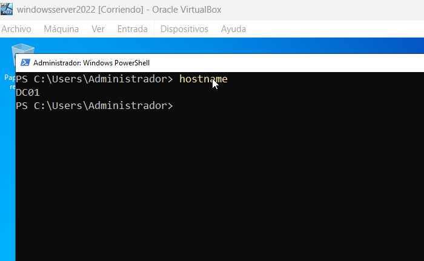

**Figure 02 — DC01 server identity.**

This evidence demonstrates the server hostname used as the Domain Controller identifier.

---

## 5.2 Verify network configuration

PowerShell:

```powershell
ipconfig /all
```

Alternatively:

```powershell
Get-NetIPConfiguration
```

The configuration must be reviewed before deploying Active Directory because DNS and network connectivity are fundamental components of a Domain Controller.

### Evidence

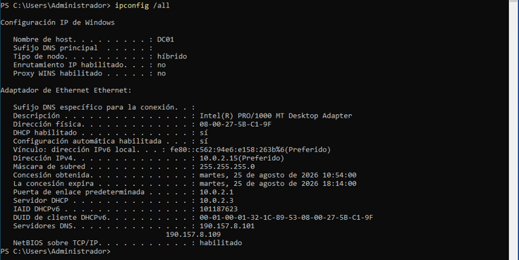

**Figure 03 — DC01 network configuration.**

---

# Activity 02 — Active Directory Domain Services Deployment

## Objective

Install the Active Directory Domain Services role and promote `DC01` to Domain Controller for the `corp.local` domain.

---

## 2.1 Install Active Directory Domain Services

PowerShell must be executed with administrative privileges.

```powershell
Install-WindowsFeature AD-Domain-Services -IncludeManagementTools
```

Verify the installation:

```powershell
Get-WindowsFeature AD-Domain-Services
```

### Evidence

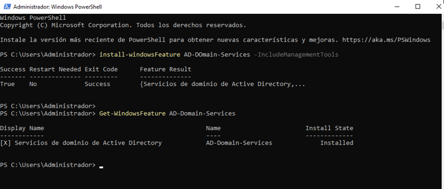

**Figure 04 — Active Directory Domain Services installation.**

---

## 2.2 Verify AD DS installation

```powershell
Get-WindowsFeature AD-Domain-Services
```

The Active Directory Domain Services role should be installed before proceeding with the Domain Controller promotion.

### Evidence

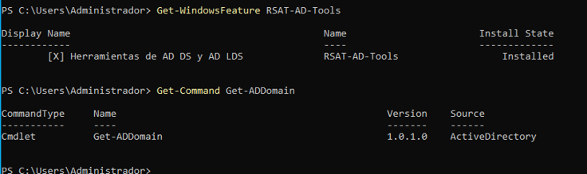

**Figure 05 — Active Directory Domain Services installed.**

---

## 2.3 Promote the server to Domain Controller

The new Active Directory forest is created using:

```powershell
Install-ADDSForest `
-DomainName "corp.local" `
-DomainNetbiosName "CORP" `
-InstallDNS
```

During the promotion process, Windows Server requests a Directory Services Restore Mode (DSRM) password.

The server is restarted after the promotion process.

After reboot, the server operates as:

```text
DC01.corp.local
```

---

### Evidence numbering note

The available laboratory evidence jumps from Figure 05 to Figure 11.

Figures 06 through 10 are therefore **not included in the current evidence set** and are not invented or replaced in this documentation.

---

# Activity 03 — Active Directory Validation

## Objective

Verify that the Active Directory domain, forest, Domain Controller, DNS and fundamental services are correctly configured.

---

## 3.1 Validate the Active Directory domain

```powershell
Get-ADDomain
```

The command provides information about the configured Active Directory domain.

The laboratory domain is:

```text
corp.local
```

### Evidence

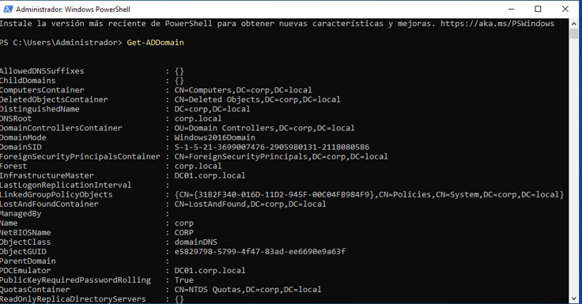

**Figure 11 — Active Directory domain validation.**

---

## 3.2 Validate the Active Directory forest

```powershell
Get-ADForest
```

This command verifies the Active Directory forest configuration.

### Evidence

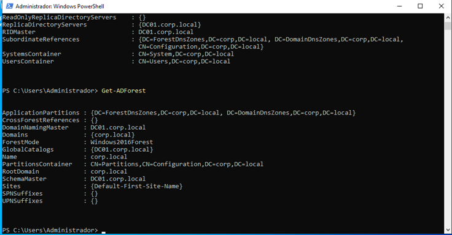

**Figure 12 — Active Directory forest validation.**

---

## 3.3 Validate the Domain Controller

```powershell
Get-ADDomainController
```

This verification confirms the Domain Controller information associated with the `corp.local` domain.

### Evidence

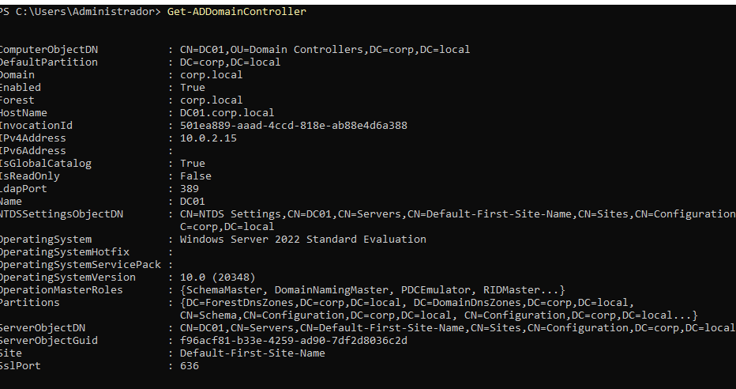

**Figure 13 — Domain Controller validation.**

---

## 3.4 Validate Active Directory services

The main services associated with the Domain Controller can be checked using:

```powershell
Get-Service NTDS,DNS,Netlogon,KDC
```

The principal services are:

- NTDS — Active Directory Domain Services.
- DNS — Domain Name System.
- Netlogon — Network authentication and domain services.
- KDC — Kerberos Key Distribution Center.

### Evidence

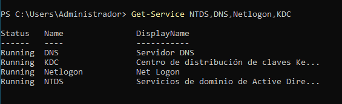

**Figure 14 — Active Directory core services.**

---

## 3.5 Validate DNS zone

```powershell
Get-DnsServerZone
```

The Active Directory DNS zone associated with the laboratory domain should be present.

### Evidence

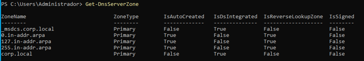

**Figure 15 — Active Directory DNS zone.**

---

## 3.6 Validate DNS resolution

```powershell
Resolve-DnsName DC01.corp.local
```

This test verifies that the Domain Controller hostname can be resolved through DNS.

### Evidence

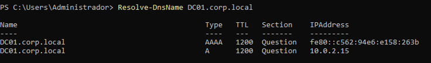

**Figure 16 — DC01 DNS resolution.**

---

## 3.7 Additional validation commands

The following commands were used as additional validation mechanisms:

```powershell
dcdiag
```

DNS-specific validation:

```powershell
dcdiag /test:dns
```

SYSVOL verification:

```powershell
Get-ChildItem C:\Windows\SYSVOL\sysvol
```

Replication status:

```powershell
repadmin /replsummary
```

Because this laboratory uses a single Domain Controller, `repadmin` is not presented as evidence of multi-DC replication.

---

# Activity 04 — Active Directory Organizational Structure

## Objective

Create a logical Organizational Unit structure to separate users, groups, servers and security-related objects.

The following OUs are created:

```text
corp.local
│
├── Users-Lab
├── Groups
├── Servers
└── Security
```

---

## 4.1 Create Users-Lab OU

```powershell
New-ADOrganizationalUnit `
-Name "Users-Lab" `
-Path "DC=corp,DC=local"
```

---

## 4.2 Create Groups OU

```powershell
New-ADOrganizationalUnit `
-Name "Groups" `
-Path "DC=corp,DC=local"
```

---

## 4.3 Create Servers OU

```powershell
New-ADOrganizationalUnit `
-Name "Servers" `
-Path "DC=corp,DC=local"
```

---

## 4.4 Create Security OU

```powershell
New-ADOrganizationalUnit `
-Name "Security" `
-Path "DC=corp,DC=local"
```

---

## 4.5 Validate the Organizational Units

```powershell
Get-ADOrganizationalUnit -Filter * |
Select-Object Name,DistinguishedName
```

### Evidence

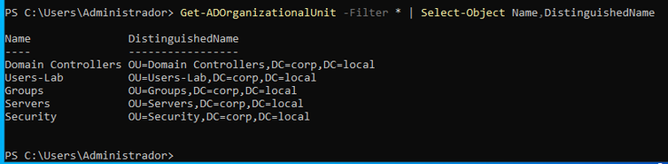

**Figure 18 — Active Directory Organizational Units.**

> **Note:** Figure 17 was marked as optional in the laboratory evidence and is therefore not included in the final figure sequence.

---

# Activity 05 — Users and Security Groups

## Objective

Create laboratory users and security groups following a basic role-based organization.

---

## 5.1 Create Lab Administrator

```powershell
New-ADUser `
-Name "Lab Administrator" `
-GivenName "Lab" `
-Surname "Administrator" `
-SamAccountName "lab.admin" `
-UserPrincipalName "lab.admin@corp.local" `
-Path "OU=Users-Lab,DC=corp,DC=local" `
-AccountPassword (Read-Host -AsSecureString "Password") `
-Enabled $true
```

---

## 5.2 Create Security Analyst

```powershell
New-ADUser `
-Name "Security Analyst" `
-GivenName "Security" `
-Surname "Analyst" `
-SamAccountName "security.analyst" `
-UserPrincipalName "security.analyst@corp.local" `
-Path "OU=Users-Lab,DC=corp,DC=local" `
-AccountPassword (Read-Host -AsSecureString "Password") `
-Enabled $true
```

---

## 5.3 Create Standard User

```powershell
New-ADUser `
-Name "Standard User" `
-GivenName "Standard" `
-Surname "User" `
-SamAccountName "standard.user" `
-UserPrincipalName "standard.user@corp.local" `
-Path "OU=Users-Lab,DC=corp,DC=local" `
-AccountPassword (Read-Host -AsSecureString "Password") `
-Enabled $true
```

---

## 5.4 Validate users

```powershell
Get-ADUser -Filter * `
-SearchBase "OU=Users-Lab,DC=corp,DC=local" |
Select-Object Name,SamAccountName,Enabled
```

### Evidence

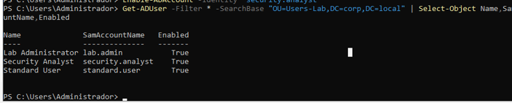

**Figure 19 — Active Directory laboratory users.**

---

## 5.5 Create Security-Admins group

```powershell
New-ADGroup `
-Name "Security-Admins" `
-GroupScope Global `
-GroupCategory Security `
-Path "OU=Groups,DC=corp,DC=local"
```

---

## 5.6 Create Security-Analysts group

```powershell
New-ADGroup `
-Name "Security-Analysts" `
-GroupScope Global `
-GroupCategory Security `
-Path "OU=Groups,DC=corp,DC=local"
```

---

## 5.7 Create Lab-Users group

```powershell
New-ADGroup `
-Name "Lab-Users" `
-GroupScope Global `
-GroupCategory Security `
-Path "OU=Groups,DC=corp,DC=local"
```

---

## 5.8 Add users to groups

```powershell
Add-ADGroupMember `
-Identity "Security-Admins" `
-Members "lab.admin"
```

```powershell
Add-ADGroupMember `
-Identity "Security-Analysts" `
-Members "security.analyst"
```

```powershell
Add-ADGroupMember `
-Identity "Lab-Users" `
-Members "standard.user"
```

---

## 5.9 Validate group membership

```powershell
Get-ADGroupMember "Security-Admins"
```

```powershell
Get-ADGroupMember "Security-Analysts"
```

```powershell
Get-ADGroupMember "Lab-Users"
```

### Evidence

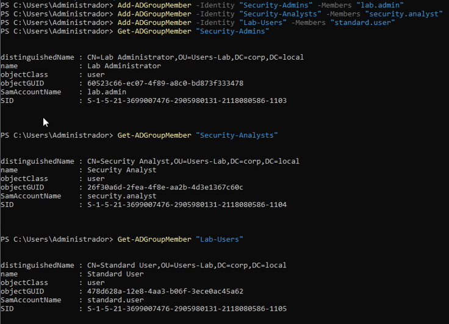

**Figure 20 — Active Directory security groups.**

---

# Activity 06 — Group Policy Management

## Objective

Create a Group Policy Object (GPO) to centralize security-related configuration.

Open Group Policy Management:

```text
gpmc.msc
```

Alternatively:

```text
Server Manager
→ Tools
→ Group Policy Management
```

### Evidence

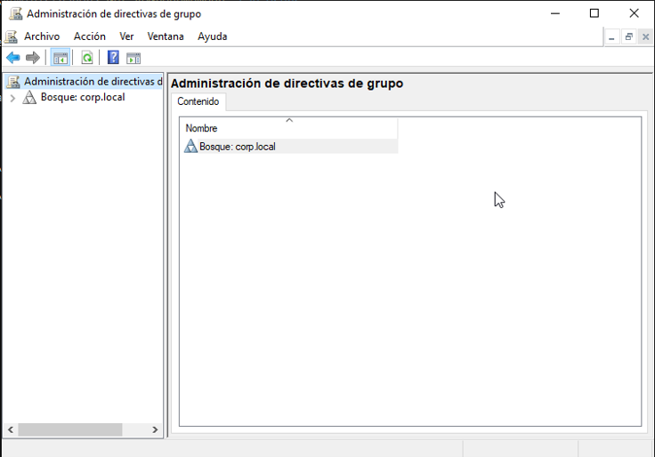

**Figure 21 — Group Policy Management.**

---

## 6.1 Create Security Baseline GPO

Create and link the following GPO to the domain:

```text
GPO-Security-Baseline
```

The GPO is intended to centralize the security configuration used throughout the laboratory.

### Evidence

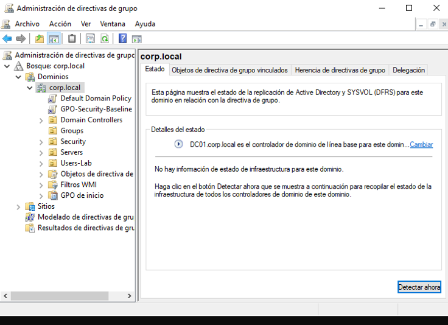

**Figure 22 — Security baseline Group Policy Object.**

---

# Activity 07 — Password and Account Lockout Policy

## Objective

Configure basic password and account lockout controls to strengthen authentication security.

Navigate to:

```text
Computer Configuration
    ↓
Policies
    ↓
Windows Settings
    ↓
Security Settings
    ↓
Account Policies
```

The relevant policy areas are:

```text
Password Policy
Account Lockout Policy
```

---

## 7.1 Password Policy

The laboratory baseline uses the following security-oriented configuration:

```text
Minimum password length: 12
Password complexity: Enabled
Password history: 5
```

The configuration is intended to reduce the risk associated with weak or reused passwords.

---

## 7.2 Account Lockout Policy

The Account Lockout Policy is reviewed as part of the authentication security configuration.

The objective is to reduce the effectiveness of repeated failed authentication attempts.

### Evidence

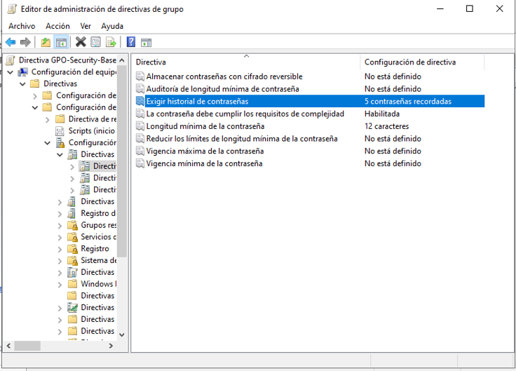

**Figure 23 — Password and account lockout policy.**

---

# Activity 08 — Windows Security Auditing

## Objective

Review Windows security auditing and authentication events generated by the Domain Controller.

Open Event Viewer:

```text
eventvwr.msc
```

Navigate to:

```text
Windows Logs
    ↓
Security
```

### Evidence

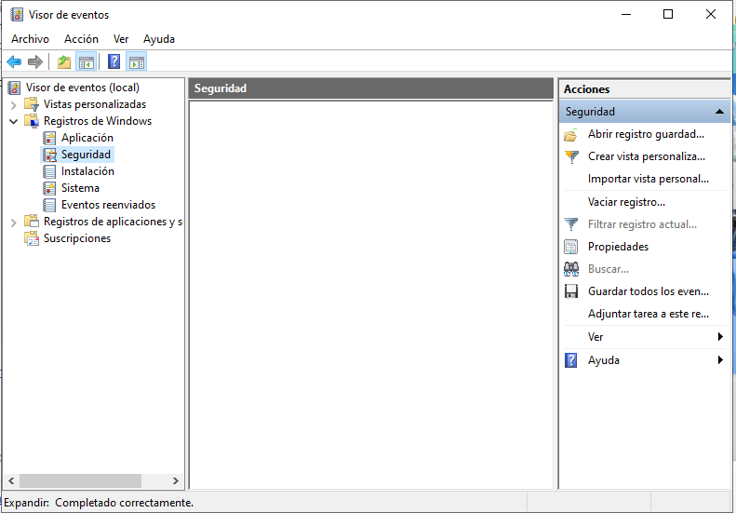

**Figure 24 — Windows Security event log.**

---

## 8.1 Review successful authentication events

Event ID `4624` can be queried with PowerShell:

```powershell
Get-WinEvent -FilterHashtable @{
    LogName='Security'
    Id=4624
} -MaxEvents 10
```

Event ID `4624` is associated with successful logon events.

### Evidence

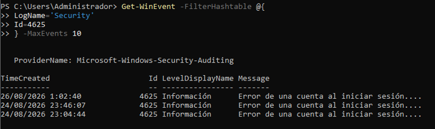

**Figure 25 — Windows authentication security event.**

---

## 8.2 Review failed authentication events

Event ID `4625` can be queried using:

```powershell
Get-WinEvent -FilterHashtable @{
    LogName='Security'
    Id=4625
} -MaxEvents 10
```

These events can be used to investigate failed authentication attempts.

---

# Activity 09 — Active Directory Security Hardening

## Objective

Review security-relevant configurations and privileged Active Directory groups.

---

## 9.1 Review Windows Firewall

```powershell
Get-NetFirewallProfile |
Select-Object Name,Enabled,DefaultInboundAction,DefaultOutboundAction
```

The purpose of this verification is to identify the state of the Windows Firewall profiles.

---

## 9.2 Review running services

```powershell
Get-Service |
Where-Object {$_.Status -eq "Running"} |
Sort-Object DisplayName |
Select-Object Status,Name,DisplayName
```

This provides a baseline for reviewing services that are active on the server.

---

## 9.3 Review privileged Active Directory groups

Because the Windows Server installation uses Spanish localization, some built-in Active Directory groups have localized names.

For example:

```text
Admins. del dominio
```

corresponds to the Domain Admins group.

To identify the Domain Admins group independently of the operating system language, retrieve the domain SID:

```powershell
$DomainSID = (Get-ADDomain).DomainSID.Value
```

The Domain Admins group uses RID `512`.

```powershell
Get-ADGroup -Identity "$DomainSID-512"
```

Members can then be reviewed using:

```powershell
Get-ADGroupMember -Identity "$DomainSID-512" |
Select-Object Name,SamAccountName,ObjectClass
```

---

## 9.4 Review Enterprise Admins

Enterprise Admins uses RID `519`.

```powershell
Get-ADGroup -Identity "$DomainSID-519"
```

Members:

```powershell
Get-ADGroupMember -Identity "$DomainSID-519" |
Select-Object Name,SamAccountName,ObjectClass
```

---

## 9.5 Review Schema Admins

Schema Admins uses RID `518`.

```powershell
Get-ADGroup -Identity "$DomainSID-518"
```

Members:

```powershell
Get-ADGroupMember -Identity "$DomainSID-518" |
Select-Object Name,SamAccountName,ObjectClass
```

---

## 9.6 Review enabled accounts

```powershell
Get-ADUser -Filter 'Enabled -eq $true' |
Select-Object Name,SamAccountName,Enabled
```

The objective is to identify active accounts and support least-privilege review.

### Evidence

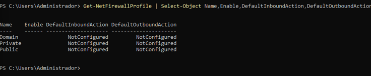

**Figure 26 — Active Directory security hardening and privileged group review.**

---

# Activity 10 — Hardening Validation

## Objective

Validate that the security policies configured through Group Policy are being applied.

---

## 10.1 Force Group Policy update

```powershell
gpupdate /force
```

This forces the server to process updated Group Policy settings.

---

## 10.2 Review applied policies

```powershell
gpresult /r
```

The output can be used to verify the Group Policy Objects applied to the computer.

---

## 10.3 Generate an HTML Group Policy report

Create the temporary directory:

```powershell
New-Item -Path C:\Temp -ItemType Directory -Force
```

Generate the report:

```powershell
gpresult /h C:\Temp\gpresult.html
```

The generated report can be opened from:

```text
C:\Temp\gpresult.html
```

### Evidence

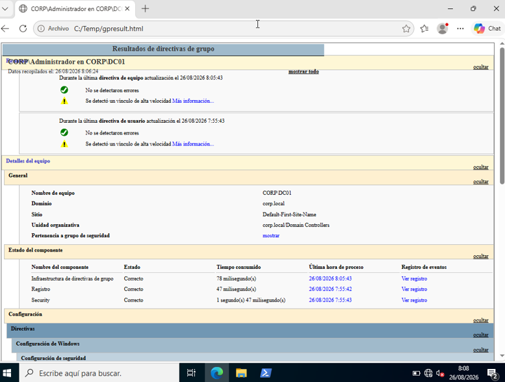

**Figure 27 — Active Directory hardening validation.**

---

# Activity 11 — Final Security Assessment

## Objective

Perform a final review of the Active Directory implementation and its security controls.

The final assessment consolidates the following areas:

- Active Directory domain.
- Domain Controller.
- DNS.
- Core services.
- Group Policy.
- Firewall.
- Privileged groups.
- User accounts.
- Security configuration.

---

## 11.1 Validate Active Directory domain

```powershell
Get-ADDomain
```

---

## 11.2 Validate Domain Controller

```powershell
Get-ADDomainController
```

---

## 11.3 Validate DNS

```powershell
Get-DnsServerZone
```

---

## 11.4 Validate core services

```powershell
Get-Service NTDS,DNS,Netlogon,KDC
```

---

## 11.5 Validate applied Group Policy

```powershell
gpresult /r
```

---

## 11.6 Review privileged Domain Admins group

```powershell
$DomainSID = (Get-ADDomain).DomainSID.Value

Get-ADGroupMember -Identity "$DomainSID-512" |
Select-Object Name,SamAccountName,ObjectClass
```

---

## 11.7 Final security assessment

The final evidence consolidates the security verification performed throughout the laboratory.

### Evidence

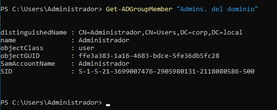

**Figure 28 — Active Directory final security assessment.**

---

# 6. Security Controls Implemented

The laboratory implements or reviews the following security controls:

| Security Area | Control |
|---|---|
| Identity | Active Directory Domain Services |
| Authentication | Domain authentication |
| DNS | Integrated Active Directory DNS |
| Organization | Organizational Units |
| Authorization | Security Groups |
| Privilege Management | Review of privileged groups |
| Password Security | Password Policy |
| Account Protection | Account Lockout Policy |
| Centralized Configuration | Group Policy |
| Monitoring | Windows Security Event Log |
| Authentication Monitoring | Event IDs 4624 and 4625 |
| Host Security | Windows Firewall review |
| Hardening | Security baseline review |
| Validation | `gpresult`, `dcdiag`, PowerShell |
| Administration | PowerShell and Windows administrative tools |

---

# 7. Evidence

The laboratory evidence follows the numbering available in the captured documentation.

## Activity 01

```text
fig-02-dc01-server-identity.png
fig-03-dc01-network-configuration.png
```

## Activity 02

```text
fig-04-active-directory-domain-services-installation.png
fig-05-active-directory-domain-services-installed.png
```

## Activity 03

```text
fig-11-active-directory-domain-validation.png
fig-12-active-directory-forest-validation.png
fig-13-domain-controller-validation.png
fig-14-active-directory-services.png
fig-15-active-directory-dns-zone.png
fig-16-dc01-dns-resolution.png
```

## Activity 04

```text
fig-18-active-directory-organizational-units.png
```

## Activity 05

```text
fig-19-active-directory-users.png
fig-20-active-directory-security-groups.png
```

## Activity 06

```text
fig-21-group-policy-management.png
fig-22-security-baseline-gpo.png
```

## Activity 07

```text
fig-23-password-and-account-lockout-policy.png
```

## Activity 08

```text
fig-24-windows-security-event-log.png
fig-25-windows-authentication-security-event.png
```

## Activity 09

```text
fig-26-active-directory-security-hardening.png
```

## Activity 10

```text
fig-27-active-directory-hardening-validation.png
```

## Activity 11

```text
fig-28-active-directory-final-security-assessment.png
```

### Evidence numbering note

The figure numbering is intentionally preserved according to the available laboratory evidence.

The following numbers are not included:

```text
06
07
08
09
10
17
```

Figures `06–10` are not present in the supplied evidence document, while Figure `17` was explicitly identified as optional.

The numbering is therefore **not renumbered artificially** in order to preserve traceability between the README and the original evidence.

---

# 8. Security Findings

The laboratory demonstrates several security-relevant aspects of Active Directory administration.

## Finding 01 — Centralized identity management

Active Directory provides centralized management of users, groups and authentication within the `corp.local` domain.

---

## Finding 02 — Privileged group exposure

Built-in privileged groups require continuous review because membership in groups such as:

```text
Domain Admins
Enterprise Admins
Schema Admins
```

provides elevated administrative capabilities.

The laboratory therefore includes explicit verification of privileged group membership.

---

## Finding 03 — Password security

Password and account lockout policies provide an additional layer of protection against weak credentials and repeated authentication attempts.

---

## Finding 04 — Security event monitoring

Windows Security event logs provide visibility into authentication activity.

Events such as:

```text
4624 — Successful logon
4625 — Failed logon
```

can be used as indicators for authentication monitoring and investigation.

---

## Finding 05 — Group Policy centralization

Group Policy provides a centralized mechanism for applying security-related configuration across the Active Directory environment.

---

# 9. Recommendations

The following recommendations are applicable to a production Active Directory environment:

### 9.1 Apply Least Privilege

Users should only receive the privileges necessary to perform their responsibilities.

Avoid unnecessary membership in:

```text
Domain Admins
Enterprise Admins
Schema Admins
```

---

### 9.2 Implement strong authentication

Use strong password policies and, where supported by the organization's architecture, implement additional authentication controls such as multifactor authentication.

---

### 9.3 Monitor authentication activity

Security events should be centrally collected and monitored to identify:

- Repeated failed logons.
- Suspicious successful logons.
- Privileged account activity.
- Unexpected authentication sources.
- Account lockouts.

---

### 9.4 Protect privileged accounts

Administrative accounts should be separated from standard user accounts.

Administrative credentials should not be used for routine activities such as browsing or ordinary workstation tasks.

---

### 9.5 Maintain Group Policy baselines

Security-related Group Policies should be documented, reviewed periodically and tested before deployment to production environments.

---

### 9.6 Monitor privileged group membership

Membership in highly privileged groups should be reviewed regularly.

Particular attention should be given to:

```text
Domain Admins
Enterprise Admins
Schema Admins
```

---

### 9.7 Maintain Windows Server security

The Domain Controller should be regularly updated and unnecessary services or roles should be avoided.

The Windows Firewall should remain enabled and configured according to the organization's security requirements.

---

### 9.8 Centralize logging

For a production environment, Windows Security logs should ideally be forwarded to a centralized SIEM platform.

This enables correlation of authentication, privilege and system events.

---

# 10. Conclusion

Laboratory 07 implemented a complete Active Directory security foundation using Windows Server 2022 Desktop Experience.

The laboratory began with the preparation of the Windows Server environment and continued with the installation of Active Directory Domain Services and the promotion of `DC01` as Domain Controller for:

```text
corp.local
```

The implementation was subsequently validated through:

- Active Directory domain verification.
- Forest verification.
- Domain Controller verification.
- DNS validation.
- Core service validation.
- Organizational Unit creation.
- User and security group management.
- Group Policy configuration.
- Password and account lockout policies.
- Windows Security event analysis.
- Privileged group review.
- Security hardening.
- Group Policy validation.
- Final security assessment.

The laboratory demonstrates the importance of combining **identity management, authentication security, authorization, centralized policy management, auditing and hardening** when deploying an Active Directory environment.

---

## 🧪 Skills Demonstrated

Through this laboratory, the following technical capabilities were practiced:

```text
Active Directory Domain Services
Windows Server 2022
Domain Controller Deployment
Active Directory Administration
DNS
PowerShell
Organizational Units
User Management
Security Groups
Group Policy
Password Policy
Account Lockout Policy
Windows Security Auditing
Event Log Analysis
Privilege Management
Security Hardening
Least Privilege
Security Validation
```

---

## 📁 Recommended Repository Structure

```text
07-active-directory-security/
│
├── README.md
│
└── images/
    ├── fig-02-dc01-server-identity.png
    ├── fig-03-dc01-network-configuration.png
    ├── fig-04-active-directory-domain-services-installation.png
    ├── fig-05-active-directory-domain-services-installed.png
    │
    ├── fig-11-active-directory-domain-validation.png
    ├── fig-12-active-directory-forest-validation.png
    ├── fig-13-domain-controller-validation.png
    ├── fig-14-active-directory-services.png
    ├── fig-15-active-directory-dns-zone.png
    ├── fig-16-dc01-dns-resolution.png
    │
    ├── fig-18-active-directory-organizational-units.png
    ├── fig-19-active-directory-users.png
    ├── fig-20-active-directory-security-groups.png
    ├── fig-21-group-policy-management.png
    ├── fig-22-security-baseline-gpo.png
    ├── fig-23-password-and-account-lockout-policy.png
    ├── fig-24-windows-security-event-log.png
    ├── fig-25-windows-authentication-security-event.png
    ├── fig-26-active-directory-security-hardening.png
    ├── fig-27-active-directory-hardening-validation.png
    └── fig-28-active-directory-final-security-assessment.png
```

---

# 📚 References

- Microsoft Windows Server documentation.
- Microsoft Active Directory Domain Services documentation.
- Microsoft Group Policy documentation.
- Microsoft Windows Security Auditing documentation.
- Microsoft PowerShell Active Directory module documentation.

---

## ⚠️ Laboratory Disclaimer

This laboratory was developed exclusively for educational and cybersecurity training purposes in an isolated virtualized environment.

The configurations, accounts, domain and security settings described in this repository are intended for laboratory experimentation and should be adapted and reviewed before being implemented in production environments.
