# ☁️ Lab 08 — Cloud Security

## AWS Security Assessment, Configuration and Validation


> **Laboratory 08 — Cloud Security**  
> Practical AWS security laboratory focused on identity and access management, data protection, auditing, network security, threat detection, security posture management, and access analysis.

---

## 📚 Table of Contents

1. [🎯 Objectives](#-objectives)
2. [☁️ Laboratory Environment](#️-laboratory-environment)
3. [🏗️ Security Architecture](#️-security-architecture)
4. [🧭 Methodology](#-methodology)
5. [1. AWS Environment and Security Baseline](#1-aws-environment-and-security-baseline)
6. [2. IAM Security Configuration](#2-iam-security-configuration)
7. [3. Amazon S3 Security](#3-amazon-s3-security)
8. [4. AWS CloudTrail](#4-aws-cloudtrail)
9. [5. VPC Security Review](#5-vpc-security-review)
10. [6. Security Groups Analysis](#6-security-groups-analysis)
11. [7. Amazon GuardDuty](#7-amazon-guardduty)
12. [8. Amazon Security Hub](#8-amazon-security-hub)
13. [9. IAM Access Analyzer — Initial Validation](#9-iam-access-analyzer--initial-validation)
14. [10. IAM Access Analyzer — Advanced Validation](#10-iam-access-analyzer--advanced-validation)
15. [📊 Security Observations](#-security-observations)
16. [🛡️ Security Recommendations](#️-security-recommendations)
17. [💰 Cost Management](#-cost-management)
18. [🧠 Lessons Learned](#-lessons-learned)
19. [📁 Evidence Structure](#-evidence-structure)
20. [📸 Evidence Index](#-evidence-index)
21. [🧰 Tools and AWS Services](#-tools-and-aws-services)
22. [🔐 Security and Privacy Considerations](#-security-and-privacy-considerations)
23. [📋 Laboratory Scope](#-laboratory-scope)
24. [📌 Evidence Integrity](#-evidence-integrity)
25. [✅ Conclusion](#-conclusion)
26. [⚖️ Disclaimer](#️-disclaimer)

---

## 🎯 Objectives

The main objectives of this laboratory are:

- Establish a controlled AWS cloud-security laboratory.
- Validate the AWS region and account context.
- Review the account security baseline.
- Apply IAM security and least-privilege principles.
- Review IAM users, groups and policies.
- Protect Amazon S3 resources against unintended public access.
- Validate S3 security configuration and object access.
- Review AWS CloudTrail management events.
- Validate CloudTrail activity using the AWS CLI.
- Review VPCs, subnets and route tables.
- Analyze security group configurations.
- Configure and validate Amazon GuardDuty.
- Review GuardDuty protection plans, findings and usage information.
- Configure and validate Amazon Security Hub.
- Review Security Hub posture, findings, resources and usage.
- Validate Security Hub status and findings through the AWS CLI.
- Use IAM Access Analyzer to analyze external access.
- Validate Access Analyzer through the AWS Management Console and AWS CLI.
- Identify security observations and translate them into practical recommendations.
- Apply cost-control practices appropriate for a learning environment.
- Produce professional evidence suitable for a cybersecurity portfolio.

---

## ☁️ Laboratory Environment

| Component | Configuration |
|---|---|
| Cloud Provider | Amazon Web Services (AWS) |
| Region | South America (São Paulo) |
| Region Code | `sa-east-1` |
| Management Interface | AWS Management Console |
| CLI Environment | AWS CloudShell |
| Identity Service | AWS IAM |
| Storage Service | Amazon S3 |
| Audit Service | AWS CloudTrail |
| Network Service | Amazon VPC |
| Threat Detection | Amazon GuardDuty |
| Security Posture | AWS Security Hub |
| Access Analysis | IAM Access Analyzer |
| Laboratory Type | Controlled cloud-security laboratory |

The laboratory was performed consistently in **South America (São Paulo)** using `sa-east-1`.

---

## 🏗️ Security Architecture

```text
                         AWS ACCOUNT
                              │
                              ▼
                    ┌──────────────────┐
                    │       IAM        │
                    │ Identity / Access│
                    └────────┬─────────┘
                             │
              ┌──────────────┼──────────────┐
              ▼              ▼              ▼
          Amazon S3      Amazon VPC      CloudTrail
       Data Protection   Network Layer     Auditing
              │              │              │
              └──────────────┼──────────────┘
                             ▼
                    Security Monitoring
                             │
              ┌──────────────┼──────────────┐
              ▼              ▼              ▼
          GuardDuty     Security Hub   Access Analyzer
       Threat Detection  Posture Mgmt   Access Analysis
```

The architecture demonstrates **defense in depth**, combining preventive, detective and analytical controls.

---

## 🧭 Methodology

```text
AWS Environment Validation
            ↓
Identity and Account Review
            ↓
IAM Security Baseline
            ↓
S3 Data Protection
            ↓
CloudTrail Auditing
            ↓
VPC and Network Review
            ↓
Security Group Analysis
            ↓
Threat Detection
            ↓
Security Posture Management
            ↓
Access Analysis
            ↓
CLI Validation
            ↓
Security Observations
            ↓
Recommendations
            ↓
Cost and Security Review
```

The methodology combines AWS Console validation with reproducible AWS CLI evidence from CloudShell.

---

# 1. AWS Environment and Security Baseline

The first activity established the AWS environment used throughout the laboratory. The AWS Management Console was used to verify the selected region and account context, followed by CloudShell validation.

### Evidence

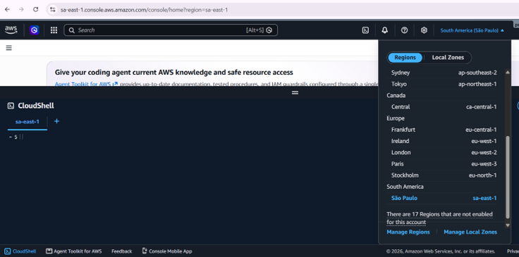

**Figure 1. AWS Management Console showing the selected AWS region.**

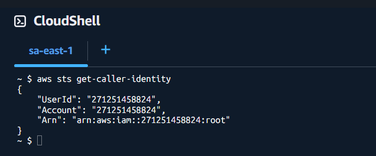

**Figure 2. AWS account identity and environment validation.**

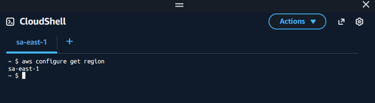

**Figure 3. AWS CloudShell operating in the selected AWS region.**

### CLI validation

```bash
aws sts get-caller-identity
```

This command validates the identity and AWS account context associated with the current CLI session.

### Security relevance

Validating account and region context before performing security operations reduces the risk of applying configuration changes to the wrong environment.

---

# 2. IAM Security Configuration

AWS Identity and Access Management (IAM) was reviewed as the foundation of the cloud-security configuration.

### Evidence

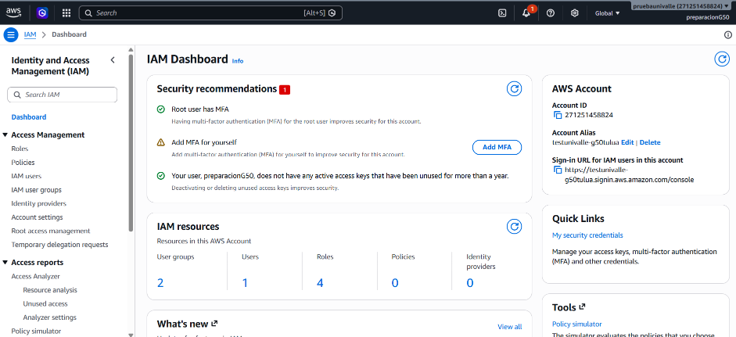

**Figure 4. IAM security baseline and account-level security configuration.**

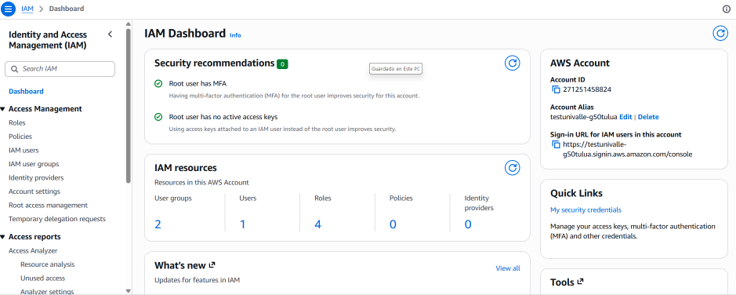

**Figure 5. Root account security configuration and protection controls.**

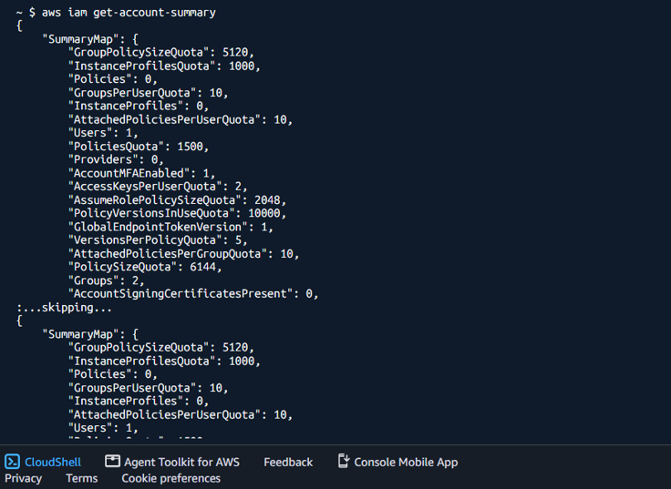

**Figure 6. IAM account summary used to review the security baseline.**

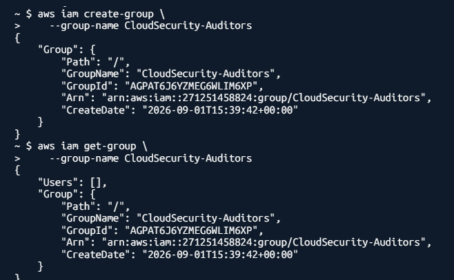

**Figure 7. IAM security group used for the cloud-security laboratory.**

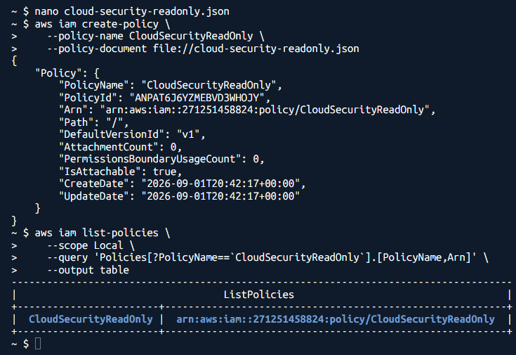

**Figure 8. Read-only IAM policy associated with the security-review approach.**

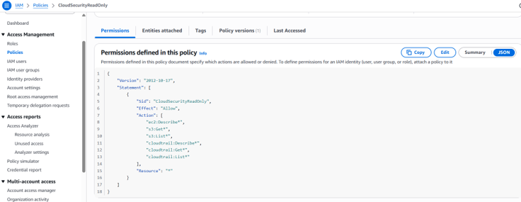

**Figure 9. IAM policy JSON used to inspect the policy definition and permissions.**

### CLI validation

```bash
aws iam get-account-summary
aws iam list-users
aws iam list-groups
aws iam list-roles
aws iam list-policies --scope Local
```

### Security relevance

The activity emphasizes least privilege, MFA for privileged identities, separation of administrative and operational permissions, and periodic review of identities and permissions.

---

# 3. Amazon S3 Security

Amazon S3 was reviewed from a data-protection perspective. The main objective was to validate public-access protections and object access.

### Evidence

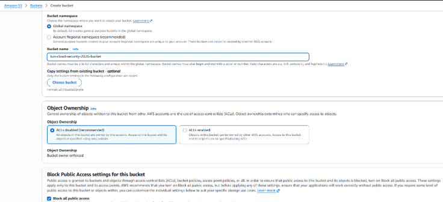

**Figure 10. Amazon S3 Block Public Access configuration.**

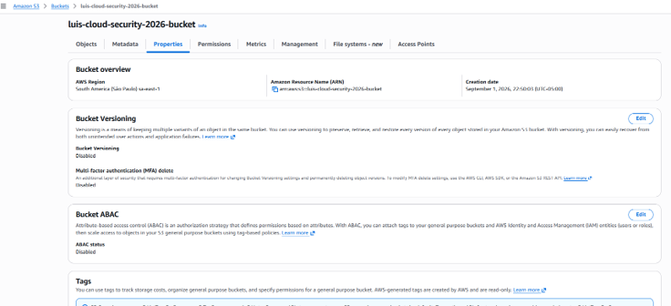

**Figure 11. S3 bucket security configuration.**

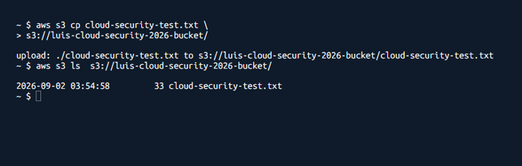

**Figure 12. S3 object and access validation.**

### CLI validation examples

```bash
aws s3api list-buckets
```

```bash
aws s3api get-public-access-block \
  --bucket <BUCKET_NAME>
```

```bash
aws s3api get-bucket-location \
  --bucket <BUCKET_NAME>
```

### Security controls

The review considered:

- Block Public Access.
- Bucket policies.
- Least-privilege access.
- Protection of sensitive objects.
- Object access validation.
- Avoidance of unintended public exposure.

---

# 4. AWS CloudTrail

AWS CloudTrail was reviewed to demonstrate auditing, accountability and traceability of AWS management activity.

### Evidence

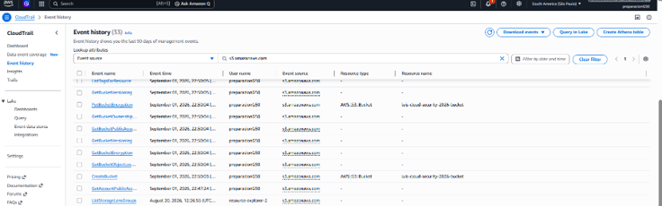

**Figure 13. AWS CloudTrail Event History showing recorded management activity.**

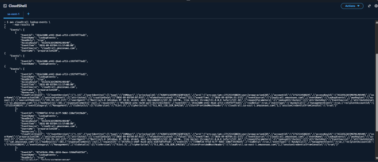

**Figure 14. CloudTrail event validation through the AWS CLI.**

### CLI validation

```bash
aws cloudtrail lookup-events \
  --region sa-east-1 \
  --max-results 10
```

A compact query can be used with:

```bash
aws cloudtrail lookup-events \
  --region sa-east-1 \
  --max-results 10 \
  --query 'Events[*].[EventName,Username,EventTime]' \
  --output table
```

### Security relevance

CloudTrail supports accountability, incident investigation, change tracking, security monitoring and audit evidence.

---

# 5. VPC Security Review

The Amazon VPC environment was reviewed to understand network components and their relationships.

### Evidence

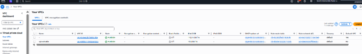

**Figure 15. VPC inventory and network-resource overview.**

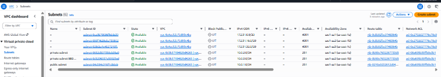

**Figure 16. VPC subnet configuration and availability-zone relationships.**

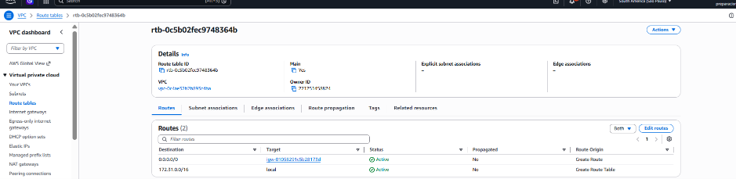

**Figure 17. VPC route-table configuration and routing analysis.**

### CLI validation

```bash
aws ec2 describe-vpcs \
  --region sa-east-1 \
  --output table
```

```bash
aws ec2 describe-subnets \
  --region sa-east-1 \
  --output table
```

```bash
aws ec2 describe-route-tables \
  --region sa-east-1 \
  --output table
```

### Security review areas

- VPC segmentation.
- Subnet organization.
- Route tables.
- Internet connectivity.
- Public versus private placement.
- Network exposure.
- Relationship between routing and security groups.

---

# 6. Security Groups Analysis

Security groups were reviewed as stateful virtual firewalls associated with AWS resources.

### Evidence

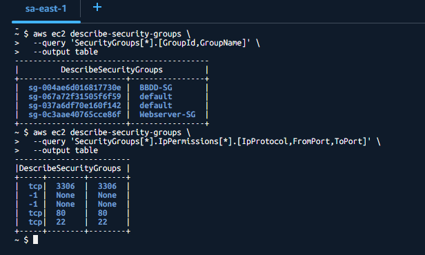

**Figure 18. Security group configuration and rule analysis.**

### CLI validation

```bash
aws ec2 describe-security-groups \
  --region sa-east-1 \
  --output json
```

For a compact inventory:

```bash
aws ec2 describe-security-groups \
  --region sa-east-1 \
  --query 'SecurityGroups[*].[GroupId,GroupName]' \
  --output table
```

For rule-level analysis:

```bash
aws ec2 describe-security-groups \
  --region sa-east-1 \
  --query 'SecurityGroups[*].[GroupId,GroupName,IpPermissions]' \
  --output json
```

### Security considerations

Security groups should be reviewed for unnecessary inbound access, broad CIDR ranges, exposed administrative ports, redundant rules and excessive permissions.

---

# 7. Amazon GuardDuty

Amazon GuardDuty was used as the laboratory's managed threat-detection capability. The service was evaluated using the available free-trial option.

## 7.1 GuardDuty Free Trial

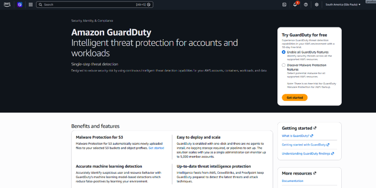

**Figure 20. GuardDuty activation screen showing the available free-trial option.**

## 7.2 GuardDuty Enabled

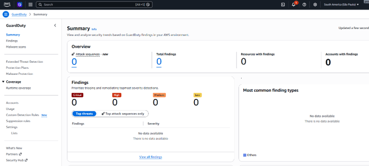

**Figure 21. GuardDuty enabled in the selected AWS region.**

## 7.3 GuardDuty Protection Plans

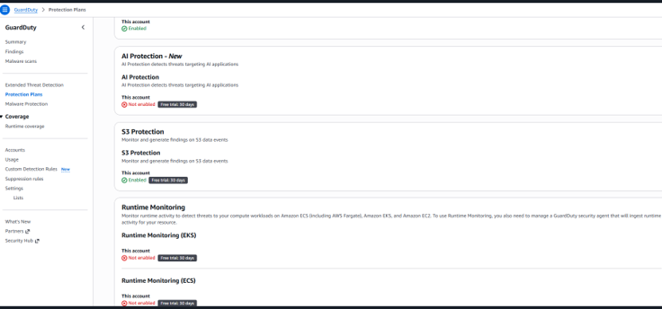

**Figure 22. GuardDuty protection-plan configuration.**

## 7.4 GuardDuty Findings

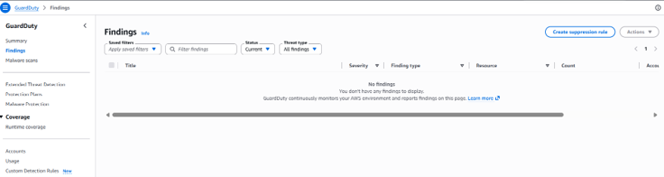

**Figure 23. GuardDuty findings view.**

Findings are security signals that require contextual analysis. A finding should not automatically be interpreted as a confirmed compromise.

## 7.5 Estimated Usage

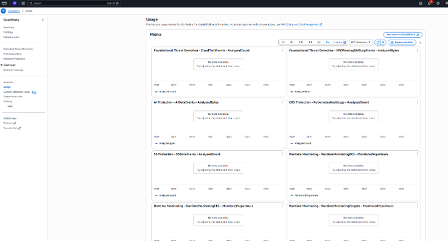

**Figure 24. GuardDuty estimated-usage view.**

The captured evidence displayed **“No data available. Try adjusting the dashboard time range.”** Therefore, the screenshot is documented as a usage-dashboard state and is not interpreted as a confirmed `$0.00` cost result.

## 7.6 CLI Validation

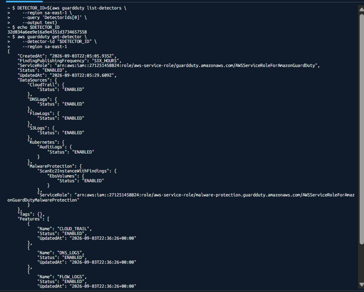

**Figure 25. GuardDuty service validation through the AWS CLI.**

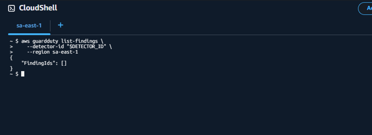

**Figure 26. GuardDuty findings validation through the AWS CLI.**

```bash
aws guardduty list-detectors \
  --region sa-east-1
```

After obtaining the detector identifier:

```bash
aws guardduty get-detector \
  --detector-id <DETECTOR_ID> \
  --region sa-east-1
```

```bash
aws guardduty list-findings \
  --detector-id <DETECTOR_ID> \
  --region sa-east-1
```

### Security relevance

GuardDuty demonstrates the detective layer of a cloud-security architecture. Detection should be combined with logging, investigation, response procedures and preventive controls.

---

# 8. Amazon Security Hub

AWS Security Hub was used to centralize security posture information and findings from supported AWS security services. The laboratory evaluated the available free-trial capability.

## 8.1 Security Hub Free Trial

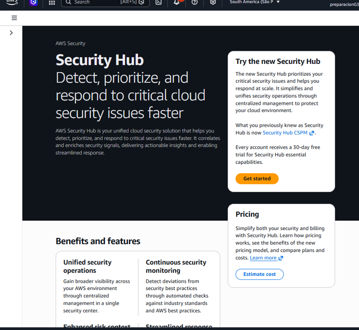

**Figure 27. Security Hub free-trial activation screen.**

## 8.2 Security Hub Enabled

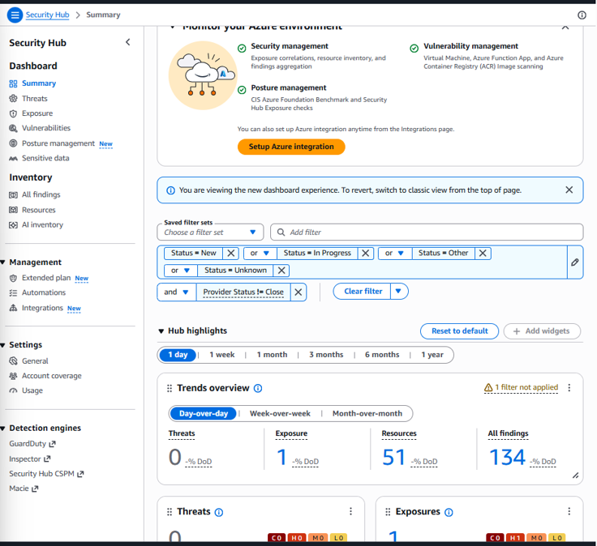

**Figure 28. Security Hub enabled state.**

## 8.3 Posture Management

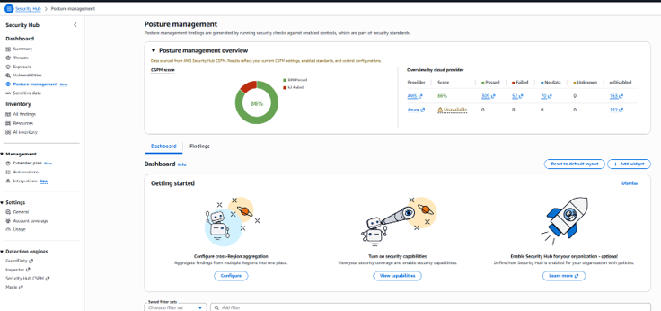

**Figure 29. Security Hub Posture Management view.**

## 8.4 All Findings

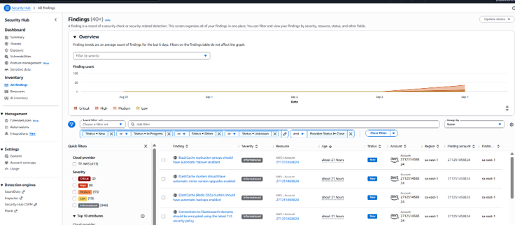

**Figure 30. Security Hub All Findings view.**

Security Hub findings may originate from controls and integrated services. The total number of findings must not automatically be interpreted as the number of vulnerabilities.

## 8.5 Resources

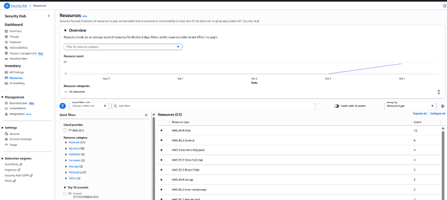

**Figure 31. Security Hub resource inventory.**

## 8.6 Usage

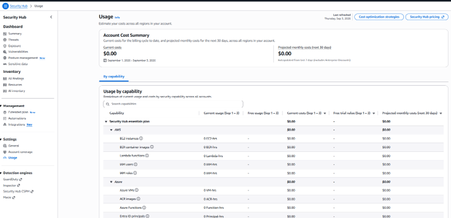

**Figure 32. Security Hub usage information.**

## 8.7 CLI Status

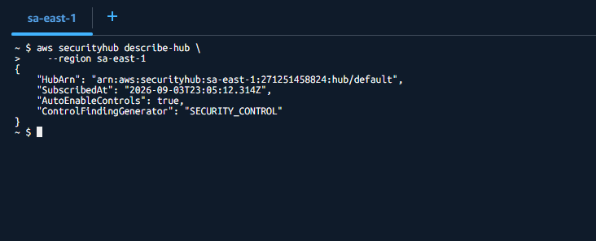

**Figure 33. Security Hub status validation through the AWS CLI.**

```bash
aws securityhub describe-hub \
  --region sa-east-1
```

```bash
aws securityhub get-enabled-standards \
  --region sa-east-1
```

## 8.8 CLI Findings

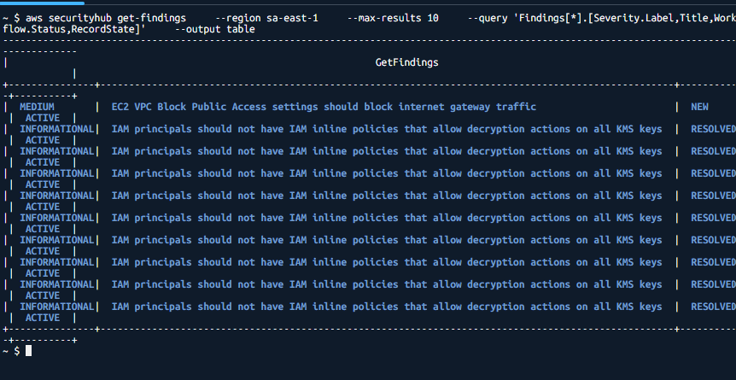

**Figure 34. Security Hub findings validated through the AWS CLI.**

```bash
aws securityhub get-findings \
  --region sa-east-1 \
  --max-results 10 \
  --query 'Findings[*].[Severity.Label,Title,Workflow.Status,RecordState]' \
  --output table
```

## 8.9 Final Configuration

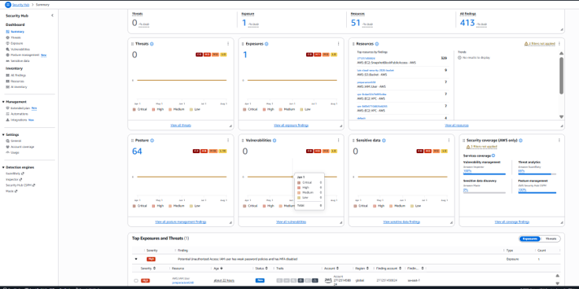

**Figure 35. Final Security Hub configuration and security-posture state.**

### Security relevance

Security Hub provides centralized visibility for security posture, controls and findings and can support prioritization and security operations.

---

# 9. IAM Access Analyzer — Initial Validation

IAM Access Analyzer was introduced to evaluate resource-based access and identify access that may extend outside the defined zone of trust.

### Evidence

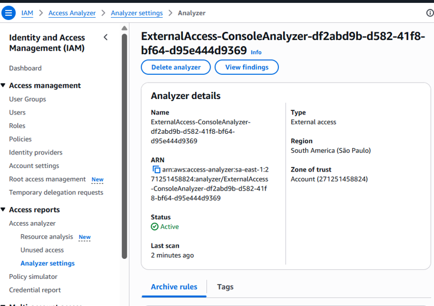

**Figure 19. Initial IAM Access Analyzer configuration and validation.**

External-access analysis helps identify resource policies that grant access outside the configured zone of trust.

---

# 10. IAM Access Analyzer — Advanced Validation

The final part of the laboratory used the current IAM Access Analyzer interface and AWS CLI to validate the analyzer configuration and analysis state.

## 10.1 Access Analyzer Dashboard

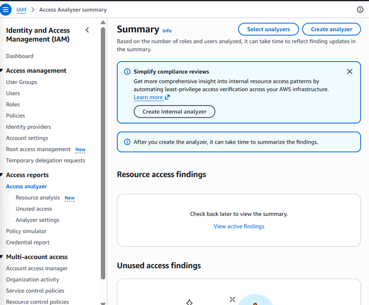

**Figure 36. IAM Access Analyzer main dashboard.**

## 10.2 Resource Analysis

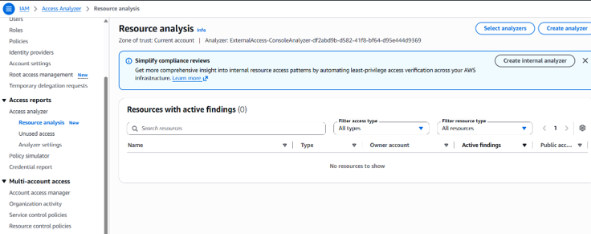

**Figure 37. Access Analyzer Resource Analysis view.**

The captured evidence shows:

```text
Zone of trust: Current account
Resources with active findings (0)
No resources to show
```

This represents the analyzer state captured during the laboratory and should not be interpreted as proof that no future access risk can exist.

## 10.3 Access Analyzer Findings

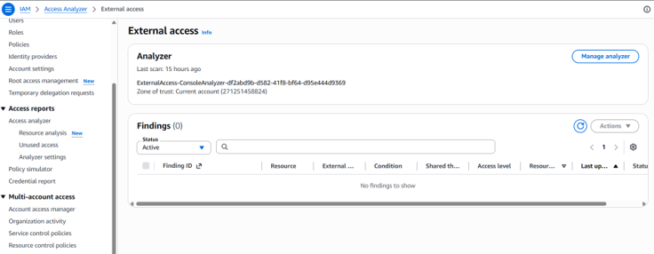

**Figure 38. IAM Access Analyzer findings view.**

Findings should be reviewed considering the resource, principal, access type, resource-based policy, trust boundary and intended business access.

## 10.4 Analyzer Settings

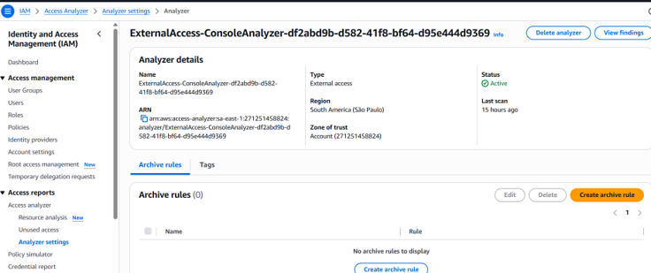

**Figure 39. Access Analyzer analyzer details and configuration.**

The analyzer configuration documents external-access analysis, the current-account zone of trust and an active analyzer state.

### Analyzer quota consideration

An active external-access analyzer already existed in the selected region. An attempt to create another analyzer resulted in **“Analyzer limit exceeded”**. The appropriate approach was therefore to reuse the existing active analyzer rather than create another one.

## 10.5 CLI Validation

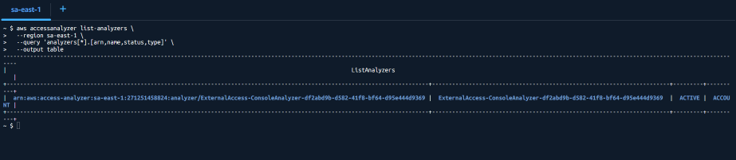

**Figure 40. IAM Access Analyzer validation through the AWS CLI.**

```bash
aws accessanalyzer list-analyzers \
  --region sa-east-1 \
  --output table
```

Findings can be queried with:

```bash
aws accessanalyzer list-findings \
  --analyzer-name <ANALYZER_NAME> \
  --region sa-east-1
```

A compact output can be generated with:

```bash
aws accessanalyzer list-findings \
  --analyzer-name <ANALYZER_NAME> \
  --region sa-east-1 \
  --query 'findings[*].[status,resource,resourceType]' \
  --output table
```

### Security relevance

IAM Access Analyzer complements IAM policy review by analyzing effective resource-based access relationships and identifying potentially unintended external access.

---

# 📊 Security Observations

| Area | Observation | Security relevance |
|---|---|---|
| AWS account | Account and region context were explicitly validated | Reduces configuration mistakes |
| IAM | Identity and permission controls were reviewed | Supports least privilege |
| Root identity | Root access should be protected and avoided for routine administration | Reduces privileged-account risk |
| S3 | Public-access protections were reviewed | Reduces unintended data exposure |
| CloudTrail | Management-event history was reviewed | Provides accountability and traceability |
| VPC | VPCs, subnets and routes were analyzed | Supports network segmentation |
| Security Groups | Rules were reviewed | Reduces unnecessary network exposure |
| GuardDuty | Threat detection was enabled for evaluation | Adds managed detection capability |
| Security Hub | Security posture and findings were centralized | Improves security visibility |
| Access Analyzer | External access analysis was validated | Helps identify unintended resource access |
| CLI | AWS services were validated from CloudShell | Provides reproducible technical evidence |
| Cost | Usage dashboards were reviewed | Supports responsible cloud-resource management |

> **Important:** Security findings, control findings, service signals and vulnerabilities are not interchangeable terms.

---

# 🛡️ Security Recommendations

## Identity and Access Management

- Use least-privilege permissions.
- Protect privileged identities with MFA.
- Avoid using the root identity for routine administration.
- Review unused IAM users, roles and credentials.
- Prefer temporary credentials where appropriate.
- Regularly review IAM policies.
- Separate administrative and operational responsibilities.

## Amazon S3

- Keep Block Public Access enabled unless a documented requirement exists.
- Review bucket policies regularly.
- Restrict access to required principals.
- Avoid exposing sensitive objects publicly.
- Apply encryption according to data-classification requirements.
- Monitor access to sensitive buckets.

## CloudTrail

- Maintain appropriate management-event visibility.
- Centralize logs when stronger audit architecture is required.
- Protect log integrity and access.
- Define retention requirements.
- Monitor administrative activity.
- Enable additional data-event logging only when justified.

## VPC and Network Security

- Minimize public exposure.
- Use private subnets for sensitive workloads when appropriate.
- Review route tables.
- Avoid unnecessary public routes.
- Document network trust boundaries.
- Review network changes periodically.

## Security Groups

- Restrict inbound traffic to required sources.
- Avoid broad CIDR ranges where possible.
- Restrict administrative ports.
- Remove obsolete rules.
- Review outbound permissions according to workload requirements.

## GuardDuty

- Review findings promptly.
- Define an incident-response process for high-severity detections.
- Evaluate protection plans according to security requirements and cost.
- Monitor service usage after any trial period.
- Integrate detections with security operations where appropriate.

## Security Hub

- Review high and critical findings first.
- Investigate findings in resource context.
- Track remediation.
- Periodically review standards and controls.
- Monitor usage and cost after trial periods.
- Do not treat the total finding count as a direct vulnerability count.

## IAM Access Analyzer

- Review external-access findings.
- Validate resource-based policies.
- Archive only findings that have been reviewed.
- Reuse existing analyzers where account/region quotas apply.
- Review trust boundaries regularly.

---

# 💰 Cost Management

The laboratory followed a cost-conscious approach appropriate for a learning environment.

### Practices

- Use one AWS region consistently.
- Prefer CloudShell for CLI validation rather than deploying unnecessary administration infrastructure.
- Avoid unnecessary NAT Gateways.
- Avoid unnecessary public IP resources.
- Avoid unnecessary EC2 instances.
- Review service-usage dashboards.
- Remove resources that are no longer required.
- Distinguish free trials from permanent free usage.
- Review billing information after enabling trial or paid capabilities.

GuardDuty and Security Hub can become chargeable after applicable trial conditions or when paid capabilities are used. IAM Access Analyzer has different pricing depending on the analysis type; external account-level analysis does not incur an additional charge, while other analysis capabilities may incur fees.

> **Important:** AWS pricing, free-tier and trial conditions can change. Verify the current AWS pricing and billing information before maintaining services for extended periods.

---

# 🧠 Lessons Learned

1. Cloud security begins with strong identity management.
2. IAM should be designed around least privilege.
3. Root credentials should not be used for routine administration.
4. S3 public-access controls are an important data-protection baseline.
5. CloudTrail provides essential audit visibility.
6. Network security requires analysis of VPCs, subnets and routes together.
7. Security groups should expose only required network services.
8. GuardDuty provides managed threat-detection capabilities.
9. Security Hub centralizes security posture and findings.
10. Security findings should be interpreted in operational context.
11. Access Analyzer helps identify unintended external access.
12. AWS CLI validation makes cloud-security evidence reproducible.
13. AWS services are often regional, so region consistency matters.
14. Free trials should not be confused with permanent free usage.
15. Cloud-security engineering must consider both security and cost.
16. Security evidence should reflect what was actually observed.
17. A finding is not automatically equivalent to a vulnerability.
18. Professional documentation must distinguish configuration state, service findings, observations and confirmed vulnerabilities.

---

# 📁 Evidence Structure

```text
08-cloud-security/
│
├── images/
│   ├── fig-01-aws-console-region.png
│   ├── fig-02-aws-account-identity.png
│   ├── fig-03-aws-cloudshell-region.png
│   ├── fig-04-iam-security-baseline.png
│   ├── fig-05-root-account-security.png
│   ├── fig-06-iam-account-summary.png
│   ├── fig-07-iam-cloud-security-auditors.png
│   ├── fig-08-iam-readonly-policy.png
│   ├── fig-09-iam-policy-json.png
│   ├── fig-10-s3-block-public-access.png
│   ├── fig-11-s3-security-configuration.png
│   ├── fig-12-s3-object-validation.png
│   ├── fig-13-cloudtrail-event-history.png
│   ├── fig-14-cloudtrail-cli-events.png
│   ├── fig-15-vpc-inventory.png
│   ├── fig-16-vpc-subnets.png
│   ├── fig-17-vpc-route-table-analysis.png
│   ├── fig-18-security-groups-analysis.png
│   ├── fig-19-iam-access-analyzer.png
│   ├── fig-20-guardduty-free-trial.png
│   ├── fig-21-guardduty-enabled.png
│   ├── fig-22-guardduty-protection-plans.png
│   ├── fig-23-guardduty-findings.png
│   ├── fig-24-guardduty-estimated-usage.png
│   ├── fig-25-guardduty-cli-validation.png
│   ├── fig-26-guardduty-findings-cli.png
│   ├── fig-27-securityhub-free-trial.png
│   ├── fig-28-securityhub-enabled.png
│   ├── fig-29-securityhub-posture-management.png
│   ├── fig-30-securityhub-all-findings.png
│   ├── fig-31-securityhub-resourcesfig-32-securityhub-usage.png
│   ├── fig-33-securityhub-cli-status.png
│   ├── fig-34-securityhub-cli-findings.png
│   ├── fig-35-securityhub-final-configuration.png
│   ├── fig-36-access-analyzer-dashboard.png
│   ├── fig-37-access-analyzer-resource-analysis.png
│   ├── fig-38-access-analyzer-findings.png
│   ├── fig-39-access-analyzer-settings.png
│   └── fig-40-access-analyzer-cli.png
│
└── README.md
```

---

# 📸 Evidence Index

| Figure | Evidence | File |
|---|---|---|
| Figure 01 | AWS Console Region | `fig-01-aws-console-region.png` |
| Figure 02 | AWS Account Identity | `fig-02-aws-account-identity.png` |
| Figure 03 | AWS CloudShell Region | `fig-03-aws-cloudshell-region.png` |
| Figure 04 | IAM Security Baseline | `fig-04-iam-security-baseline.png` |
| Figure 05 | Root Account Security | `fig-05-root-account-security.png` |
| Figure 06 | IAM Account Summary | `fig-06-iam-account-summary.png` |
| Figure 07 | IAM Cloud Security Auditors | `fig-07-iam-cloud-security-auditors.png` |
| Figure 08 | IAM ReadOnly Policy | `fig-08-iam-readonly-policy.png` |
| Figure 09 | IAM Policy JSON | `fig-09-iam-policy-json.png` |
| Figure 10 | S3 Block Public Access | `fig-10-s3-block-public-access.png` |
| Figure 11 | S3 Security Configuration | `fig-11-s3-security-configuration.png` |
| Figure 12 | S3 Object Validation | `fig-12-s3-object-validation.png` |
| Figure 13 | CloudTrail Event History | `fig-13-cloudtrail-event-history.png` |
| Figure 14 | CloudTrail CLI Events | `fig-14-cloudtrail-cli-events.png` |
| Figure 15 | VPC Inventory | `fig-15-vpc-inventory.png` |
| Figure 16 | VPC Subnets | `fig-16-vpc-subnets.png` |
| Figure 17 | VPC Route Table Analysis | `fig-17-vpc-route-table-analysis.png` |
| Figure 18 | Security Groups Analysis | `fig-18-security-groups-analysis.png` |
| Figure 19 | IAM Access Analyzer | `fig-19-iam-access-analyzer.png` |
| Figure 20 | GuardDuty Free Trial | `fig-20-guardduty-free-trial.png` |
| Figure 21 | GuardDuty Enabled | `fig-21-guardduty-enabled.png` |
| Figure 22 | GuardDuty Protection Plans | `fig-22-guardduty-protection-plans.png` |
| Figure 23 | GuardDuty Findings | `fig-23-guardduty-findings.png` |
| Figure 24 | GuardDuty Estimated Usage | `fig-24-guardduty-estimated-usage.png` |
| Figure 25 | GuardDuty CLI Validation | `fig-25-guardduty-cli-validation.png` |
| Figure 26 | GuardDuty Findings CLI | `fig-26-guardduty-findings-cli.png` |
| Figure 27 | Security Hub Free Trial | `fig-27-securityhub-free-trial.png` |
| Figure 28 | Security Hub Enabled | `fig-28-securityhub-enabled.png` |
| Figure 29 | Security Hub Posture Management | `fig-29-securityhub-posture-management.png` |
| Figure 30 | Security Hub All Findings | `fig-30-securityhub-all-findings.png` |
| Figure 31 | Security Hub Resources | `fig-31-securityhub-resources` |
| Figure 32 | Security Hub Usage | `fig-32-securityhub-usage.png` |
| Figure 33 | Security Hub CLI Status | `fig-33-securityhub-cli-status.png` |
| Figure 34 | Security Hub CLI Findings | `fig-34-securityhub-cli-findings.png` |
| Figure 35 | Security Hub Final Configuration | `fig-35-securityhub-final-configuration.png` |
| Figure 36 | Access Analyzer Dashboard | `fig-36-access-analyzer-dashboard.png` |
| Figure 37 | Access Analyzer Resource Analysis | `fig-37-access-analyzer-resource-analysis.png` |
| Figure 38 | Access Analyzer Findings | `fig-38-access-analyzer-findings.png` |
| Figure 39 | Access Analyzer Settings | `fig-39-access-analyzer-settings.png` |
| Figure 40 | Access Analyzer CLI | `fig-40-access-analyzer-cli.png` |

---

# 🧰 Tools and AWS Services

| Service / Tool | Purpose |
|---|---|
| AWS Management Console | Cloud configuration and visualization |
| AWS CloudShell | CLI-based security validation |
| AWS IAM | Identity and access management |
| Amazon S3 | Data storage and access control |
| AWS CloudTrail | Audit and activity logging |
| Amazon VPC | Network security and segmentation |
| Security Groups | Stateful network filtering |
| Amazon GuardDuty | Managed threat detection |
| AWS Security Hub | Security posture and findings |
| IAM Access Analyzer | Access and policy analysis |
| AWS CLI | Reproducible technical validation |

---

# 🔐 Security and Privacy Considerations

This laboratory documentation is intended for a public cybersecurity portfolio. Before committing it to GitHub, verify that screenshots and command outputs do not expose:

- AWS account IDs.
- IAM user IDs.
- Access keys.
- Secret access keys.
- Session tokens.
- Passwords.
- MFA codes.
- Private keys.
- Sensitive ARNs.
- Internal hostnames.
- Confidential bucket contents.
- Sensitive business information.

If a screenshot contains sensitive information, redact it before publishing.

```text
AWS Account:
<REDACTED>
```

Never place AWS credentials in the repository.

---

# 📋 Laboratory Scope

```text
Cloud Provider:
Amazon Web Services (AWS)

Region:
South America (São Paulo)

Region Code:
sa-east-1

Environment:
Controlled AWS security laboratory

Management:
AWS Management Console

CLI:
AWS CloudShell
```

The laboratory was designed as an educational and professional portfolio exercise. No authorization was granted or assumed for testing unrelated third-party AWS accounts or resources.

---

# 📌 Evidence Integrity

The figures in this README correspond to the evidence collected for the laboratory.

The documentation intentionally distinguishes between:

- Configuration state.
- Security-control status.
- Service findings.
- Security observations.
- Confirmed vulnerabilities.
- Recommendations.

For example, a Security Hub finding count is not automatically classified as a vulnerability count, and the GuardDuty estimated-usage screenshot is not interpreted as a confirmed zero-cost result when the captured interface reports that no data is available.

This distinction is important for professional cybersecurity reporting.

---

# ✅ Conclusion

Laboratory 08 demonstrated a layered approach to AWS cloud security using native AWS security services.

The laboratory covered:

- AWS environment validation.
- IAM security.
- S3 data protection.
- CloudTrail auditing.
- VPC and subnet analysis.
- Route-table review.
- Security-group analysis.
- GuardDuty threat detection.
- Security Hub posture management.
- IAM Access Analyzer.
- AWS CLI validation.
- Security observations.
- Security recommendations.
- Cost-management considerations.

The laboratory demonstrates how preventive, detective and analytical security controls can be combined within an AWS environment.

The main principles reinforced are:

- **Least privilege**
- **Strong identity security**
- **MFA for privileged access**
- **Data protection**
- **Network segmentation**
- **Continuous auditing**
- **Threat detection**
- **Security posture management**
- **Access analysis**
- **Evidence-based security reporting**
- **Cost-aware cloud security**

The laboratory also reinforces an important professional principle: **security documentation must accurately represent the evidence obtained**. A configuration state, service finding or scanner result should not be described as a confirmed vulnerability unless the evidence supports that conclusion.

---

# ⚖️ Disclaimer

This laboratory was performed for educational, research and professional cybersecurity training purposes within a controlled AWS environment.

The AWS services and techniques documented here must only be used in accounts and resources for which the user has explicit authorization.

Cloud-security testing against third-party environments without authorization may violate applicable laws, contracts and AWS policies.

The commands included in this document are intended for controlled laboratory validation and defensive security learning.

---

## 🏁 Laboratory Status

```text
Laboratory: 08 - Cloud Security
Platform: AWS
Region: sa-east-1
Evidence: 40 figures
CLI Validation: Included
Security Services: IAM, S3, CloudTrail, VPC,
                   GuardDuty, Security Hub,
                   IAM Access Analyzer
Focus: Cloud Security
```

---

**Author:** Luis Germán Toro Pareja  
**Portfolio:** Cybersecurity Portfolio  
**Laboratory:** 08 — Cloud Security  
**Environment:** Amazon Web Services (AWS)

