# 🔐 Laboratory 09 — Security Awareness

## Awareness and Cybersecurity Education

---

## 📋 Table of Contents

1. [Objective](#1-objective)
2. [Scope](#2-scope)
3. [Methodology](#3-methodology)
4. [Environment](#4-environment)
5. [Security Awareness Framework](#5-security-awareness-framework)
6. [Activities](#6-activities)
7. [Awareness Materials](#7-awareness-materials)
8. [Assessment](#8-assessment)
9. [Metrics and Continuous Improvement](#9-metrics-and-continuous-improvement)
10. [Evidence Index](#10-evidence-index)
11. [Security Recommendations](#11-security-recommendations)
12. [Lessons Learned](#12-lessons-learned)
13. [Conclusion](#13-conclusion)
14. [References](#14-references)
15. [Disclaimer](#15-disclaimer)

---

# 1. Objective

The objective of Laboratory 09 is to design and document a cybersecurity awareness and education program focused on strengthening secure user behavior and improving the ability to recognize, prevent, and report common cybersecurity threats.

The laboratory addresses human-centered security risks through controlled educational scenarios covering:

- Phishing
- Password security
- Multifactor Authentication (MFA)
- Social engineering
- Secure email
- Safe web browsing
- Information protection
- Security incident reporting
- Cybersecurity knowledge assessment
- Metrics and continuous improvement

The laboratory follows an awareness-program lifecycle in which cybersecurity risks are identified, educational materials are developed, knowledge is evaluated, and improvement actions are defined.

---

# 2. Scope

This laboratory focuses on cybersecurity awareness and education activities rather than exploitation of real systems or users.

The scope includes:

- Security awareness program definition.
- Cybersecurity awareness risk identification.
- Awareness learning objectives.
- Controlled phishing examples.
- Phishing indicator analysis.
- Password security recommendations.
- Multifactor authentication awareness.
- Social engineering scenarios.
- Secure email and web browsing practices.
- Information protection.
- Security incident reporting.
- Knowledge assessment.
- Metrics and continuous improvement.

All scenarios used in this laboratory are educational and controlled.

No real-world phishing campaign, credential harvesting, malware deployment, unauthorized access, or targeting of real users is performed.

---

# 3. Methodology

The laboratory follows a continuous cybersecurity awareness lifecycle:

```text
Define
   ↓
Assess
   ↓
Educate
   ↓
Evaluate
   ↓
Measure
   ↓
Improve
   ↓
Define
```

| Phase | Purpose |
|---|---|
| Define | Establish the scope, audience, objectives, and awareness topics |
| Assess | Identify human-related cybersecurity risk areas |
| Educate | Develop cybersecurity awareness materials and scenarios |
| Evaluate | Assess knowledge and understanding |
| Measure | Analyze assessment results using defined metrics |
| Improve | Identify knowledge gaps and improve future awareness activities |

This approach supports continuous improvement of cybersecurity awareness activities.

---

# 4. Environment

## 4.1 Platform

The laboratory is implemented using a GitHub-based documentation and evidence repository.

```text
09-Security Awareness/
├── assessments/
├── images/
├── materials/
├── templates/
└── README.md
```

## 4.2 Laboratory Components

### Assessments

The `assessments/` directory contains:

- Security awareness program definition.
- Security awareness matrix.
- Program lifecycle.
- Initial risk assessment.
- Knowledge assessment.
- Assessment results.

### Materials

The `materials/` directory contains educational content covering:

- Phishing awareness.
- Password security.
- MFA awareness.
- Social engineering.
- Secure email and web browsing.
- Information protection.
- Incident reporting.

### Templates

The `templates/` directory contains reusable documentation templates for:

- Awareness sessions.
- Phishing analysis.
- Security incident reporting.

### Evidence

The `images/` directory contains screenshots documenting the development of the laboratory activities.

---

# 5. Security Awareness Framework

The Security Awareness Program is organized around the following principles:

## 5.1 Risk-Based Awareness

Awareness activities should address cybersecurity risks that can be influenced by user behavior.

Examples include:

- Phishing.
- Credential theft.
- Password reuse.
- Social engineering.
- Information exposure.
- Unsafe browsing.
- Delayed incident reporting.

## 5.2 Security Education

Educational materials are designed to explain:

- What the threat is.
- How the threat can affect users.
- How to recognize warning signs.
- What behavior should be avoided.
- What action should be taken.

## 5.3 Assessment

Knowledge assessment is used to determine whether users understand the cybersecurity practices covered by the program.

## 5.4 Measurement

Metrics can be used to evaluate:

- Assessment completion.
- Knowledge scores.
- Topic performance.
- Knowledge gaps.
- Improvement opportunities.

## 5.5 Continuous Improvement

Assessment results should be used to improve future awareness materials and educational activities.

---

# 6. Activities

## Activity 01 — Security Awareness Program Definition

### Objective

Define the purpose, target audience, objectives, topics, methodology, assessment strategy, metrics, and expected outcomes of the cybersecurity awareness program.

### Implementation

The program definition establishes:

- Program purpose.
- Target audience.
- Program objectives.
- Security awareness topics.
- Assessment strategy.
- Metrics.
- Expected outcomes.
- Continuous improvement approach.

The complete program definition is documented in:

```text
assessments/program-definition.md
```

### Evidence

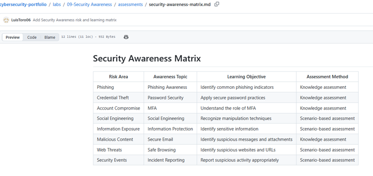

**Figure 01 — Security Awareness Matrix**

### Result

A structured cybersecurity awareness program was defined with learning objectives and assessment methods.

---

## Activity 02 — Security Awareness Program Lifecycle and Risk Assessment

### Objective

Establish a lifecycle for the awareness program and identify common human-related cybersecurity risk areas.

### Program Lifecycle

The awareness program follows:

```text
Define
   ↓
Assess
   ↓
Educate
   ↓
Evaluate
   ↓
Measure
   ↓
Improve
   ↓
Define
```

### Evidence — Program Lifecycle

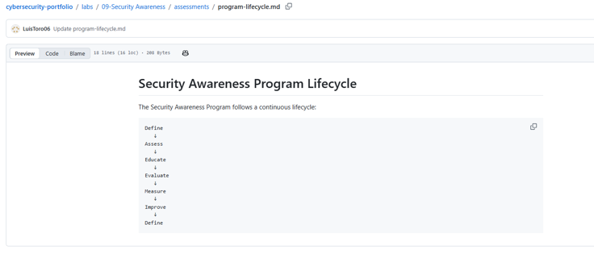

**Figure 02 — Security Awareness Program Lifecycle**

### Risk Assessment

A controlled initial risk assessment was developed to identify common cybersecurity awareness risk areas, including:

- Phishing.
- Password reuse.
- Social engineering.
- Information exposure.
- Unsafe browsing.
- Incident reporting.

### Evidence — Risk Assessment

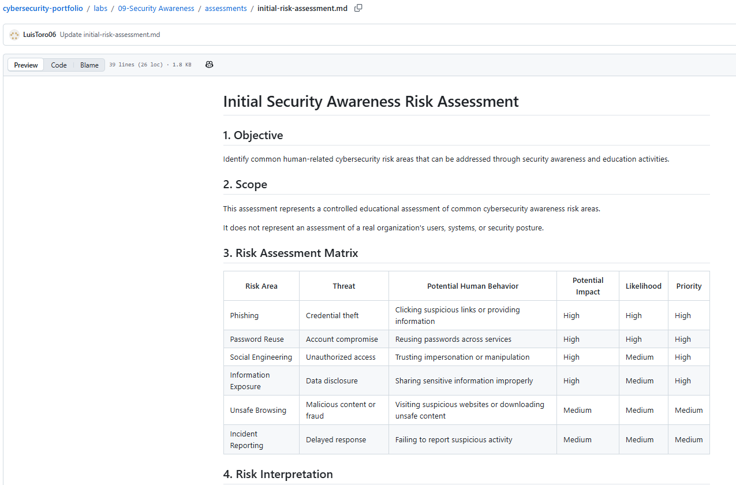

**Figure 03 — Initial Security Awareness Risk Assessment**

### Result

The awareness lifecycle and initial risk areas were established as the foundation for the subsequent educational activities.

---

## Activity 03 — Phishing Awareness

### Objective

Develop the ability to recognize common phishing indicators and respond appropriately to suspicious messages.

### Controlled Scenario

A fictional phishing example was created for educational purposes.

The example demonstrates:

- Urgency.
- Unexpected requests.
- Account verification requests.
- Suspicious calls to action.
- Potential credential theft.

### Evidence — Phishing Example

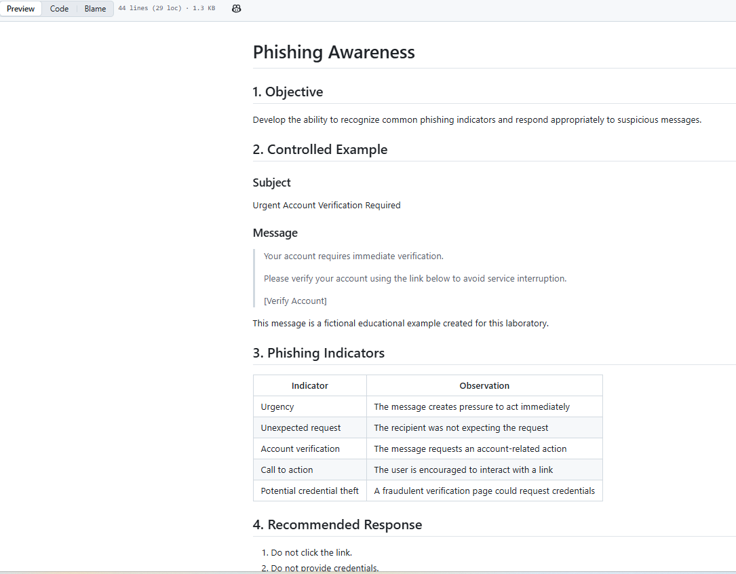

**Figure 04 — Controlled Phishing Awareness Example**

### Phishing Analysis

A reusable phishing analysis template was created to document:

- Message information.
- Initial indicators.
- Technical indicators.
- Risk assessment.
- Recommended response.
- Final assessment.
- Analyst notes.

### Evidence

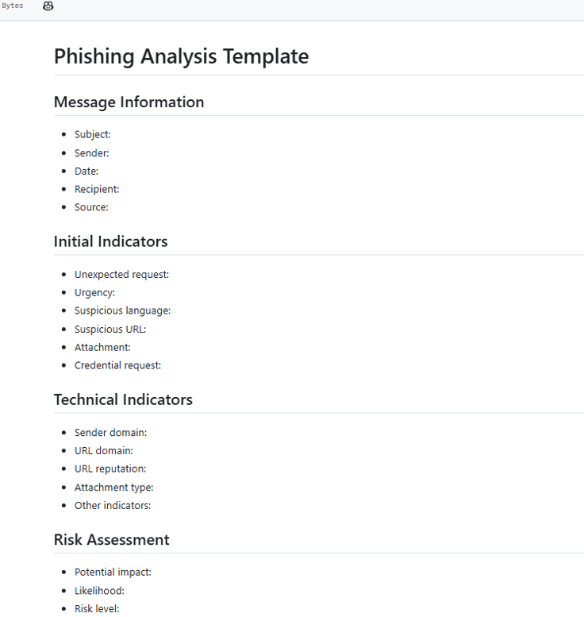

**Figure 05 — Phishing Analysis Template**

> Note: The current evidence represents a reusable phishing analysis template rather than the analysis of a real phishing message.

### Result

A controlled phishing awareness scenario and reusable analysis structure were developed.

---

## Activity 04 — Password Security and Multifactor Authentication

### Objective

Promote secure authentication practices and explain the role of MFA in protecting accounts.

### Password Security

The awareness material addresses:

- Long and unique passwords.
- Password reuse prevention.
- Password managers.
- Credential protection.
- Secure handling of authentication secrets.
- MFA enablement.

### Evidence

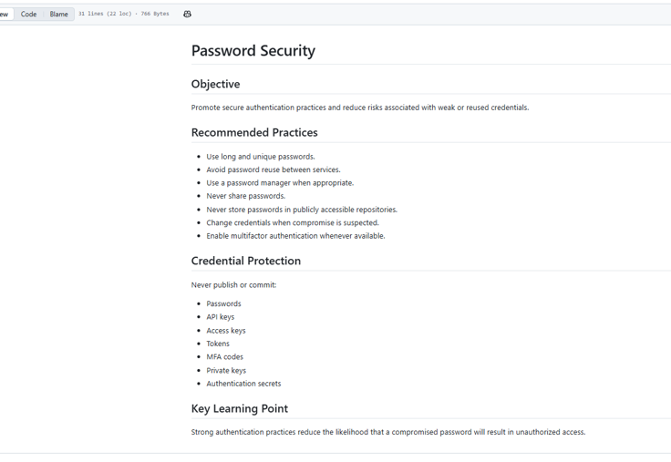

**Figure 06 — Password Security Awareness**

### Multifactor Authentication

The MFA material explains:

1. Something you know.
2. Something you have.
3. Something you are.

It also emphasizes:

- Enabling MFA.
- Rejecting unexpected authentication requests.
- Never sharing authentication codes.
- Reporting suspicious authentication prompts.

### Evidence

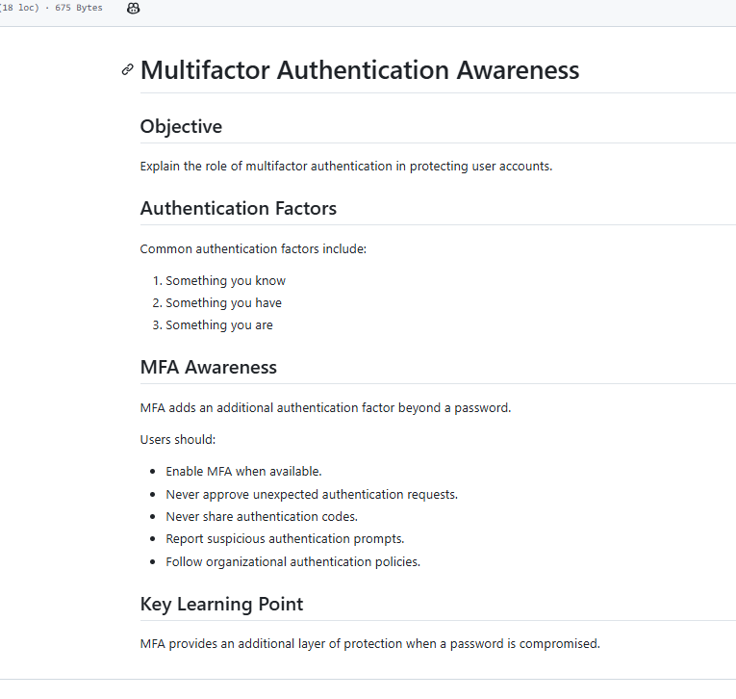

**Figure 07 — Multifactor Authentication Awareness**

### Result

Secure authentication practices were incorporated into the awareness program.

---

## Activity 05 — Social Engineering Awareness

### Objective

Increase awareness of manipulation techniques used to influence users into performing unsafe actions.

### Techniques Covered

- Authority.
- Urgency.
- Fear.
- Trust exploitation.
- Impersonation.
- Curiosity.
- Scarcity.

### Controlled Scenario

A fictional IT-support scenario demonstrates an attempt to obtain an MFA verification code through impersonation and urgency.

The scenario is strictly educational and does not involve real users or credentials.

### Evidence

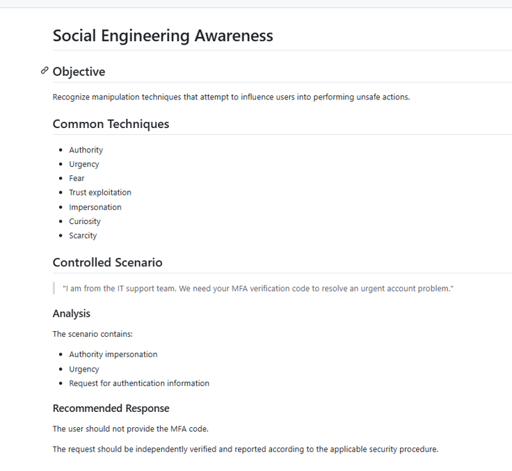

**Figure 08 — Controlled Social Engineering Awareness Scenario**

### Result

The activity demonstrates the importance of independently verifying unusual requests and refusing to disclose authentication information.

---

## Activity 06 — Secure Email and Web Browsing

### Objective

Promote safe behavior when interacting with emails, links, attachments, and websites.

### Secure Email Practices

- Verify unexpected messages.
- Inspect the sender.
- Be cautious with attachments.
- Avoid unsolicited credential requests.
- Independently verify unusual requests.
- Report suspicious messages.

### Safe Web Browsing

- Verify the domain name.
- Inspect suspicious URLs.
- Avoid unexpected downloads.
- Do not enter credentials into suspicious websites.
- Use trusted websites and applications.
- Keep browsers and operating systems updated.

### Evidence

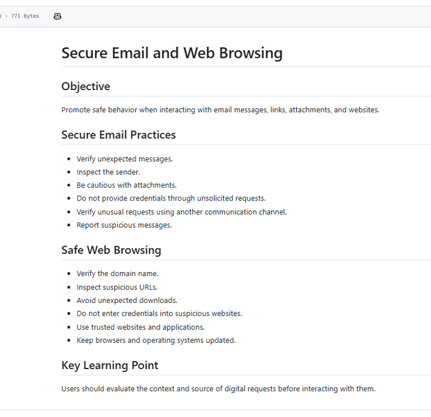

**Figure 09 — Secure Email and Web Browsing Awareness**

### Result

Secure email and browsing practices were incorporated into the awareness program.

---

## Activity 07 — Information Protection

### Objective

Promote appropriate handling and protection of information according to its sensitivity.

### Educational Classification

| Classification | Example |
|---|---|
| Public | Public documentation |
| Internal | Internal procedures |
| Confidential | Sensitive organizational information |
| Restricted | Credentials, secrets, authentication material |

### Protection Practices

- Share information only with authorized recipients.
- Avoid public storage of sensitive information.
- Protect credentials and authentication secrets.
- Avoid exposing API keys and tokens.
- Verify recipients before sharing information.
- Follow information handling policies.

### GitHub Security Rule

Never commit the following to a public repository:

- Passwords.
- API keys.
- Access keys.
- Tokens.
- Private keys.
- MFA codes.
- Authentication secrets.

### Evidence

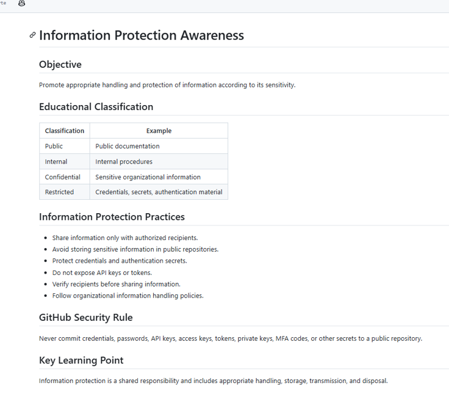

**Figure 10 — Information Protection Awareness**

### Result

Information protection was incorporated as a core component of the security awareness program.

---

## Activity 08 — Security Incident Reporting

### Objective

Teach users how to recognize suspicious activity and report it through an appropriate security process.

### Recommended Process

```text
Identify
   ↓
Stop Interaction
   ↓
Preserve Evidence
   ↓
Document
   ↓
Report
   ↓
Follow Response Instructions
```

### Reportable Events

Examples include:

- Suspected phishing.
- Unexpected authentication requests.
- Suspected credential compromise.
- Suspicious downloads.
- Loss of a device containing sensitive information.
- Unauthorized information disclosure.
- Other suspicious cybersecurity events.

### Evidence

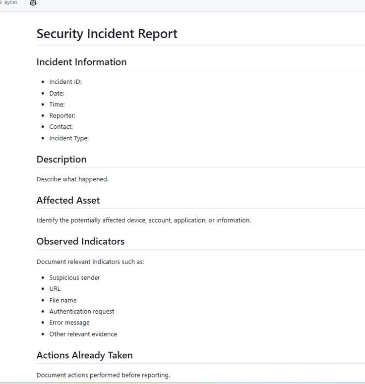

**Figure 11 — Security Incident Report Template**

### Result

A standardized incident reporting template was established to support consistent documentation and escalation of suspicious cybersecurity events.

---

## Activity 09 — Security Awareness Knowledge Assessment

### Objective

Evaluate knowledge related to the cybersecurity awareness topics covered throughout the laboratory.

### Assessment Topics

The assessment covers:

- Phishing.
- MFA.
- Suspicious attachments.
- Social engineering.
- Credential protection.
- GitHub security.
- Unexpected MFA requests.
- Safe web browsing.
- Phishing reporting.
- Security incident reporting.

### Assessment Structure

The assessment contains 10 questions designed for educational purposes.

### Evidence

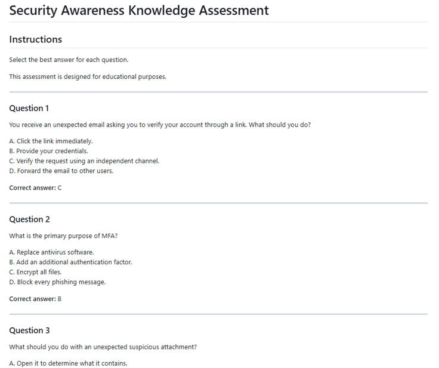

**Figure 12 — Security Awareness Knowledge Assessment**

### Important Note

The assessment questions and answer key represent the evaluation instrument.

They should not be interpreted as measured performance results until the assessment has actually been completed by participants.

The assessment instrument is documented in:

```text
assessments/knowledge-assessment.md
```

### Result

A structured knowledge assessment was created to evaluate the effectiveness of the awareness topics.

---

## Activity 10 — Metrics

### Objective

Define measurable indicators that can be used to evaluate the effectiveness of the cybersecurity awareness program.

### Assessment Metrics

| Metric | Description |
|---|---|
| Number of questions | Total questions included in the assessment |
| Correct answers | Number of correctly answered questions |
| Incorrect answers | Number of incorrectly answered questions |
| Final score | Percentage of correct answers |
| Completion rate | Percentage of participants completing the assessment |

### Topic Performance

| Topic | Result |
|---|---|
| Phishing | TBD |
| Password Security | TBD |
| MFA | TBD |
| Social Engineering | TBD |
| Information Protection | TBD |
| Secure Browsing | TBD |
| Incident Reporting | TBD |

### Knowledge Gaps

Knowledge gaps should be identified after the assessment is performed.

No knowledge gap is considered measured until supported by actual assessment results.

### Assessment Results File

Metrics and future results are documented in:

```text
assessments/assessment-results.md
```

At the current laboratory stage, metrics that depend on participant results remain marked as `TBD`.

### Continuous Improvement

```text
Assessment
    ↓
Analysis
    ↓
Knowledge Gaps
    ↓
Improvement Actions
    ↓
Updated Awareness Content
    ↓
New Assessment
```

### Result

A metrics framework was established without introducing hypothetical participant results.

---

# 7. Awareness Materials

The laboratory includes:

```text
materials/
├── 01-phishing-awareness.md
├── 02-password-security.md
├── 03-mfa-awareness.md
├── 04-social-engineering.md
├── 05-secure-email-and-browsing.md
├── 06-information-protection.md
└── 07-incident-reporting.md
```

These materials provide the educational content supporting the laboratory activities.

---

# 8. Assessment

The knowledge assessment is documented in:

```text
assessments/knowledge-assessment.md
```

The assessment consists of 10 questions covering the main awareness topics addressed in the laboratory.

The assessment is designed to evaluate whether participants can:

- Identify phishing indicators.
- Understand MFA.
- Recognize social engineering.
- Protect credentials.
- Identify suspicious attachments.
- Apply safe browsing practices.
- Protect sensitive information.
- Report cybersecurity incidents appropriately.

Assessment results are documented separately in:

```text
assessments/assessment-results.md
```

No performance results are reported until an actual assessment has been performed.

---

# 9. Metrics and Continuous Improvement

The laboratory defines a metrics framework to support evaluation and continuous improvement.

The principal indicators include:

- Number of assessment questions.
- Correct answers.
- Incorrect answers.
- Final score.
- Assessment completion rate.
- Topic-level performance.
- Knowledge gaps.
- Improvement actions.

The current `assessment-results.md` file should retain `TBD` values until actual assessment data is available.

This distinction is important because an assessment instrument describes what will be evaluated, while assessment results represent measured performance.

---

# 10. Evidence Index

The laboratory currently contains the following evidence figures:

| Figure | Evidence | Activity |
|---|---|---:|
| `fig-01-security-awareness-matrix.png` | Security Awareness Matrix | 01 |
| `fig-02-security-awareness-program-lifecycle.png` | Security Awareness Program Lifecycle | 02 |
| `fig-03-security-awareness-risk-assessment.png` | Initial Security Awareness Risk Assessment | 02 |
| `fig-04-phishing-awareness-example.png` | Controlled Phishing Awareness Example | 03 |
| `fig-05-phishing-indicators-analysis.png` | Phishing Analysis Template | 03 |
| `fig-06-password-security.png` | Password Security Awareness | 04 |
| `fig-07-mfa-awareness.png` | Multifactor Authentication Awareness | 04 |
| `fig-08-social-engineering-scenario.png` | Social Engineering Scenario | 05 |
| `fig-09-secure-email-and-web-browsing.png` | Secure Email and Web Browsing | 06 |
| `fig-10-information-protection.png` | Information Protection Awareness | 07 |
| `fig-11-incident-report-template.png` | Security Incident Report Template | 08 |
| `fig-12-security-awareness-knowledge-assessment.png` | Security Awareness Knowledge Assessment | 09 |

### Evidence Integrity

All evidence included in this laboratory represents controlled educational activities and documentation.

No real credentials, passwords, access tokens, private keys, API keys, MFA codes, or other authentication secrets should be included in the repository.

---

# 11. Security Recommendations

## Phishing

- Verify unexpected messages.
- Inspect senders and URLs.
- Avoid suspicious links and attachments.
- Report suspected phishing.

## Password Security

- Use strong and unique passwords.
- Avoid password reuse.
- Use a password manager when appropriate.
- Never share credentials.

## MFA

- Enable MFA whenever available.
- Never share authentication codes.
- Reject unexpected authentication requests.
- Report suspicious authentication prompts.

## Social Engineering

- Verify unusual requests independently.
- Be cautious of urgency and authority claims.
- Do not disclose sensitive information without verification.

## Information Protection

- Protect sensitive information.
- Avoid publishing secrets in repositories.
- Verify recipients before sharing information.
- Follow information classification and handling requirements.

## Incident Reporting

- Report suspicious activity promptly.
- Preserve relevant evidence.
- Follow established reporting procedures.
- Avoid modifying evidence unnecessarily.

---

# 12. Lessons Learned

The laboratory demonstrates that cybersecurity awareness is an important component of an organization's overall security posture.

Key lessons include:

1. Human behavior can influence cybersecurity risk.
2. Phishing awareness is essential for reducing credential theft and social engineering risks.
3. Strong passwords and MFA provide important layers of account protection.
4. Social engineering often relies on manipulation rather than technical exploitation.
5. Users should verify unusual requests independently.
6. Sensitive information must be protected throughout its lifecycle.
7. Incident reporting enables suspicious activity to be escalated appropriately.
8. Security awareness should be measured rather than treated exclusively as a one-time training activity.
9. Assessment results should be used to identify knowledge gaps.
10. Continuous improvement is necessary to maintain effective cybersecurity awareness.

---

# 13. Conclusion

Laboratory 09 developed a structured cybersecurity awareness and education program covering common human-centered cybersecurity risks.

The laboratory established:

- A security awareness matrix.
- A program lifecycle.
- An initial awareness risk assessment.
- Controlled phishing awareness scenarios.
- Phishing analysis methodology.
- Password security guidance.
- MFA awareness.
- Social engineering awareness.
- Secure email and web browsing guidance.
- Information protection practices.
- Security incident reporting procedures.
- A knowledge assessment.
- A metrics and continuous improvement approach.

The laboratory also establishes an important distinction between an assessment instrument and measured assessment results.

The knowledge assessment can be created before execution, but performance metrics should only be reported after an actual assessment has been completed.

This approach maintains evidence integrity and avoids presenting hypothetical results as measured cybersecurity awareness outcomes.

---

# 14. References

## NIST SP 800-50 Rev. 1

**Building a Cybersecurity and Privacy Learning Program**

NIST Special Publication 800-50 Revision 1, September 2024.

https://csrc.nist.gov/pubs/sp/800/50/r1/final

This publication provides lifecycle-based guidance for developing and managing cybersecurity and privacy learning programs, including evaluation, metrics, behavior change, and continuous improvement.

## NIST Cybersecurity Framework 2.0

**Cybersecurity Framework (CSF) 2.0**

NIST Cybersecurity Framework.

https://www.nist.gov/cyberframework

The framework includes the Protect Function and the Awareness and Training category (PR.AT), addressing cybersecurity awareness and training activities.

## NIST SP 800-61 Rev. 3

**Incident Response Recommendations and Considerations for Cybersecurity Risk Management**

NIST Special Publication 800-61 Revision 3, April 2025.

https://csrc.nist.gov/pubs/sp/800/61/r3/final

This publication provides current NIST guidance for integrating incident response into cybersecurity risk management and supersedes SP 800-61 Revision 2.

## CISA — Secure Our World

**Secure Our World**

Cybersecurity and Infrastructure Security Agency (CISA).

https://www.cisa.gov/secure-our-world

The initiative provides practical security guidance related to phishing, strong passwords, MFA, and software updates.

---

# 15. Disclaimer

This laboratory is intended exclusively for cybersecurity education, awareness, documentation, and professional portfolio development.

All phishing messages, social engineering scenarios, and other potentially malicious examples are fictional and controlled.

No real-world users, organizations, credentials, accounts, or systems were intentionally targeted.

The laboratory does not authorize unauthorized access, credential harvesting, malware deployment, phishing campaigns, or other offensive activity against systems or users without explicit authorization.

All assessment results must be based on actual completed assessments. No hypothetical results are presented as measured findings.
